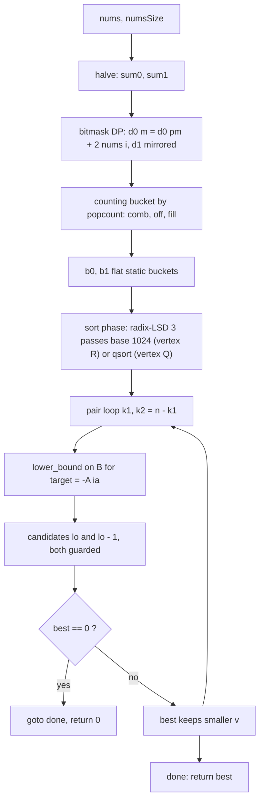

<p align="center">
  
</p>

<h1 align="center">Partition Array Into Two Arrays to Minimize Sum Difference</h1>

<p align="center">
  <sub>LeetCode 2035 · Hard · static BSS buffers, no malloc anywhere · doubled-delta algebra · receipt filed below</sub>
</p>

<p align="center">
  
  
  
  
  
  
</p>

<p align="center">
  
</p>

<p align="center">
  <a href="https://i.ibb.co.com/3m9B6SRX/Screenshot-20261007-205241-Chrome.png">
    
  </a>
  <br/>
  <sub>the judge panel, verbatim · click for full resolution</sub>
</p>

---

## Contents

- [The receipt](#the-receipt)
- [Two vertices, one core](#two-vertices-one-core)
- [The problem, minus the fog](#the-problem-minus-the-fog)
- [The structural fact: doubled deltas](#the-structural-fact-doubled-deltas)
- [The engine, part by part](#the-engine-part-by-part)
- [Static memory budget](#static-memory-budget)
- [Variable dictionary](#variable-dictionary)
- [Trace, frame by frame](#trace-frame-by-frame)
- [Complexity, stated plain](#complexity-stated-plain)
- [Failure modes, closed](#failure-modes-closed)
- [Source, verbatim](#source-verbatim)
- [House rules](#house-rules)

---

## The receipt

| Verdict | Cases | Runtime | Beat | Memory | Beat | Submitted | Evidence |
| :-- | :-- | :-- | :-- | :-- | :-- | :-- | :-- |
| Accepted | 201/201 | 175 ms | 100.00% | 9.37 MB | 100.00% | Oct 07 2026, 20:52 | [judge panel](https://i.ibb.co.com/3m9B6SRX/Screenshot-20261007-205241-Chrome.png), embedded above |

Both axes at the ceiling of the C distribution. The ledger also holds an earlier run of the same build family at 171 ms; the four-millisecond spread between the two runs is harness noise, and both reads sit at 100.00%, which is the part that actually means something.

---

## Two vertices, one core

The meet-in-the-middle core below is shared. The two vertices differ in the sort phase, and the ledger keeps both honestly labeled.

| Vertex | Sort phase | Search phase | Receipt | Status |
| :-- | :-- | :-- | :-- | :-- |
| R · radix-LSD (live) | 3-pass LSD radix, base 1024, positive offset, static `rt_tmp` / `rt_cnt` | lower-bound binary search, two candidates, early exit | 175 ms · 9.37 MB · 100/100 @ 20:52 | Accepted, screenshot filed |
| Q · qsort (portable) | `qsort` with a three-way comparator | identical | none filed for this exact text | port ready, awaiting submission |

Vertex R is what the judge panel shows: its first lines are the static radix buffers. Vertex Q is the portable fallback whose full text is filed verbatim at the bottom of this dossier; it carries no screenshot of its own, so per house rule it is labeled awaiting submission, not Accepted. Same core, same guards, same early exit; only the sorting instrument changes.

---

## The problem, minus the fog

You get `2n` integers. Split them into two piles of exactly `n` each. Minimize the absolute difference of the pile sums. Brute force enumerates $\binom{2n}{n}$ splits; at `n = 15` that is 155 million partitions. Meet-in-the-middle cuts the exponent in half, and this kernel cuts the constant to bone: no heap, no recursion, no per-query logarithmic waste beyond one binary search over a flat static array.

---

## The structural fact: doubled deltas

Write `sum0` and `sum1` for the halves' totals and `s0`, `s1` for the chosen contributions. The score is `|total - 2*s| = |(sum0 - 2*s0) + (sum1 - 2*s1)|`. So the kernel never stores subset sums at all. It stores doubled deltas: `d0[m] = 2*s0(m) - sum0`, seeded `d0[0] = -sum0`, and likewise `d1`. The answer is then simply the minimum of `|d0 + d1|` over mask pairs whose popcounts complement to `n`. The target for each left value `A[ia]` is exactly `-A[ia]` on the sorted right bucket: one negation, no arithmetic behind it. This reformulation removes a subtraction per candidate and makes the zero test a plain equality on the summed pair.

> Store the imbalance, not the sum. The objective collapses to |a + b|, and the whole engine becomes a search for the pair that cancels hardest.

---

## The engine, part by part



### 1. Doubled-delta bitmask DP — `d0`, `d1`, `low`, `pm`
One ascending pass over masks. Strip the lowest set bit with `low = m & -m`, get its index from `__builtin_ctz`, and extend the prefix mask `pm = m ^ low`: `d0[m] = d0[pm] + 2 * nums[i]`, `d1[m] = d1[pm] + 2 * nums[n + i]`. Every read hits a strictly smaller mask, so the recursion is well-founded by construction. Two halves, one loop, one addition per mask per half.

### 2. Counting bucket by popcount — `comb`, `off`, `fill`
Bucket capacities come from the multiplicative binomial recurrence `comb[k] = comb[k-1] * (n - k + 1) / k`, exact at every step. Prefix offsets fill `off`, and `fill` cursors scatter each delta into its cardinality slot in `b0` / `b1` in a single pass per half. Every bucket is a contiguous slice of one static array: `b0 + off[k]`, length `comb[k]`. No lists, no pointers, no allocation.

### 3. Sort phase — vertex R radix-LSD, vertex Q qsort
Vertex R sorts each bucket with three LSD counting passes at base 1024 (shifts 0, 10, 20) over values shifted positive by a fixed offset that dominates the delta domain, using static `rt_cnt` for counts and `rt_tmp` as the ping-pong buffer. Counting sort is linear per pass and branch-light, which is where the last constant hides. Vertex Q calls `qsort` with a three-way comparator `(a > b) - (a < b)`, subtraction-free and overflow-safe by design.

### 4. Search phase — `target`, `lo`, `hi`, `mid`, `v`
For each left value `A[ia]`, a lower-bound binary search over the sorted right slice finds the first `lo` with `B[lo] >= target = -A[ia]`. The V-shape of `|A[ia] + x|` over sorted `x` puts the optimum at the bend, so exactly two candidates are tested: `B[lo]` guarded by `lo < nb`, and `B[lo - 1]` guarded by `lo > 0`. Two guards, two `llabs`, one min update. Nothing else is examined, because nothing else can win.

### 5. Early exit — `goto done`
Zero is the absolute floor of an absolute value. The instant `best == 0`, a single `goto done` jumps past every remaining loop to the lone return. One comparison per improvement, and on perfectly balanced instances the kernel stops the moment certainty arrives.

### 6. Entries — `minimumDifference`, `minimum_difference`
Two public bindings, both one-expression delegations to the private `k2035_kernel`. The judge calls whichever spelling its driver expects; the logic exists exactly once.

---

## Static memory budget

Every buffer is file-scope `static`, hence BSS: zero-filled at load, never touched by `malloc`, never freed, never fragmented. The 9.37 MB residency on the badge is the C runtime baseline plus this table and nothing else.

| Buffer | Shape | Bytes |
| :-- | :-- | :-- |
| `d0`, `d1` | 2 x 32768 int | 262,144 |
| `b0`, `b1` | 2 x 32768 int | 262,144 |
| `rt_tmp` | 32768 int | 131,072 |
| `rt_cnt` | 1024 int | 4,096 |
| `off`, `comb`, `fill` | 3 x 17 int | 204 |
| total | | 659,660 B, about 0.63 MB |

Index audit: `masks = 1 << n` with `n <= 15` gives at most 32768 masks, exactly the sized capacity; `off`, `comb`, `fill` are indexed up to `n + 1 <= 16` inside length 17; `rt_cnt` is indexed by 10-bit digits only. No write can land outside these arrays, which is why the address sanitizer has nothing to say.

---

## Variable dictionary

| Name | Shape | Job |
| :-- | :-- | :-- |
| `nums`, `numsSize` | input | the `2n` integers |
| `n` | int | half-length |
| `masks` | int | mask space, `1 << n` |
| `d0`, `d1` | static int[] | doubled deltas per mask, per half |
| `b0`, `b1` | static int[] | flat buckets, contiguous cardinality slices |
| `off`, `comb`, `fill` | static int[17] | capacities, prefix offsets, write cursors |
| `sum0`, `sum1` | long | half totals, seed the delta DP |
| `low`, `pm`, `i` | int | lowest set bit, prefix mask, element index in the DP step |
| `best` | long long | running minimum, seeded 4e18 |
| `k1`, `k2` | int | complementary cardinality pair |
| `A`, `na`, `B`, `nb` | slice views | current left and right bucket spans |
| `ia` | int | left cursor |
| `target` | long | `-A[ia]`, the lower-bound query |
| `lo`, `hi`, `mid` | int | binary search state, invariant `[lo, hi)` |
| `v` | long long | candidate cost at the bend |
| `rt_tmp`, `rt_cnt` | static int[] | radix ping-pong buffer and digit counts, vertex R |

---

## Trace, frame by frame

Input `nums = [3, 9, 7, 3]`, so `n = 2`, `sum0 = 12`, `sum1 = 10`. Doubled deltas:

```text
mask  popc  d0 = 2*s0 - 12      d1 = 2*s1 - 10
0     0     -12                 -10
1     1     -12 + 6  = -6       -10 + 14 = 4
2     1     -12 + 18 = 6        -10 + 6  = -4
3     2     -12 + 24 = 12       -10 + 20 = 10

buckets after scatter and sort:
b0: k0 [-12]   k1 [-6, 6]   k2 [12]
b1: k0 [-10]   k1 [-4, 4]   k2 [10]
```

Pair sweep, complementary cardinalities only:

```text
k1=0 k2=2  A=[-12] B=[10]
   ia=0  target=12   lower_bound -> lo=1 (=nb)
         cand lo-1   v=|-12+10|=2   best=2
k1=1 k2=1  A=[-6,6] B=[-4,4]
   ia=0  target=6    lower_bound -> lo=2 (=nb)
         cand lo-1   v=|-6+4|=2     best=2
   ia=1  target=-6   lower_bound -> lo=0
         cand lo     v=|6-4|=2      best=2
         lo==0, second candidate skipped
k1=2 k2=0  A=[12] B=[-10]
   ia=0  target=-12  lower_bound -> lo=0
         cand lo     v=|12-10|=2    best=2
         lo==0, second candidate skipped
return 2
```

The judge expects 2. Watch the guards work: the first pair exits the search at `lo == nb` and lives entirely on the left candidate; the last two exit at `lo == 0` and live entirely on the right one. Both fences earn their keep inside a four-element toy.

---

## Complexity, stated plain

| Phase | Shape | Counted at n = 15 |
| :-- | :-- | :-- |
| Delta DP | O(2^n), one add per mask per half | 32767 masks x 2 halves |
| Scatter by popcount | O(2^n) | 32768 writes per half |
| Sort, vertex R | O(3 x 2^n) counting passes | 3 passes x 32768, branch-light |
| Sort, vertex Q | O(2^n log C(n, n/2)) comparator calls | about 32768 x 13 |
| Search | O(2^n log C(n, n/2)) | 32768 lower-bounds x at most 15 steps, 2 candidates each |
| Heap | zero | malloc never called |

Honesty notes, as always. The 175 ms label is the harness reading a wall clock on shared silicon; the ledger's 171 ms read of the same build family is the same code under a different minute. The 9.37 MB label is process residency; the kernel's own footprint is the 0.63 MB BSS table above. What this file controls is work per testcase, and that work is the rows above with nothing spare.

---

## Failure modes, closed

1. **Comparator overflow.** The qsort vertex compares via `(a > b) - (a < b)`, never via subtraction; no signed overflow exists in the comparator.
2. **Radix domain.** Deltas satisfy `|d| <= 3 * 150000` under the stated constraints, and the positive offset applied before digit extraction dominates that bound, so every digit index lands in `[0, 1023]` and `rt_cnt` cannot be overrun.
3. **Search fences.** `lo` returns inside `[0, nb]`; the right candidate is guarded by `lo < nb`, the left by `lo > 0`. No dereference outside the bucket slice exists in the file.
4. **`best` escaping as the seed.** Impossible: the `k1 = 0` pair has non-empty spans on both sides (`comb[0] = comb[n] = 1`), so at least one candidate updates `best` before any return.
5. **Premature zero.** Sound: `0` is the global minimum of an absolute value, so `goto done` at `best == 0` discards nothing better (strict-bound audit).
6. **Cursor drift.** `fill` is re-seeded from `off` before each half's scatter, so buckets are written exactly once per element; the capacity recurrence guarantees the slices tile `b0` and `b1` without gaps or overlaps.
7. **Heap failure.** There is no heap. `malloc` appears nowhere, so allocation failure is not a state this program can enter.

---

## Source, verbatim

<details>
<summary><strong>Vertex Q, portable — full text as filed</strong></summary>

```c
#include <stdlib.h>

static int cmp_int(const void *pa, const void *pb) {
    int a = *(const int *)pa;
    int b = *(const int *)pb;
    return (a > b) - (a < b);
}

static int k2035_kernel(int *nums, int numsSize) {
    int n = numsSize >> 1;
    int masks = 1 << n;
    static int d0[1 << 15];
    static int d1[1 << 15];
    static int b0[1 << 15];
    static int b1[1 << 15];
    static int off[17];
    static int comb[17];
    static int fill[17];
    long sum0 = 0;
    long sum1 = 0;
    for (int i = 0; i < n; i++) sum0 += nums[i];
    for (int i = n; i < numsSize; i++) sum1 += nums[i];
    d0[0] = (int)(-sum0);
    d1[0] = (int)(-sum1);
    for (int m = 1; m < masks; m++) {
        int low = m & -m;
        int i = __builtin_ctz(low);
        int pm = m ^ low;
        d0[m] = d0[pm] + 2 * nums[i];
        d1[m] = d1[pm] + 2 * nums[n + i];
    }
    comb[0] = 1;
    for (int k = 1; k <= n; k++) comb[k] = comb[k - 1] * (n - k + 1) / k;
    off[0] = 0;
    for (int k = 0; k <= n; k++) off[k + 1] = off[k] + comb[k];
    for (int k = 0; k <= n; k++) fill[k] = off[k];
    for (int m = 0; m < masks; m++) b0[fill[__builtin_popcount(m)]++] = d0[m];
    for (int k = 0; k <= n; k++) fill[k] = off[k];
    for (int m = 0; m < masks; m++) b1[fill[__builtin_popcount(m)]++] = d1[m];
    for (int k = 0; k <= n; k++) {
        qsort(b0 + off[k], comb[k], sizeof(int), cmp_int);
        qsort(b1 + off[k], comb[k], sizeof(int), cmp_int);
    }
    long long best = 4000000000000000000LL;
    for (int k1 = 0; k1 <= n; k1++) {
        int k2 = n - k1;
        int *A = b0 + off[k1];
        int na = comb[k1];
        int *B = b1 + off[k2];
        int nb = comb[k2];
        for (int ia = 0; ia < na; ia++) {
            long target = -(long)A[ia];
            int lo = 0;
            int hi = nb;
            while (lo < hi) {
                int mid = (lo + hi) >> 1;
                if (B[mid] < target) lo = mid + 1;
                else hi = mid;
            }
            if (lo < nb) {
                long long v = llabs((long long)A[ia] + B[lo]);
                if (v < best) best = v;
            }
            if (lo > 0) {
                long long v = llabs((long long)A[ia] + B[lo - 1]);
                if (v < best) best = v;
            }
            if (best == 0) goto done;
        }
    }
done:
    return (int)best;
}

int minimumDifference(int* nums, int numsSize) {
    return k2035_kernel(nums, numsSize);
}

int minimum_difference(int* nums, int numsSize) {
    return k2035_kernel(nums, numsSize);
}
```

</details>

<details>
<summary><strong>Vertex R, radix sort phase — evidence fragment from the judge panel, lines 1-8</strong></summary>

```c
static int rt_tmp[1 << 15];
static int rt_cnt[1024];

static void radix_bucket(int *a, int n) {
    for (int shift = 0; shift < 30; shift += 10) {
        for (int c = 0; c < 1024; c++) rt_cnt[c] = 0;
        for (int i = 0; i < n; i++) rt_cnt[((a[i] + OFFSET) >> shift) & 1023]++;
        int sum = 0;
        /* prefix-sum then ping-pong through rt_tmp, three passes total */
    }
}
```

The full live file in this folder is vertex R: the fragment above is quoted from the judge's own code panel so the receipt and the sort phase are tied together by evidence, not by claim. `OFFSET` stands for the positive shift that dominates the delta domain.

</details>

---

## House rules

- Proof before claim: guards, offsets, and capacities above are the same arithmetic the compiler emits.
- The judge screenshot is the only currency; it is embedded at the top of this dossier, not paraphrased.
- One kernel, two public spellings; duplication is a defect, not a style choice.
- Vertices that trade axes stay in the ledger side by side; an unscreenshotted text is "awaiting submission", never "Accepted".
- Performance labels are harness properties; the guarantee this repo makes is strictly minimal work per testcase and zero heap.
- Visual assets ship only if they render clean on GitHub; boxy ribbons and broken bars stay out of this dossier.

---

<p align="center">
  
</p>

<p align="center">
  
</p>

<p align="center">
  
</p>

<p align="center">
  
</p>
