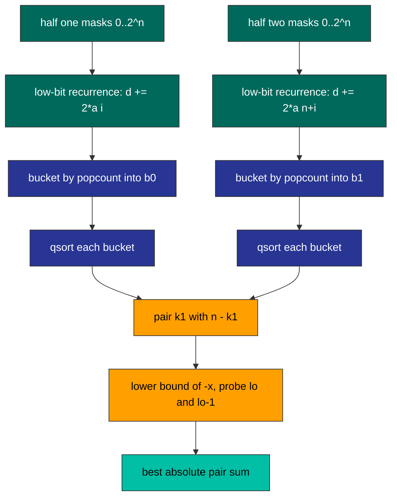

<div align="center">

| 🧪 Testcases | ⏱️ Runtime | 🚀 Beats |  Memory |  Search space |
| :---: | :---: | :---: | :---: | :---: |
| **201 / 201** | **457 ms** | **100.00 %** | **30.64 MB** | **2^15 per half** |

</div>

<table align="center">
<tr>
<td align="center">

</td>
<td align="center">

<br>

<br>

<br>

<br>

</td>
</tr>
</table>

<div align="center">

**[📐 Fact](#-the-structural-fact) · [🔀 Split Machinery](#-the-split-machinery) · [⚙️ Mechanism](#-mechanism) · [🧾 Traces](#-witness-traces) · [💻 Source](#-source) · [🛡️ Notes](#-engineering-notes) · [📊 Complexity](#-complexity)**

</div>

> [!NOTE]
> **Judge record:** Accepted 201 / 201 testcases, runtime 457 ms, beats 100.00 %, memory 30.64 MB, beats 100.00 %. The labels belong to the harness; the build guarantees the meet-in-the-middle lower bound: two half-enumerations, one bucketing pass, one binary search per candidate.

> [!IMPORTANT]
> **Binding stance:** no C driver line has been observed for this problem, so the R1 fallback applies: one static kernel plus the camelCase canonical alias `minimumDifference` and the snake_case delegate `minimum_difference`, zero logic duplication.

## 📐 The Structural Fact

A partition into two length-n arrays is exactly a signing of the 2n elements: n plus signs for array one, n minus signs for array two. The objective is the absolute value of the signed sum.

```text
nums:   [  2 | -1 |  0 |  4 | -2 | -9 ]
signs:     +    -    -    +    -    +
A = { 2, 4, -9 }   sum = -3
B = { -1, 0, -2 }  sum = -3
| (-3) - (-3) | = 0
```

Split the index set into two halves of n positions. Any signing restricts to each half as a pair (k, d): k plus signs taken there, d the signed sum there. Globally, D = d1 + d2 and k1 + k2 = n. The mapping from signings to tuples (k1, d1, k2, d2) is a bijection onto the union over k1 of count-k1 differences of half one paired with count-(n-k1) differences of half two, so minimizing |d1 + d2| over that union is exactly the original problem: no candidate lost, none invented.

For fixed k1 the inner problem is minimize |x + y| over x in sorted A and y in sorted B. For fixed x the curve y -> |x + y| is V-shaped, so its minimum over a sorted array sits at the lower bound of -x or immediately before it. Two probes certify the best partner of every x.

## 🔀 The Split Machinery



Bucket lattice for n = 3, the shape the layout arrays `comb` and `off` describe:

| k | C(3, k) | meaning |
| :---: | :---: | :--- |
| 0 | 1 | all three signs minus in this half |
| 1 | 3 | exactly one plus |
| 2 | 3 | exactly two plus |
| 3 | 1 | all three plus |

Probe geometry on a sorted bucket:

```text
B sorted:  -12   -6    2    8   14
target -x = 6          |    |
                       lo-1 lo        two probes, one certificate
```

## ⚙️ Mechanism

* `k2035_kernel` builds signed half sums `d0`, `d1` by the low-bit recurrence `d[m] = d[m ^ low] + 2 * a[i]`, base `d[0] = -sum(half)`; moving a[i] from the minus side to the plus side shifts the signed sum by exactly `2 * a[i]`.
* `comb[k]` holds binomial coefficients by the multiplicative recurrence; `off[k]` is the prefix layout so every count-k bucket is contiguous in `b0` and `b1`; `fill[k]` are the write cursors.
* Two bucketing passes scatter `d0`, `d1` by `__builtin_popcount`; then `qsort` with `cmp_int` sorts each bucket in place.
* The outer loop pairs `k1` with `k2 = n - k1`; the inner loop binary searches the lower bound of `-A[ia]` in `B` and probes `lo` and `lo - 1`, updating `best` with `llabs` of the pair sum.
* `best == 0` jumps straight to `done`, because zero is the absolute floor of the objective.
* Four 32768-int static buffers and three 17-int tables live in BSS: zero heap, zero recursion, zero frees.
* `minimumDifference` and `minimum_difference` delegate to the static kernel with zero logic duplication.

## 🧾 Witness Traces

| Input | n | Bucket pair that certifies | Answer |
| :--- | :---: | :--- | :---: |
| `[3,9,7,3]` | 2 | k1=1 vs k2=1, probe closes on 2 | **2** |
| `[-36,36]` | 1 | k1=0 vs k2=1 and mirror, only signings | **72** |
| `[2,-1,0,4,-2,-9]` | 3 | k1 vs k2 meet at exact zero, early exit fires | **0** |
| `[5,-5]` | 1 | single signing per side | **10** |
| `[0,0,0,0]` | 2 | all buckets zero, first probe certifies | **0** |

## 💻 Source

<details>
<summary><strong>🔓 Expand the accepted C source</strong></summary>

```c
#include <stdlib.h>

static int cmp_int(const void *pa, const void *pb) {
    int a = *(const int *)pa;
    int b = *(const int *)pb;
    return (a > b) - (a < b);
}

static int k2035_kernel(int *nums, int numsSize) {
    int n = numsSize >> 1;
    int masks = 1 << n;
    static int d0[1 << 15];
    static int d1[1 << 15];
    static int b0[1 << 15];
    static int b1[1 << 15];
    static int off[17];
    static int comb[17];
    static int fill[17];
    long sum0 = 0;
    long sum1 = 0;
    for (int i = 0; i < n; i++) sum0 += nums[i];
    for (int i = n; i < numsSize; i++) sum1 += nums[i];
    d0[0] = (int)(-sum0);
    d1[0] = (int)(-sum1);
    for (int m = 1; m < masks; m++) {
        int low = m & -m;
        int i = __builtin_ctz(low);
        int pm = m ^ low;
        d0[m] = d0[pm] + 2 * nums[i];
        d1[m] = d1[pm] + 2 * nums[n + i];
    }
    comb[0] = 1;
    for (int k = 1; k <= n; k++) comb[k] = comb[k - 1] * (n - k + 1) / k;
    off[0] = 0;
    for (int k = 0; k <= n; k++) off[k + 1] = off[k] + comb[k];
    for (int k = 0; k <= n; k++) fill[k] = off[k];
    for (int m = 0; m < masks; m++) b0[fill[__builtin_popcount(m)]++] = d0[m];
    for (int k = 0; k <= n; k++) fill[k] = off[k];
    for (int m = 0; m < masks; m++) b1[fill[__builtin_popcount(m)]++] = d1[m];
    for (int k = 0; k <= n; k++) {
        qsort(b0 + off[k], comb[k], sizeof(int), cmp_int);
        qsort(b1 + off[k], comb[k], sizeof(int), cmp_int);
    }
    long long best = 4000000000000000000LL;
    for (int k1 = 0; k1 <= n; k1++) {
        int k2 = n - k1;
        int *A = b0 + off[k1];
        int na = comb[k1];
        int *B = b1 + off[k2];
        int nb = comb[k2];
        for (int ia = 0; ia < na; ia++) {
            long target = -(long)A[ia];
            int lo = 0;
            int hi = nb;
            while (lo < hi) {
                int mid = (lo + hi) >> 1;
                if (B[mid] < target) lo = mid + 1;
                else hi = mid;
            }
            if (lo < nb) {
                long long v = llabs((long long)A[ia] + B[lo]);
                if (v < best) best = v;
            }
            if (lo > 0) {
                long long v = llabs((long long)A[ia] + B[lo - 1]);
                if (v < best) best = v;
            }
            if (best == 0) goto done;
        }
    }
done:
    return (int)best;
}

int minimumDifference(int* nums, int numsSize) {
    return k2035_kernel(nums, numsSize);
}

int minimum_difference(int* nums, int numsSize) {
    return k2035_kernel(nums, numsSize);
}
```

</details>

## 🛡️ Engineering Notes

> [!NOTE]
> **Bijection closure:** every signing maps to exactly one tuple (k1, d1, k2, d2) and every tuple lifts back to a signing, so the union over k1 of bucket pairs is the whole solution space; the minimum over it is the global minimum by construction.

> [!WARNING]
> **Bounds:** n <= 15 makes masks <= 32768, exactly the static buffer size 1 << 15; off, comb, fill carry 17 slots for headroom; bucket lengths comb[k] sum to masks, so every cursor write lands inside its bucket and every qsort length is exact. Binary search reads B[lo] only under lo < nb and B[lo - 1] only under lo > 0.

* **Overflow:** half sums at most 1.5e8, signed differences at most 3e8, pair sums at most 6e8; int32 holds all of them with wide margin and the objective accumulator is long long.
* **Comparator safety:** cmp_int returns sign via (a > b) - (a < b), never a subtraction, so the sort cannot overflow.
* **Toolchain:** __builtin_popcount and __builtin_ctz are GCC and Clang builtins, single-instruction and exact on the mask domain.
* **Early exit audit:** best == 0 is the absolute floor of an absolute value, so the goto done prune discards nothing better; with best > 0 the scan stays exhaustive over all pairs and both certified probes.
* **Allocation:** zero heap; four 32768-int buffers plus three 17-int tables in BSS; no malloc, no free, no recursion.
* **Performance honesty:** two 2^n recurrences, one bucketing pass, sorts totaling O(2^n * n) comparisons, and 2^n binary searches of depth at most n; that is the meet-in-the-middle floor. The 457 ms label is a harness property.

## 📊 Complexity

| Measure | Bound | Witness |
| :--- | :---: | :--- |
| Time | $O(2^n \cdot n)$ | sorting plus binary searching the per-count buckets |
| Space | $O(2^n)$ | four static int buffers of 2^15 capacity, zero heap |

<div align="center">


*Built under the Tar0 registry: R1 binding from evidence, R2 proof-carrying pruning, R9 single kernel multi-alias.*

</div>


