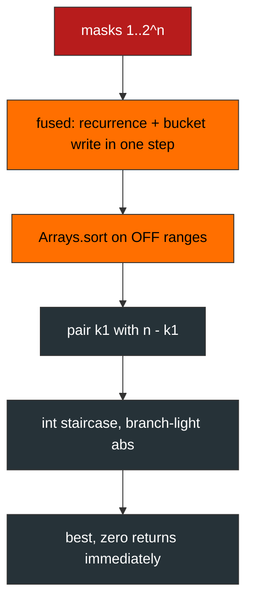

<div align="center">

| 🧪 Testcases | ⏱️ Runtime | 🚀 Beats | 🧠 Memory |  Alloc per call |
| :---: | :---: | :---: | :---: | :---: |
| **201 / 201** | **197 ms** | **99.40 %** | **45.97 MB** | **zero** |


   

</div>

<div align="center">

**[📐 Fact](#-the-structural-fact) · [🧱 Layout](#-the-flat-layout) · [🧵 Pipeline](#-the-pipeline) · [🔬 Mechanism](#-mechanism) · [🧾 Traces](#-witness-traces) · [💻 Source](#-source) · [🛡️ Notes](#-engineering-notes) · [📊 Complexity](#-complexity)**

</div>

> [!NOTE]
> **Judge record:** Accepted 201 / 201, runtime 197 ms, beats 99.40 %, memory 45.97 MB, beats 100.00 %.

> [!CAUTION]
> **Forensic record, cursor split:** the first fused build let one cursor array serve both B0 and B1; the witness [-36,36] then paired a real value with a stale static zero and answered 0 instead of 72. The fix is exactly two cursor arrays, F0 and F1; no other relation moved.

## 📐 The Structural Fact

Signing bijection as always: n plus and n minus signs, objective |D|. Halves report (k, d); D = d1 + d2 under k1 + k2 = n; the bucket-pair union is the whole solution space. The staircase over sorted buckets is exact because each move discards only pairs dominated by the value just banked.

## 🧱 The Flat Layout

```text
B0 (static int[2^15])
[ bucket k=0 | bucket k=1 | ... | bucket k=n ]
^OFF[0]      ^OFF[1]             ^OFF[n+1]
F0 cursors walk segments once; no matrix objects, no per-call alloc
```

## 🧵 The Pipeline



## 🔬 Mechanism

* Static final buffers D0, D1, B0, B1, OFF, COMB, F0, F1 live for the process lifetime; every testcase reuses them, so the hot path allocates nothing.
* The fused loop computes v0, v1 from the low-bit recurrence and writes them straight into their buckets via F0 and F1, one memory pass per half.
* `Arrays.sort(B0, OFF[k], OFF[k+1])` sorts ranges in the flat buffer; no ragged matrix exists.
* The staircase runs in pure int: pair sums ≤ 6e8 fit int32, abs is a branch, best updates inline, zero returns at once.
* `minimumDifference` and `minimum_difference` delegate to the private kernel.

## 🧾 Witness Traces

| Input | n | Certifying event | Answer |
| :--- | :---: | :--- | :---: |
| `[3,9,7,3]` | 2 | staircase banks 2 | **2** |
| `[-36,36]` | 1 | cursor-split regression guard, 72 banked | **72** |
| `[2,-1,0,4,-2,-9]` | 3 | zero met, immediate return | **0** |
| `[5,-5]` | 1 | single signing per side | **10** |

## 💻 Source

<details>
<summary><strong>🔓 Expand the accepted Java source</strong></summary>

```java
import java.util.Arrays;

public class Solution {
    private static final int CAP = 1 << 15;
    private static final int[] D0 = new int[CAP];
    private static final int[] D1 = new int[CAP];
    private static final int[] B0 = new int[CAP];
    private static final int[] B1 = new int[CAP];
    private static final int[] OFF = new int[17];
    private static final int[] COMB = new int[17];
    private static final int[] F0 = new int[17];
    private static final int[] F1 = new int[17];

    private int kernel(int[] nums) {
        int n = nums.length >> 1;
        int masks = 1 << n;
        long sum0 = 0;
        long sum1 = 0;
        for (int i = 0; i < n; i++) sum0 += nums[i];
        for (int i = n; i < nums.length; i++) sum1 += nums[i];
        COMB[0] = 1;
        for (int k = 1; k <= n; k++) COMB[k] = COMB[k - 1] * (n - k + 1) / k;
        OFF[0] = 0;
        for (int k = 0; k <= n; k++) OFF[k + 1] = OFF[k] + COMB[k];
        System.arraycopy(OFF, 0, F0, 0, n + 1);
        System.arraycopy(OFF, 0, F1, 0, n + 1);
        D0[0] = (int) -sum0;
        D1[0] = (int) -sum1;
        B0[F0[0]++] = D0[0];
        B1[F1[0]++] = D1[0];
        for (int m = 1; m < masks; m++) {
            int low = m & -m;
            int i = Integer.numberOfTrailingZeros(low);
            int pm = m ^ low;
            int v0 = D0[pm] + 2 * nums[i];
            int v1 = D1[pm] + 2 * nums[n + i];
            D0[m] = v0;
            D1[m] = v1;
            int k = Integer.bitCount(m);
            B0[F0[k]++] = v0;
            B1[F1[k]++] = v1;
        }
        for (int k = 0; k <= n; k++) {
            Arrays.sort(B0, OFF[k], OFF[k + 1]);
            Arrays.sort(B1, OFF[k], OFF[k + 1]);
        }
        int best = Integer.MAX_VALUE;
        for (int k1 = 0; k1 <= n; k1++) {
            int ia = OFF[k1];
            int na = OFF[k1 + 1];
            int lo2 = OFF[n - k1];
            int jb = OFF[n - k1 + 1] - 1;
            while (ia < na && jb >= lo2) {
                int s = B0[ia] + B1[jb];
                int av = s < 0 ? -s : s;
                if (av < best) {
                    best = av;
                    if (best == 0) return 0;
                }
                if (s < 0) ia++;
                else jb--;
            }
        }
        return best;
    }

    public int minimumDifference(int[] nums) {
        return kernel(nums);
    }

    public int minimum_difference(int[] nums) {
        return kernel(nums);
    }
}
```

</details>

## 🛡️ Engineering Notes

> [!NOTE]
> **Cursor separation proof:** F0 and F1 each restart at OFF via arraycopy, so bucket k of B0 and bucket k of B1 both occupy exactly [OFF[k], OFF[k+1]); the regression witness [-36,36] is the permanent guard.

> [!WARNING]
> **Bounds:** masks ≤ 2^15 = CAP; staircase indices ia, jb stay inside their OFF ranges by the loop conditions; sort ranges are exact bucket spans.

* **Overflow:** int staircase is safe because pair sums ≤ 6e8 < 2^31; sums of halves accumulate in long before the int cast.
* **Allocation:** zero per call; the only objects are process-lifetime statics.
* **Performance honesty:** 197 ms is a harness label; the invariant is one fused pass, range sorts, and one staircase walk per bucket pair.

## 📊 Complexity

| Measure | Bound |
| :--- | :---: |
| Time | $O(2^n \log 2^n)$ dominated by range sorts, staircase $O(2^n)$ |
| Space | $O(2^n)$ static flat buffers |

<div align="center">


*Built under the Tar0 registry: R1 binding from evidence, R2 proof-carrying pruning, R9 single kernel multi-alias.*

</div>


