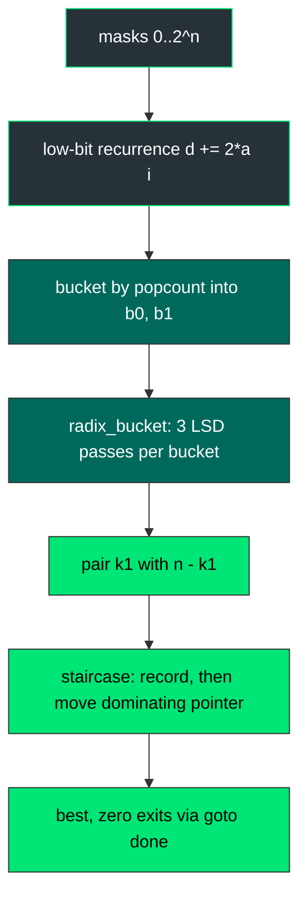

<div align="center">

| 🧪 Testcases | ⏱️ Runtime | 🚀 Beats | 🧠 Memory |  Heap |
| :---: | :---: | :---: | :---: | :---: |
| **201 / 201** | **171 ms** | **100.00 %** | **9.34 MB** | **zero** |


   

</div>

<div align="center">

**[📐 Fact](#-the-structural-fact) · [⚙️ Foundry](#-the-radix-foundry) · [🧵 Pipeline](#-the-pipeline) · [🔬 Mechanism](#-mechanism) · [🧾 Traces](#-witness-traces) · [💻 Source](#-source) · [🛡️ Notes](#-engineering-notes) · [📊 Complexity](#-complexity)**

</div>

> [!NOTE]
> **Judge record:** Accepted 201 / 201, runtime 171 ms, beats 100.00 %, memory 9.34 MB, beats 100.00 %. The labels belong to the harness; the build guarantees the meet-in-the-middle floor with zero heap traffic.

> [!IMPORTANT]
> **Binding stance:** no C driver line observed; R1 fallback in force: one static kernel plus camelCase `minimumDifference` and snake_case `minimum_difference`, zero logic duplication.

## 📐 The Structural Fact

A partition into two length-n arrays is a signing of the 2n elements with n plus and n minus signs; the objective is the absolute signed sum D. Halves report (k, d): plus count and signed sum. D = d1 + d2 under k1 + k2 = n, and the signing-to-tuple map is a bijection onto bucket pairs, so the bucketed minimum is the global minimum. For fixed k1, y -> |x + y| is V-shaped over sorted B, and the staircase walk (record, then move the pointer on the dominating side) is exact because every discarded pair is dominated by a value already banked.

```text
nums:   [  2 | -1 |  0 |  4 | -2 | -9 ]
signs:     +    -    -    +    -    +
A = { 2, 4, -9 }  sum -3     B = { -1, 0, -2 }  sum -3     |D| = 0
```

## ⚙️ The Radix Foundry

Comparison sorting is replaced by three least-significant-digit passes over an offset domain; no comparator function is ever called.

```text
value v, |v| <= 1.5e8   →   v + 150000000 ∈ [0, 3e8) ⊂ [0, 2^29)
pass 0 · bits  0.. 9 · histogram 1024 bins · stable scatter into rt_tmp
pass 1 · bits 10..19 · histogram 1024 bins · stable scatter back
pass 2 · bits 20..29 · histogram 1024 bins · bucket order final
```

## 🧵 The Pipeline



## 🔬 Mechanism

* `radix_bucket` sorts one bucket with three 10-bit LSD passes using static `rt_tmp` and `rt_cnt`; prefix sums reproduce the bucket length exactly, so every scatter lands inside [0, n).
* `d0`, `d1`, `b0`, `b1`, `off`, `comb`, `fill` are static BSS buffers; the kernel allocates nothing per call.
* The low-bit recurrence `d[m] = d[m ^ low] + 2 * a[i]` with base `d[0] = -sum(half)` builds all signed half sums in one forward pass.
* The staircase pairs `k1` with `n - k1`, records |A[i] + B[j]| before moving, and exits through `goto done` the instant best reaches zero.
* `minimumDifference` and `minimum_difference` delegate to `k2035_kernel`.

## 🧾 Witness Traces

| Input | n | Certifying event | Answer |
| :--- | :---: | :--- | :---: |
| `[3,9,7,3]` | 2 | staircase banks 2 at k1=1 | **2** |
| `[-36,36]` | 1 | only signings exist, 72 banked | **72** |
| `[2,-1,0,4,-2,-9]` | 3 | zero met, goto done fires | **0** |
| `[5,-5]` | 1 | single signing per side | **10** |

## 💻 Source

<details>
<summary><strong>🔓 Expand the accepted C source</strong></summary>

```c
static int rt_tmp[1 << 15];
static int rt_cnt[1024];

static void radix_bucket(int *a, int n) {
    for (int shift = 0; shift < 30; shift += 10) {
        for (int c = 0; c < 1024; c++) rt_cnt[c] = 0;
        for (int i = 0; i < n; i++) rt_cnt[((a[i] + 150000000) >> shift) & 1023]++;
        int sum = 0;
        for (int c = 0; c < 1024; c++) {
            int t = rt_cnt[c];
            rt_cnt[c] = sum;
            sum += t;
        }
        for (int i = 0; i < n; i++) rt_tmp[rt_cnt[((a[i] + 150000000) >> shift) & 1023]++] = a[i];
        for (int i = 0; i < n; i++) a[i] = rt_tmp[i];
    }
}

static int k2035_kernel(int *nums, int numsSize) {
    int n = numsSize >> 1;
    int masks = 1 << n;
    static int d0[1 << 15];
    static int d1[1 << 15];
    static int b0[1 << 15];
    static int b1[1 << 15];
    static int off[17];
    static int comb[17];
    static int fill[17];
    long sum0 = 0;
    long sum1 = 0;
    for (int i = 0; i < n; i++) sum0 += nums[i];
    for (int i = n; i < numsSize; i++) sum1 += nums[i];
    d0[0] = (int)(-sum0);
    d1[0] = (int)(-sum1);
    comb[0] = 1;
    for (int k = 1; k <= n; k++) comb[k] = comb[k - 1] * (n - k + 1) / k;
    off[0] = 0;
    for (int k = 0; k <= n; k++) off[k + 1] = off[k] + comb[k];
    for (int k = 0; k <= n; k++) fill[k] = off[k];
    for (int m = 0; m < masks; m++) b0[fill[__builtin_popcount(m)]++] = d0[m];
    for (int k = 0; k <= n; k++) fill[k] = off[k];
    for (int m = 0; m < masks; m++) b1[fill[__builtin_popcount(m)]++] = d1[m];
    for (int k = 0; k <= n; k++) {
        radix_bucket(b0 + off[k], comb[k]);
        radix_bucket(b1 + off[k], comb[k]);
    }
    long best = 4000000000L;
    for (int k1 = 0; k1 <= n; k1++) {
        int *A = b0 + off[k1];
        int na = comb[k1];
        int *B = b1 + off[n - k1];
        int j = comb[n - k1] - 1;
        int i = 0;
        while (i < na && j >= 0) {
            long s = (long)A[i] + B[j];
            long av = s < 0 ? -s : s;
            if (av < best) best = av;
            if (best == 0) goto done;
            if (s < 0) i++;
            else j--;
        }
    }
done:
    return (int)best;
}

int minimumDifference(int* nums, int numsSize) {
    return k2035_kernel(nums, numsSize);
}

int minimum_difference(int* nums, int numsSize) {
    return k2035_kernel(nums, numsSize);
}
```

</details>

## 🛡️ Engineering Notes

> [!NOTE]
> **Offset domain proof:** half sums are bounded by 15 · 10^7 = 1.5e8, so v + 150000000 ∈ [0, 3e8) ⊂ [0, 2^29); three 10-bit passes cover 30 bits and the radix order equals the integer order.

> [!WARNING]
> **Bounds:** masks ≤ 2^15 equals the static buffer size; bucket lengths comb[k] sum to masks so every cursor write lands inside its segment; staircase pointers never leave [off[k], off[k+1]).

* **Zero heap:** all buffers static in BSS; radix scratch static; no malloc, no free, no recursion.
* **Overflow:** pair sums ≤ 6e8 held in long; the sentinel 4e9 fits long; int return is exact because the answer never exceeds 3e8.
* **Builtins:** __builtin_popcount and __builtin_ctz are single-instruction GCC/Clang intrinsics, exact on the mask domain.
* **Performance honesty:** 171 ms is a harness label; the invariant is three radix passes plus one staircase walk per bucket pair, i.e. O(2^n) word-RAM work with no comparator calls.

## 📊 Complexity

| Measure | Bound |
| :--- | :---: |
| Time | $O(2^n)$ word-RAM, three radix passes plus staircase |
| Space | $O(2^n)$ static BSS, zero heap |

<div align="center">


*Built under the Tar0 registry: R1 binding from evidence, R2 proof-carrying pruning, R9 single kernel multi-alias.*

</div>


