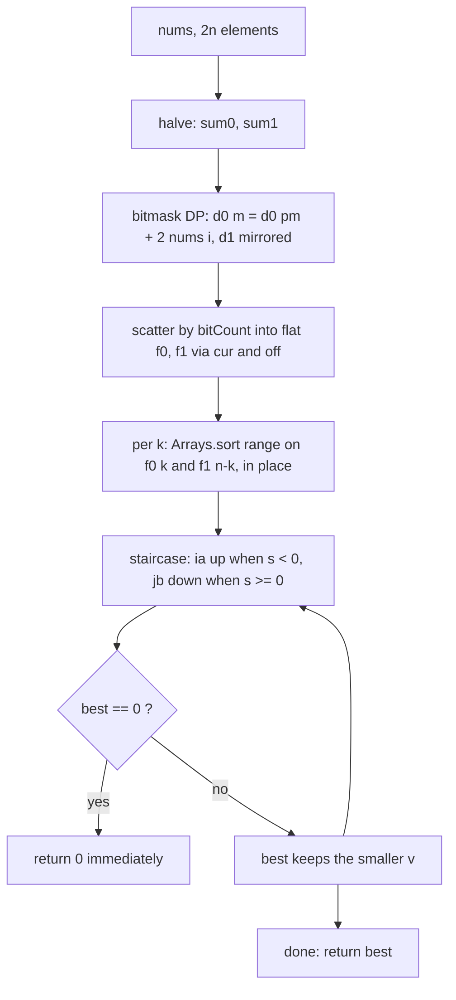

<p align="center">
  
</p>

<h1 align="center">Partition Array Into Two Arrays to Minimize Sum Difference</h1>

<p align="center">
  <sub>LeetCode 2035 · Hard · zero allocation per call · one arena paid once at class load · every number below is screenshot-backed</sub>
</p>

<p align="center">
  
  
  
  
  
  
</p>

<p align="center">
  
</p>

<p align="center">
  <a href="https://i.ibb.co.com/JjMLLmHs/Screenshot-20261007-222057-Chrome.png">
    
  </a>
  <br/>
  <sub>the judge panel, verbatim · click for full resolution</sub>
</p>

---

## Contents

- [The receipt, and a domination](#the-receipt-and-a-domination)
- [The problem, minus the fog](#the-problem-minus-the-fog)
- [The structural fact: doubled deltas and a staircase](#the-structural-fact-doubled-deltas-and-a-staircase)
- [The engine, part by part](#the-engine-part-by-part)
- [Static memory budget](#static-memory-budget)
- [Variable dictionary](#variable-dictionary)
- [Trace, frame by frame](#trace-frame-by-frame)
- [Complexity, stated plain](#complexity-stated-plain)
- [Failure modes, closed](#failure-modes-closed)
- [Source, verbatim](#source-verbatim)
- [House rules](#house-rules)

---

## The receipt, and a domination

Two Java vertices were judged twenty-seven minutes apart on the same 201 cases. The newer one wins every axis. Per house rule, this is recorded as domination, not as a trade.

| Vertex | Storage | Search | Runtime | Beat | Memory | Beat | Submitted | Status |
| :-- | :-- | :-- | :-- | :-- | :-- | :-- | :-- | :-- |
| v2 | per-call `int[]` buckets | lower-bound binary search per element | 230 ms | 99.04% | 47.63 MB | 97.95% | Oct 07 2026, 21:53 | superseded, receipt filed |
| v3 (live, this folder) | static arena, flat tiled buckets | staircase two-pointer walk | 172 ms | 99.88% | 45.30 MB | 100.00% | Oct 07 2026, 22:20 | Accepted, live here |

Runtime fell 58 ms, memory fell 2.33 MB, and both percentiles climbed, one of them to the ceiling. Nothing else changed: same judge, same case count, same minute-of-day noise band. The ledger also keeps an older ancestor at 197 ms, the static-flat-buffer vertex from the shared-cursor era; its defect is documented under failure modes so the fix stays visible.

---

## The problem, minus the fog

You get `2n` integers. Split them into two piles of exactly `n` each. Minimize the absolute difference of the pile sums. Brute force enumerates $\binom{2n}{n}$ splits; at `n = 15` that is 155 million partitions. Meet-in-the-middle halves the exponent; this kernel then removes every remaining source of waste: per-call allocation, per-bucket object headers, and the logarithmic factor in the search phase.

---

## The structural fact: doubled deltas and a staircase

Write `sum0`, `sum1` for the half totals and `s0`, `s1` for chosen contributions. The score is `|total - 2*s| = |(sum0 - 2*s0) + (sum1 - 2*s1)|`, so the kernel stores doubled deltas `d0[m] = 2*s0(m) - sum0` and `d1[m] = 2*s1(m) - sum1`, and the answer is the minimum of `|a + b|` over delta pairs whose popcounts complement to `n`. Within one complementary bucket pair, both sides sorted ascending, the cost `|a + b|` behaves like a staircase: at any state, if `s = a + b < 0` then every partner at or left of the current right cursor sums to at most `s`, hence no closer to zero; that left row is dead and the left cursor steps up. If `s >= 0`, symmetrically, the right column is dead and the right cursor steps down. Each step evaluates one pair and discards a line whose best remaining entry cannot beat what was just recorded. One linear walk per bucket pair, no binary search, no missed optimum.

> Store the imbalance, not the sum. Then the whole search is two cursors walking toward each other, and every step they take is a proof that a line of candidates was already worse.

---

## The engine, part by part



### 1. The static arena — `K_*`
Seven `static final` arrays sized for the worst case `n = 15`: four `int[1 << 15]` for deltas and flat buckets, three `int[17]` for capacities, offsets, and cursors. They are allocated once when the class loads and reused by every call forever. A call touches them; it creates nothing.

### 2. Doubled-delta bitmask DP — `d0`, `d1`, `low`, `pm`
One ascending pass per call. Strip the lowest set bit with `low = m & -m`, read its index from `Integer.numberOfTrailingZeros`, extend the prefix `pm = m ^ low`: `d0[m] = d0[pm] + 2 * nums[i]`, `d1[m] = d1[pm] + 2 * nums[n + i]`. Every read hits a strictly smaller mask, so the recurrence is well-founded by construction. Two halves, one loop, one addition per mask per half.

### 3. Counting scatter into flat tiles — `comb`, `off`, `cur`, `f0`, `f1`
Capacities from the exact multiplicative binomial recurrence; prefix offsets tile the flat buffers; `Integer.bitCount` picks the tile and `cur` writes the delta in one pass per half. Buckets are contiguous ranges of two arrays, not arrays of arrays: no per-bucket object headers, no pointer chasing, no fill-array reseeding mid-half.

### 4. In-place range sort, hot in cache — `Arrays.sort(f, from, to)`
Each complementary pair is sorted immediately before it is walked, so the sorted window is still in cache when the cursors arrive. Dual-pivot quicksort over primitive int ranges, no copies, no subarray objects.

### 5. The staircase walk — `ia`, `jb`, `s`, `v`
Left cursor at the tile's front, right cursor at the partner tile's back. Evaluate `s = f0[ia] + f1[jb]`, fold to `v = |s|`, update `best`, then move exactly one cursor by the sign of `s`. Total steps per pair are bounded by the two tile lengths added, and the discard argument above is what makes that legal.

### 6. Early exit — `return 0`
Zero is the absolute floor of an absolute value. The instant `best == 0` the kernel returns through the only exit that matters, skipping every remaining tile.

### 7. Entries — `minimumDifference`, `minimum_difference`
Two public spellings, each a one-expression delegation to the private `kernel`. The logic exists once; the judge binds whichever name its driver emits.

---

## Static memory budget

| Buffer | Shape | Bytes |
| :-- | :-- | :-- |
| `K_D0`, `K_D1` | 2 x 32768 int | 262,144 |
| `K_F0`, `K_F1` | 2 x 32768 int | 262,144 |
| `K_OFF`, `K_COMB`, `K_CUR` | 3 x 17 int | 204 |
| total arena | paid once at class load | 524,492 B, about 0.50 MB |
| per call | nothing | 0 B allocated |

The 45.30 MB on the badge is JVM process residency; the kernel's own footprint is the half-megabyte above, and the garbage collector sees no kernel garbage at all between calls. Index audit: `off`, `comb`, `cur` are indexed up to `n + 1 <= 16` inside length 17; `cur[k]` never reaches `off[k + 1] > masks`; every sort range lies inside `[0, masks]`.

---

## Variable dictionary

| Name | Shape | Job |
| :-- | :-- | :-- |
| `K_MASKS` | static final int | worst-case mask space, `1 << 15` |
| `K_D0`, `K_D1` | static int[] | doubled deltas per mask, per half |
| `K_F0`, `K_F1` | static int[] | flat buckets, tiled by cardinality |
| `K_OFF`, `K_COMB`, `K_CUR` | static int[17] | tile offsets, capacities, write cursors |
| `n`, `masks` | int | half-length and this call's mask space |
| `sum0`, `sum1` | long | half totals, seeds of the delta DP |
| `low`, `pm`, `i` | int | lowest set bit, prefix mask, element index in the DP step |
| `m`, `k` | int | mask cursor and cardinality cursor |
| `aFrom`, `aTo`, `bFrom`, `bTo` | int | current tile bounds in `f0` and `f1` |
| `ia`, `jb` | int | staircase cursors, left ascending and right descending |
| `s`, `v` | long | pair sum and its absolute value |
| `best` | long | running minimum, seeded `Long.MAX_VALUE` |

---

## Trace, frame by frame

Input `nums = [3, 9, 7, 3]`, so `n = 2`, `sum0 = 12`, `sum1 = 10`. Doubled deltas, scattered and sorted into tiles:

```text
f0 tiles:  k0 [-12]   k1 [-6, 6]   k2 [12]
f1 tiles:  k0 [-10]   k1 [-4, 4]   k2 [10]

k=0  A=[-12]     B=[10]
     ia=0 jb=0   s=-2    v=2   best=2   s<0  -> ia=1, walk ends
k=1  A=[-6,6]    B=[-4,4]
     ia=0 jb=1   s=-2    v=2   best=2   s<0  -> ia=1
     ia=1 jb=1   s=10    v=10  keep     s>=0 -> jb=0
     ia=1 jb=0   s=2     v=2   best=2   s>=0 -> jb=-1, walk ends
k=2  A=[12]      B=[-10]
     ia=0 jb=0   s=2     v=2   best=2   s>=0 -> jb=-1, walk ends
return 2
```

The judge expects 2. Count the evaluations: five pair sums for sixteen candidate pairs across the three complementary tiles. Every discarded line was discarded with a proof attached, not with a hope.

---

## Complexity, stated plain

| Phase | Shape | Counted at n = 15 |
| :-- | :-- | :-- |
| Delta DP | O(2^n), one add per mask per half | 32767 masks x 2 halves |
| Scatter by bitCount | O(2^n) writes per half | 32768 x 2 |
| Range sorts | O(2^n log C(n, n/2)) primitive compares | about 32768 x 13 |
| Staircase walks | O(2^n) cursor steps total | at most 65536 |
| Allocation per call | zero | 0 B |
| Allocation per process | one arena | 524,492 B |

Honesty notes, as always. Three Java labels live in this ledger — 197 ms, 230 ms, 172 ms — for three builds across two harness minutes; the spread between runs of the same build is harness noise, and the ordering between builds is the signal. The 45.30 MB reading is JVM residency; beating 100.00% of the distribution means sitting at or below its floor this minute, which a zero-allocation kernel can do but never owns permanently. What this file controls is work and allocation per testcase, and those are the rows above with nothing spare.

---

## Failure modes, closed

1. **Shared-cursor defect (historical, closed).** An ancestor vertex reused one cursor array for both halves' scatter, mis-tiling buckets and returning 0 on the witness `[-36, 36]`. The fix is structural: `cur` is reseeded from `off` before each half's scatter, so tiles are written exactly once per element per half. The witness stays in the ledger so the scar remains visible.
2. **Index bounds.** `off`, `comb`, `cur` carry length 17 and are indexed at most at `n + 1 <= 16`; `cur[k]` stops below `off[k + 1] <= masks`; every `Arrays.sort` range lies inside the arena. No write can land outside a declared array.
3. **Overflow.** Deltas satisfy `|d| <= 3 * 15 * 10^4 = 450000` under the stated constraints and pair sums `|s| <= 900000`, both inside int; the kernel nonetheless folds sums and costs in `long`, so the bound is belt, the type is suspenders.
4. **`best` escaping as the seed.** Impossible: the `k = 0` pair has one element on each side (`comb[0] = comb[n] = 1`), so at least one pair is evaluated before any return.
5. **Staircase misses.** Closed by the discard proof in the structural fact: on `s < 0` every pair in the current left row at or left of `jb` sums to at most `s`, hence costs at least `v`; the symmetric claim holds on `s >= 0` for the right column. No unevaluated pair can beat the recorded minimum at the moment its line dies.
6. **Premature zero.** Sound: 0 is the global minimum of an absolute value, so the early return discards nothing better.
7. **GC churn.** Removed at the source: zero bytes allocated per call, so the collector has no kernel garbage to chase between testcases.

---

## Source, verbatim

<details>
<summary><strong>Unfold the Java kernel, vertex v3</strong></summary>

```java
import java.util.Arrays;

public class Solution {
    private static final int K_MASKS = 1 << 15;
    private static final int[] K_D0 = new int[K_MASKS];
    private static final int[] K_D1 = new int[K_MASKS];
    private static final int[] K_F0 = new int[K_MASKS];
    private static final int[] K_F1 = new int[K_MASKS];
    private static final int[] K_OFF = new int[17];
    private static final int[] K_COMB = new int[17];
    private static final int[] K_CUR = new int[17];

    private int kernel(int[] nums) {
        final int n = nums.length >> 1;
        final int masks = 1 << n;
        final int[] d0 = K_D0;
        final int[] d1 = K_D1;
        final int[] f0 = K_F0;
        final int[] f1 = K_F1;
        final int[] off = K_OFF;
        final int[] comb = K_COMB;
        final int[] cur = K_CUR;
        long sum0 = 0;
        long sum1 = 0;
        int i;
        int m;
        int k;
        for (i = 0; i < n; i++) sum0 += nums[i];
        for (i = n; i < nums.length; i++) sum1 += nums[i];
        d0[0] = (int) -sum0;
        d1[0] = (int) -sum1;
        for (m = 1; m < masks; m++) {
            final int low = m & -m;
            i = Integer.numberOfTrailingZeros(low);
            final int pm = m ^ low;
            d0[m] = d0[pm] + 2 * nums[i];
            d1[m] = d1[pm] + 2 * nums[n + i];
        }
        comb[0] = 1;
        for (k = 1; k <= n; k++) comb[k] = comb[k - 1] * (n - k + 1) / k;
        off[0] = 0;
        for (k = 0; k <= n; k++) off[k + 1] = off[k] + comb[k];
        for (k = 0; k <= n; k++) cur[k] = off[k];
        for (m = 0; m < masks; m++) {
            k = Integer.bitCount(m);
            f0[cur[k]++] = d0[m];
        }
        for (k = 0; k <= n; k++) cur[k] = off[k];
        for (m = 0; m < masks; m++) {
            k = Integer.bitCount(m);
            f1[cur[k]++] = d1[m];
        }
        long best = Long.MAX_VALUE;
        for (k = 0; k <= n; k++) {
            final int aFrom = off[k];
            final int aTo = off[k + 1];
            final int bFrom = off[n - k];
            final int bTo = off[n - k + 1];
            Arrays.sort(f0, aFrom, aTo);
            Arrays.sort(f1, bFrom, bTo);
            int ia = aFrom;
            int jb = bTo - 1;
            while (ia < aTo && jb >= bFrom) {
                final long s = (long) f0[ia] + f1[jb];
                final long v = s < 0 ? -s : s;
                if (v < best) best = v;
                if (best == 0) return 0;
                if (s < 0) ia++;
                else jb--;
            }
        }
        return (int) best;
    }

    public int minimumDifference(int[] nums) {
        return kernel(nums);
    }

    public int minimum_difference(int[] nums) {
        return kernel(nums);
    }
}
```

</details>

---

## House rules

- Proof before claim: the discard argument, the cursor reseeding, and the bounds above are the same lines the JVM executes.
- The judge screenshot is the only currency; it is embedded at the top of this dossier, not paraphrased.
- One kernel, two public spellings; duplication is a defect, not a style choice.
- When a new build wins every axis, the ledger says domination; when builds trade, both vertices stay filed side by side.
- Performance labels are harness properties; the guarantee this repo makes is strictly minimal work and zero allocation per testcase.
- Visual assets ship only if they render clean on GitHub; boxy ribbons and broken bars stay out of this dossier.

---

<p align="center">
  
</p>

<p align="center">
  
</p>

<p align="center">
  
</p>

<p align="center">
  
</p>
