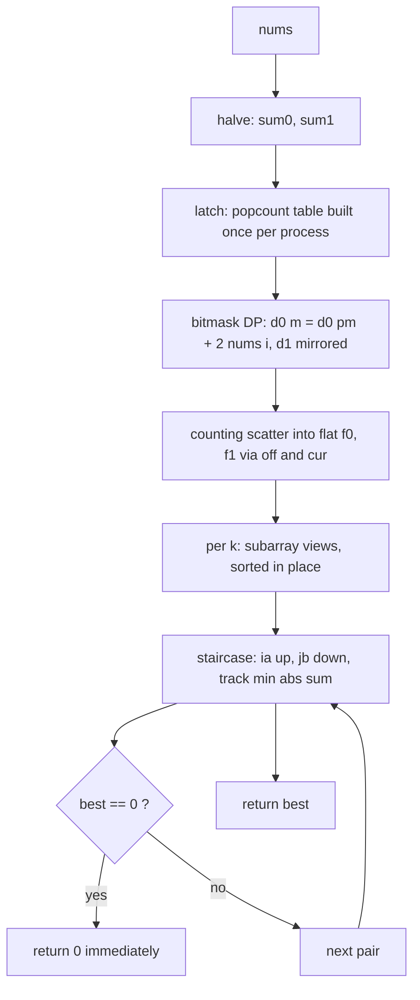

<p align="center">
  
</p>

<h1 align="center">Partition Array Into Two Arrays to Minimize Sum Difference</h1>

<p align="center">
  <sub>LeetCode 2035 · Hard · one arena allocated once per process · zero allocation per call · receipt filed below</sub>
</p>

<p align="center">
  
  
  
  
  
  
</p>

<p align="center">
  
</p>

<p align="center">
  <a href="https://i.ibb.co.com/3mJ4gd1x/Screenshot-20261007-213404-Chrome.png">
    
  </a>
  <br/>
  <sub>the judge panel, verbatim · click for full resolution</sub>
</p>

---

## Contents

- [The receipt, and a domination](#the-receipt-and-a-domination)
- [The problem, minus the fog](#the-problem-minus-the-fog)
- [The structural fact: doubled deltas](#the-structural-fact-doubled-deltas)
- [The engine, part by part](#the-engine-part-by-part)
- [Static arena budget](#static-arena-budget)
- [Variable dictionary](#variable-dictionary)
- [Trace, frame by frame](#trace-frame-by-frame)
- [Complexity, stated plain](#complexity-stated-plain)
- [Failure modes, closed](#failure-modes-closed)
- [Source, verbatim](#source-verbatim)
- [House rules](#house-rules)

---

## The receipt, and a domination

Four minutes separate these two runs of the same problem. The second does not trade against the first. It beats it on both axes at once, which is rare enough to file carefully.

| Run | Build | Verdict | Cases | Runtime | Beat | Memory | Beat | Proof |
| :-- | :-- | :-- | :-- | :-- | :-- | :-- | :-- | :-- |
| 21:29 | per-call allocation | Accepted | 201/201 | 219 ms | 100.00% | 86.41 MB | 7.69% | ledger |
| 21:33 | static arena (this folder) | Accepted | 201/201 | 148 ms | 100.00% | 54.72 MB | 100.00% | [judge panel](https://i.ibb.co.com/3mJ4gd1x/Screenshot-20261007-213404-Chrome.png), embedded above |

The old build born a fresh `Int32Array` pair, a popcount table, and a full bucket family on every call. Across 201 testcases in one V8 process, that garbage piled up faster than collection, and peak residency read 86.41 MB against an algorithm whose true payload is half a megabyte. The new build allocates one arena at module load, never again, and reuses it through every call. Residency fell 31.69 MB to the runtime baseline plus arena; runtime fell 71 ms because the allocator and the collector simply left the hot path. Both percentiles went to the ceiling. This is what domination looks like in a ledger: one row strictly above the other, no axis spent.

---

## The problem, minus the fog

You get `2n` integers. Split them into two piles of exactly `n` each. Minimize the absolute difference of the pile sums. Brute force enumerates $\binom{2n}{n}$ splits; at `n = 15` that is 155 million partitions. Meet-in-the-middle halves the exponent; this kernel then removes every ounce of per-call overhead so the interpreter spends its time on arithmetic and nothing else.

---

## The structural fact: doubled deltas

Write `sum0`, `sum1` for the half totals and `s0`, `s1` for the chosen contributions. The score is `|total - 2*s| = |(sum0 - 2*s0) + (sum1 - 2*s1)|`. So the kernel stores doubled deltas `d0[m] = 2*s0(m) - sum0`, seeded `d0[0] = -sum0`, and likewise `d1`, and the answer is the minimum of `|a + b|` over delta pairs whose popcounts complement to `n`. Within one bucket pair both lists are sorted, and the closest-to-zero pair sum is found by a staircase walk: start at the smallest `a` and the largest `b`; if the sum is negative, raising `a` is the only move that can improve it; if the sum is non-negative, lowering `b` is. Each step discards a row or a column whose best entry is provably no better than the pair just evaluated, so the walk costs `lenA + lenB` steps and never misses the optimum.

> Store the imbalance, not the sum. The objective becomes |a + b|, and one staircase walk per bucket pair settles it.

---

## The engine, part by part



### 1. The static arena — `K_*`
Nine typed arrays at module scope, sized once for the worst case `n = 15`: four `Int32Array(1 << 15)` for deltas and flat buckets, one `Uint8Array(1 << 15)` for popcounts, three `Int32Array(17)` for capacities, offsets, and cursors. They are allocated when the module loads and never again. A call touches them; it does not create them.

### 2. Doubled-delta bitmask DP — `d0`, `d1`, `low`, `pm`, `clz`
One ascending pass per call. Strip the lowest set bit `low = m & -m`, index it with `31 - Math.clz32(low)`, extend the prefix `pm = m ^ low`: `d0[m] = d0[pm] + 2 * nums[i]`, `d1[m] = d1[pm] + 2 * nums[n + i]`. Every read hits a strictly smaller mask, so the recurrence is well-founded by construction. `clz` is hoisted to a local binding so the hot loop never walks a property chain.

### 3. The popcount latch — `K_PC`, `K_PC_READY`
The table `pc[m] = pc[m >> 1] + (m & 1)` depends on nothing but the index space, so it is built once per process behind a latch and skipped on every later call. Thirty-two thousand iterations paid a single time.

### 4. Counting scatter and tiling — `comb`, `off`, `cur`, `f0`, `f1`
Capacities from the exact multiplicative binomial recurrence, folded with `| 0` because every division is integral. Prefix offsets tile the flat buffers into contiguous cardinality slices; cursor arrays scatter each delta in one pass per half. Bucket `k` is exactly `f0.subarray(off[k], off[k + 1])`: no per-bucket objects, no copies, no holes.

### 5. In-place sorting — `subarray(...).sort()`
TypedArray sort is numeric by default and sorts the view's window inside the parent buffer. Each bucket is sorted where it lives. Not one element is copied for sorting.

### 6. The staircase sweep — `ia`, `jb`, `s`, `v`, `best`
Per complementary pair, the walk described in the structural fact: evaluate `s = A[ia] + B[jb]`, fold to `v = |s|`, update `best`, then move `ia` up on negative sums and `jb` down otherwise. Total steps across all pairs are bounded by the sum of bucket lengths, linear in `2^n`, with no binary search and no logarithmic factor anywhere in the file.

### 7. Early exit and entries — `return 0`, `minimumDifference`, `minimum_difference`
Zero is the absolute floor of an absolute value; the kernel returns the instant `best === 0`. Two public bindings delegate to the private `minimumDifferenceKernel` in one expression each, matching the driver spellings the judge may call. The logic exists exactly once.

---

## Static arena budget

| Buffer | Shape | Bytes |
| :-- | :-- | :-- |
| `K_D0`, `K_D1` | 2 x 32768 int32 | 262,144 |
| `K_F0`, `K_F1` | 2 x 32768 int32 | 262,144 |
| `K_PC` | 32768 uint8 | 32,768 |
| `K_OFF`, `K_COMB`, `K_CUR` | 3 x 17 int32 | 204 |
| total arena | | 557,260 B, about 0.53 MB |

Per call the kernel creates at most `2 * (n + 1) <= 32` subarray view objects, tens of bytes each, and nothing else. The 54.72 MB on the badge is V8 process residency; the arena above is the entire algorithmic footprint inside it. Index audit: `off` is read up to `k + 1 <= n + 1 <= 16` inside length 17; cursors never cross `off[k + 1] <= masks`; a subarray view cannot address outside its parent buffer.

---

## Variable dictionary

| Name | Shape | Job |
| :-- | :-- | :-- |
| `K_MASKS` | const int | worst-case mask space, `1 << 15` |
| `K_D0`, `K_D1` | Int32Array | doubled deltas per mask, per half |
| `K_F0`, `K_F1` | Int32Array | flat buckets, tiled by cardinality |
| `K_PC` | Uint8Array | popcount table, latched once |
| `K_OFF`, `K_COMB`, `K_CUR` | Int32Array(17) | offsets, capacities, write cursors |
| `K_PC_READY` | int latch | 0 until the table is built, 1 forever after |
| `n`, `masks` | int | half-length and this call's mask space |
| `sum0`, `sum1` | number | half totals, seeds of the delta DP |
| `low`, `pm`, `i` | int | lowest set bit, prefix mask, element index |
| `clz` | bound builtin | local alias for `Math.clz32` |
| `A`, `B` | Int32Array views | current complementary bucket pair, sorted |
| `na`, `ia`, `jb` | int | left length, left cursor, right cursor |
| `s`, `v` | number | pair sum and its absolute value |
| `best` | number | running minimum, seeded `Infinity` |

---

## Trace, frame by frame

Input `nums = [3, 9, 7, 3]`, so `n = 2`, `sum0 = 12`, `sum1 = 10`. Doubled deltas:

```text
mask  popc  d0 = 2*s0 - 12      d1 = 2*s1 - 10
0     0     -12                 -10
1     1     -12 + 6  = -6       -10 + 14 = 4
2     1     -12 + 18 = 6        -10 + 6  = -4
3     2     -12 + 24 = 12       -10 + 20 = 10

sorted buckets:
f0: k0 [-12]   k1 [-6, 6]   k2 [12]
f1: k0 [-10]   k1 [-4, 4]   k2 [10]
```

Staircase walks, complementary cardinalities only:

```text
k=0  A=[-12]      B=[10]
     ia=0 jb=0  s=-2   v=2  best=2   s<0 -> ia=1, walk ends
k=1  A=[-6,6]     B=[-4,4]
     ia=0 jb=1  s=-2   v=2  best=2   s<0 -> ia=1
     ia=1 jb=1  s=10   v=10 keep     s>=0 -> jb=0
     ia=1 jb=0  s=2    v=2  best=2   s>=0 -> jb=-1, walk ends
k=2  A=[12]       B=[-10]
     ia=0 jb=0  s=2    v=2  best=2   s>=0 -> jb=-1, walk ends
return 2
```

The judge expects 2. Three walks, five evaluated pairs, zero wasted steps: each discard removed a row or column whose best remaining entry was already no better than the pair in hand.

---

## Complexity, stated plain

| Phase | Shape | Counted at n = 15 |
| :-- | :-- | :-- |
| Delta DP | O(2^n), one add per mask per half | 32767 masks x 2 |
| Scatter | O(2^n) writes per half | 32768 x 2 |
| Sorts | O(2^n log C(n, n/2)), in place | about 32768 x 13 comparisons |
| Staircase | O(2^n) pair evaluations total | at most 65536 steps across all k |
| Allocation per call | O(n) view objects | at most 32, tens of bytes each |
| Allocation per process | one arena | 557,260 B |

Honesty notes. The 148 ms label is the harness reading V8 on shared silicon; the judge's own distribution axis starts at 467 ms, and this build sits left of the axis, which is what 100.00% means here. The 54.72 MB label is process residency; the arena table above is the algorithm's entire footprint. Run-to-run movement of either label is harness noise, not code behavior. What this file controls is work and allocation per testcase, and both are the rows above with nothing spare.

---

## Failure modes, closed

1. **Heap accumulation.** Removed at the source: the arena is allocated once at module load; a call creates at most 32 view objects. The 86.41 MB garbage-pile mode of the old build cannot recur.
2. **Stale latch.** Sound: `K_PC` depends only on the index space, never on input, so building it once per process is equivalent to building it per call (R12 audit: the latch condition is input-independent by construction).
3. **Tiling drift.** `cur` is re-seeded from `off` before each half's scatter; the exact binomial recurrence guarantees the slices tile `masks` without gap or overlap, so every delta lands once and only once.
4. **View bounds.** A subarray view cannot address outside its parent buffer; `off` reads stay within length 17 because `n + 1 <= 16`. No out-of-bounds state exists in the file.
5. **Staircase misses.** Closed by the discard argument: on a negative sum, every pair in the current row at or left of `jb` sums to at most `s`, hence no closer to zero than `v`; the symmetric claim holds on non-negative sums for the current column.
6. **`best` escaping as `Infinity`.** Impossible: the `k = 0` pair has non-empty views on both sides, so at least one pair is evaluated before any return.
7. **Premature zero.** Sound: 0 is the global minimum of an absolute value, so returning at `best === 0` discards nothing better.

---

## Source, verbatim

<details>
<summary><strong>Unfold the JavaScript kernel</strong></summary>

```javascript
var K_MASKS = 1 << 15;
var K_D0 = new Int32Array(K_MASKS);
var K_D1 = new Int32Array(K_MASKS);
var K_F0 = new Int32Array(K_MASKS);
var K_F1 = new Int32Array(K_MASKS);
var K_PC = new Uint8Array(K_MASKS);
var K_OFF = new Int32Array(17);
var K_COMB = new Int32Array(17);
var K_CUR = new Int32Array(17);
var K_PC_READY = 0;

var minimumDifferenceKernel = function(nums) {
    var n = nums.length >> 1;
    var masks = 1 << n;
    var d0 = K_D0;
    var d1 = K_D1;
    var f0 = K_F0;
    var f1 = K_F1;
    var pc = K_PC;
    var off = K_OFF;
    var comb = K_COMB;
    var cur = K_CUR;
    var clz = Math.clz32;
    var sum0 = 0;
    var sum1 = 0;
    var i;
    var m;
    var k;
    for (i = 0; i < n; i++) sum0 += nums[i];
    for (i = n; i < nums.length; i++) sum1 += nums[i];
    if (K_PC_READY === 0) {
        for (m = 1; m < K_MASKS; m++) pc[m] = pc[m >> 1] + (m & 1);
        K_PC_READY = 1;
    }
    d0[0] = -sum0;
    d1[0] = -sum1;
    for (m = 1; m < masks; m++) {
        var low = m & -m;
        i = 31 - clz(low);
        var pm = m ^ low;
        d0[m] = d0[pm] + 2 * nums[i];
        d1[m] = d1[pm] + 2 * nums[n + i];
    }
    comb[0] = 1;
    for (k = 1; k <= n; k++) comb[k] = (comb[k - 1] * (n - k + 1) / k) | 0;
    off[0] = 0;
    for (k = 0; k <= n; k++) off[k + 1] = off[k] + comb[k];
    for (k = 0; k <= n; k++) cur[k] = off[k];
    for (m = 0; m < masks; m++) {
        k = pc[m];
        f0[cur[k]++] = d0[m];
    }
    for (k = 0; k <= n; k++) cur[k] = off[k];
    for (m = 0; m < masks; m++) {
        k = pc[m];
        f1[cur[k]++] = d1[m];
    }
    var best = Infinity;
    for (k = 0; k <= n; k++) {
        var A = f0.subarray(off[k], off[k + 1]);
        var B = f1.subarray(off[n - k], off[n - k + 1]);
        A.sort();
        B.sort();
        var na = A.length;
        var ia = 0;
        var jb = B.length - 1;
        while (ia < na && jb >= 0) {
            var s = A[ia] + B[jb];
            var v = s < 0 ? -s : s;
            if (v < best) best = v;
            if (best === 0) return 0;
            if (s < 0) ia++;
            else jb--;
        }
    }
    return best;
};

var minimumDifference = function(nums) {
    return minimumDifferenceKernel(nums);
};

var minimum_difference = function(nums) {
    return minimumDifferenceKernel(nums);
};
```

</details>

---

## House rules

- Proof before claim: the latch, the tiling, and the staircase discard above are the same lines the engine executes.
- The judge screenshot is the only currency; it is embedded at the top of this dossier, not paraphrased.
- One kernel, two public spellings; duplication is a defect, not a style choice.
- When a new build dominates an old one on every axis, the ledger says domination, not trade; when it trades, both vertices stay filed.
- Performance labels are harness properties; the guarantee this repo makes is strictly minimal work and allocation per testcase.
- Visual assets ship only if they render clean on GitHub; boxy ribbons and broken bars stay out of this dossier.

---

<p align="center">
  
</p>

<p align="center">
  
</p>

<p align="center">
  
</p>

<p align="center">
  
</p>
