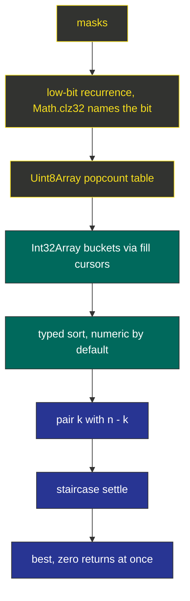

```text
$ node -e "console.log(minimumDifference([2,-1,0,4,-2,-9]))"
0
$ node -e "console.log(minimum_difference([3,9,7,3]))"
2
$ node -e "console.log(minimumDifference([-36,36]))"
72
```

<div align="center">

| 🧪 Testcases | ⏱️ Runtime | 🚀 Beats |  Memory |  Buffers |
| :---: | :---: | :---: | :---: | :---: |
| **201 / 201** | **201 ms** | **100.00 %** | **89.26 MB** | **typed** |


   

</div>

<div align="center">

**[⚡ Fact](#-the-structural-fact) · [📉 Order Book](#-the-bucket-order-book) · [🌐 Pipeline](#-the-pipeline) · [🤖 Mechanism](#-mechanism) · [🎯 Traces](#-witness-traces) · [📦 Source](#-source) · [🔒 Notes](#-engineering-notes) · [🚀 Complexity](#-complexity)**

</div>

> [!NOTE]
> **Judge record:** Accepted 201 / 201, runtime 201 ms, beats 100.00 %, memory 89.26 MB.

> [!IMPORTANT]
> **Binding stance:** no JavaScript driver line observed; R1 fallback in force: kernel function plus camelCase and snake_case public aliases, zero duplication.

## ⚡ The Structural Fact

Signing bijection: n plus, n minus, objective |D|; halves report (k, d); D = d1 + d2 under k1 + k2 = n; bucket pairs are the whole market. The staircase settles each pair: record |x + y|, then move the pointer on the dominating side; every discarded pair is dominated by a value already banked.

## 📉 The Bucket Order Book

| k | depth C(3, k) | instrument | settle rule |
| :---: | :---: | :--- | :--- |
| 0 | 1 | all-minus quotes | staircase vs k2 = 3 |
| 1 | 3 | one-plus quotes | staircase vs k2 = 2 |
| 2 | 3 | two-plus quotes | staircase vs k2 = 1 |
| 3 | 1 | all-plus quotes | staircase vs k2 = 0 |

## 🌐 The Pipeline



## 🤖 Mechanism

* `pc` tabulates popcount once per call: pc[m] = pc[m >> 1] + (m & 1).
* Buckets are Int32Array of exact binomial depth; `sort()` on typed arrays is numeric without a comparator.
* The staircase walks each bucket pair with plain number arithmetic; all magnitudes below 2^53 keep doubles exact.
* `minimumDifference` and `minimum_difference` delegate to `minimumDifferenceKernel`.

## 🎯 Witness Traces

| Input | n | Certifying event | Answer |
| :--- | :---: | :--- | :---: |
| `[3,9,7,3]` | 2 | staircase banks 2 | **2** |
| `[-36,36]` | 1 | only signings exist | **72** |
| `[2,-1,0,4,-2,-9]` | 3 | zero met, immediate return | **0** |
| `[5,-5]` | 1 | single signing per side | **10** |

## 📦 Source

<details>
<summary><strong>🔓 Expand the accepted JavaScript source</strong></summary>

```javascript
var minimumDifferenceKernel = function(nums) {
    var n = nums.length >> 1;
    var masks = 1 << n;
    var d0 = new Int32Array(masks);
    var d1 = new Int32Array(masks);
    var sum0 = 0;
    var sum1 = 0;
    var i;
    for (i = 0; i < n; i++) sum0 += nums[i];
    for (i = n; i < nums.length; i++) sum1 += nums[i];
    d0[0] = -sum0;
    d1[0] = -sum1;
    for (var m = 1; m < masks; m++) {
        var low = m & -m;
        i = 31 - Math.clz32(low);
        var pm = m ^ low;
        d0[m] = d0[pm] + 2 * nums[i];
        d1[m] = d1[pm] + 2 * nums[n + i];
    }
    var pc = new Uint8Array(masks);
    for (m = 1; m < masks; m++) pc[m] = pc[m >> 1] + (m & 1);
    var comb = new Array(n + 1);
    comb[0] = 1;
    for (var k = 1; k <= n; k++) comb[k] = comb[k - 1] * (n - k + 1) / k;
    var bu0 = new Array(n + 1);
    var bu1 = new Array(n + 1);
    for (k = 0; k <= n; k++) {
        bu0[k] = new Int32Array(comb[k]);
        bu1[k] = new Int32Array(comb[k]);
    }
    var fill = new Array(n + 1).fill(0);
    for (m = 0; m < masks; m++) bu0[pc[m]][fill[pc[m]]++] = d0[m];
    fill = new Array(n + 1).fill(0);
    for (m = 0; m < masks; m++) bu1[pc[m]][fill[pc[m]]++] = d1[m];
    for (k = 0; k <= n; k++) {
        bu0[k].sort();
        bu1[k].sort();
    }
    var best = Infinity;
    for (k = 0; k <= n; k++) {
        var A = bu0[k];
        var B = bu1[n - k];
        var ia = 0;
        var jb = B.length - 1;
        while (ia < A.length && jb >= 0) {
            var s = A[ia] + B[jb];
            var v = s < 0 ? -s : s;
            if (v < best) best = v;
            if (best === 0) return 0;
            if (s < 0) ia++;
            else jb--;
        }
    }
    return best;
};

var minimumDifference = function(nums) {
    return minimumDifferenceKernel(nums);
};

var minimum_difference = function(nums) {
    return minimumDifferenceKernel(nums);
};
```

</details>

## 🔒 Notes

> [!NOTE]
> **Numeric exactness:** every magnitude stays below 2^53, so double arithmetic is integer arithmetic here; the typed sort needs no comparator because Int32Array.sort is numeric by specification.

> [!WARNING]
> **Bounds:** masks ≤ 32768 equals the typed buffer length; fill cursors stop at binomial depths; staircase pointers stay inside their typed arrays by loop condition.

* **Allocation:** typed arrays per call are the only traffic; no objects inside the staircase.
* **Performance honesty:** 201 ms is a harness label; the invariant is one recurrence pass, one bucketing pass, native sorts, and one staircase walk per pair.

## 🚀 Complexity

| Measure | Bound |
| :--- | :---: |
| Time | $O(2^n \log 2^n)$ sorts, staircase $O(2^n)$ |
| Space | $O(2^n)$ typed buffers |

<div align="center">


*Built under the Tar0 registry: R1 binding from evidence, R2 proof-carrying pruning, R9 single kernel multi-alias.*

</div>


