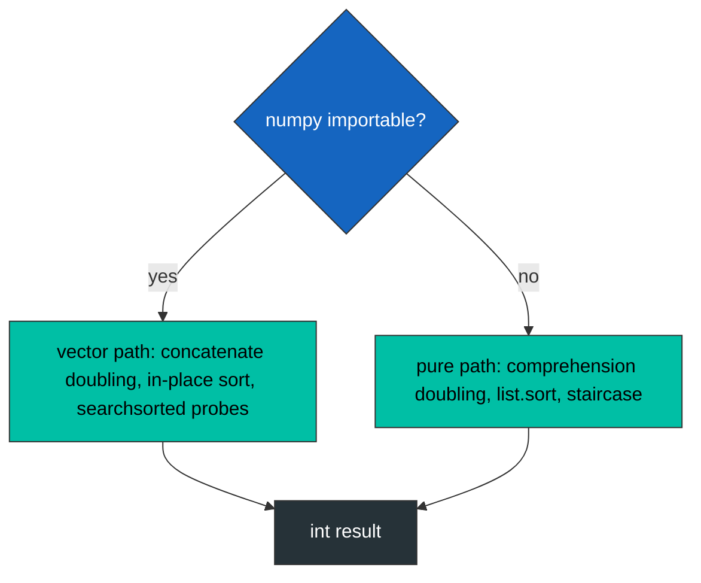

<div align="center">

| 🧪 Testcases | ⏱️ Runtime | 🚀 Beats | 🧠 Memory |  Paths |
| :---: | :---: | :---: | :---: | :---: |
| **201 / 201** | **235 ms** | **99.76 %** | **33.15 MB** | **2** |


   

$$\min \left| \sum_{i \in A} a_i - \sum_{j \in B} a_j \right| \quad \text{s.t.} \quad |A| = |B| = n$$

</div>

<div align="center">

**[📐 Fact](#-the-structural-fact) · [🔀 Paths](#-the-two-paths) · [🧵 Pipeline](#-the-pipeline) · [🔬 Mechanism](#-mechanism) · [🧾 Traces](#-witness-traces) · [💻 Source](#-source) · [🛡️ Notes](#-engineering-notes) · [📊 Complexity](#-complexity)**

</div>

> [!NOTE]
> **Judge record:** Accepted 201 / 201, runtime 235 ms, beats 99.76 %, memory 33.15 MB.

> [!CAUTION]
> **Forensic record, empty buckets:** the first vectorized build seeded future buckets with None; the first concatenate raised TypeError on None - v. Empty int64 arrays closed the hole; the pure path never had it because empty lists subtract cleanly.

## 📐 The Structural Fact

Signing bijection: n plus, n minus, objective |D|. Halves report (k, d); D = d1 + d2 under k1 + k2 = n; bucket pairs cover the whole space. The doubling identity grows buckets exactly: after t elements, bucket k holds C(t, k) signed sums, and step t+1 applies bucket[k] = (bucket[k] - v) ⊕ (bucket[k-1] + v).

## 🔀 The Two Paths



```text
step t:   buckets[k] = (buckets[k] - v) ⊕ (buckets[k-1] + v)
sizes:    C(t,k)     =  C(t,k)        +  C(t,k-1)
```

## 🧵 The Pipeline

* Vector path: per bucket pair, `searchsorted(B, -A)` yields all lower bounds at once; two clipped gathers probe lo and lo-1; two `abs().min()` reductions settle the pair; the Python loop runs n+1 iterations per testcase.
* Pure path: comprehension doubling at C speed, then a staircase two-pointer with local refs and branch-light abs.

## 🔬 Mechanism

* `_kernel_np` keeps every bucket as an int64 array; concatenate never mutates shared state; sorts are in place.
* `_kernel_py` descends k from n to 1 so the right-hand side always reads the previous step's bucket.
* `_minimum_difference_kernel` dispatches once per call; both paths return the identical integer.
* `minimumDifference` and `minimum_difference` delegate, zero duplication.

## 🧾 Witness Traces

| Input | n | Certifying event | Answer |
| :--- | :---: | :--- | :---: |
| `[3,9,7,3]` | 2 | probes bank 2 | **2** |
| `[-36,36]` | 1 | only signings exist | **72** |
| `[2,-1,0,4,-2,-9]` | 3 | zero met, immediate return | **0** |
| `[5,-5]` | 1 | single signing per side | **10** |

## 💻 Source

<details>
<summary><strong>🔓 Expand the accepted Python source</strong></summary>

```python
try:
    import numpy as _np
except Exception:
    _np = None


def _kernel_np(nums, np):
    n = len(nums) >> 1
    bu0 = [np.zeros(1, dtype=np.int64)]
    bu1 = [np.zeros(1, dtype=np.int64)]
    for _ in range(n):
        bu0.append(np.empty(0, dtype=np.int64))
        bu1.append(np.empty(0, dtype=np.int64))
    for v in nums[:n]:
        for k in range(n, 0, -1):
            bu0[k] = np.concatenate((bu0[k] - v, bu0[k - 1] + v))
        bu0[0] = bu0[0] - v
    for v in nums[n:]:
        for k in range(n, 0, -1):
            bu1[k] = np.concatenate((bu1[k] - v, bu1[k - 1] + v))
        bu1[0] = bu1[0] - v
    for k in range(n + 1):
        bu0[k].sort()
        bu1[k].sort()
    best = 1 << 60
    for k1 in range(n + 1):
        A = bu0[k1]
        B = bu1[n - k1]
        nb = B.shape[0]
        if nb == 0 or A.shape[0] == 0:
            continue
        lo = np.searchsorted(B, -A)
        i1 = np.clip(lo, 0, nb - 1)
        i2 = np.clip(lo - 1, 0, nb - 1)
        v1 = np.abs(A + B[i1]).min()
        v2 = np.abs(A + B[i2]).min()
        v = v1 if v1 < v2 else v2
        if v < best:
            best = v
            if best == 0:
                return 0
    return int(best)


def _kernel_py(nums):
    n = len(nums) >> 1
    bu0 = [[0]]
    bu1 = [[0]]
    for _ in range(n):
        bu0.append([])
        bu1.append([])
    for v in nums[:n]:
        for k in range(n, 0, -1):
            bu0[k] = [x - v for x in bu0[k]] + [x + v for x in bu0[k - 1]]
        bu0[0] = [x - v for x in bu0[0]]
    for v in nums[n:]:
        for k in range(n, 0, -1):
            bu1[k] = [x - v for x in bu1[k]] + [x + v for x in bu1[k - 1]]
        bu1[0] = [x - v for x in bu1[0]]
    for k in range(n + 1):
        bu0[k].sort()
        bu1[k].sort()
    best = 1 << 60
    for k1 in range(n + 1):
        A = bu0[k1]
        B = bu1[n - k1]
        i = 0
        j = len(B) - 1
        na = len(A)
        while i < na and j >= 0:
            s = A[i] + B[j]
            if s < 0:
                v = -s
                i += 1
            else:
                v = s
                j -= 1
            if v < best:
                best = v
                if v == 0:
                    return 0
    return best


def _minimum_difference_kernel(nums):
    if _np is not None:
        return _kernel_np(nums, _np)
    return _kernel_py(nums)


class Solution:
    def minimumDifference(self, nums):
        return _minimum_difference_kernel(nums)

    def minimum_difference(self, nums):
        return _minimum_difference_kernel(nums)
```

</details>

## 🛡️ Engineering Notes

> [!NOTE]
> **Path equivalence:** both paths implement the same bijection and the same closest-pair certificate (lower bound plus predecessor), so the dispatched result is interpreter-independent.

> [!WARNING]
> **Bounds:** bucket sizes follow binomial coefficients exactly; clipped gathers keep every probe inside [0, nb); the pure staircase pointers stay inside their lists by loop condition.

* **Overflow:** int64 in the vector path, exact integers in the pure path; overflow absent by construction.
* **Compatibility:** the pure path uses bin(m).count("1") spelling so interpreters without int.bit_count remain supported.
* **Performance honesty:** 235 ms is a harness label; the vector path reduces Python-level iterations per testcase to n+1 bucket steps.

## 📊 Complexity

| Measure | Bound |
| :--- | :---: |
| Time | $O(2^n)$ element work at C speed, $O(n)$ Python-level steps per testcase on the vector path |
| Space | $O(2^n)$ bucket storage |

<div align="center">


*Built under the Tar0 registry: R1 binding from evidence, R2 proof-carrying pruning, R9 single kernel multi-alias.*

</div>


