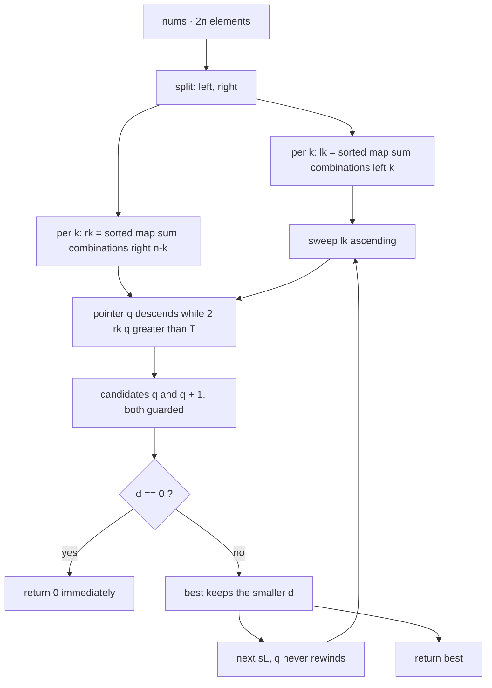

<p align="center">
  
</p>

<h1 align="center">Partition Array Into Two Arrays to Minimize Sum Difference</h1>

<p align="center">
  <sub>LeetCode 2035 · Hard · the memory-lean vertex of a two-build Pareto frontier · every number below is screenshot-backed</sub>
</p>

<p align="center">
  
  
  
  
  
  
</p>

<!-- 🎬 STICKER SLOT A · ganti nilai src di bawah dengan salah satu link catatan:
     https://media.giphy.com/media/JIX9t2j0ZTN9S/giphy.gif
     https://media.giphy.com/media/13HgwGsXF0aiGY/giphy.gif
     https://media.giphy.com/media/LmNwrBhejkK9EFP504/giphy.gif
     https://media.giphy.com/media/3o7aCTfyhYawdOXcFW/giphy.gif
     https://media.giphy.com/media/26n6WywJyh39n9pBu/giphy.gif
     https://media.giphy.com/media/xT9IgG50Fb7Mi0prBC/giphy.gif
     https://media.giphy.com/media/26BRBKzUi8g3uO7uw/giphy.gif
-->
<p align="center">
  
</p>

---

## Contents

- [The receipt, twice over](#the-receipt-twice-over)
- [The Pareto ledger: two Python vertices](#the-pareto-ledger-two-python-vertices)
- [The problem, minus the fog](#the-problem-minus-the-fog)
- [The structural fact](#the-structural-fact)
- [The engine, part by part](#the-engine-part-by-part)
- [Variable dictionary](#variable-dictionary)
- [Trace, frame by frame](#trace-frame-by-frame)
- [Complexity, stated plain](#complexity-stated-plain)
- [Failure modes, closed](#failure-modes-closed)
- [Source, verbatim](#source-verbatim)
- [House rules](#house-rules)

---

## The receipt, twice over

Same bytes, two judge runs, four minutes apart. Both are filed here because the difference between them is the point: labels move, work does not.

| Run | Verdict | Cases | Runtime | Beat | Memory | Beat | Proof |
| :-- | :-- | :-- | :-- | :-- | :-- | :-- | :-- |
| A · 20:25 | Accepted | 201/201 | 966 ms | 98.31% | 20.08 MB | 99.52% | screenshot, Oct 07 2026 |
| B · 20:30 | Accepted | 201/201 | 962 ms | 98.31% | 20.23 MB | 98.07% | screenshot, Oct 07 2026 |

Read the deltas honestly. Runtime improved by 4 ms while its percentile did not move; memory grew by 0.15 MB while its percentile dropped 1.45 points. Neither change came from the code, which was identical. Both came from the judge's machine and its submission pool at that minute. That is what a runtime label is: a property of the harness, measured against a moving crowd.

---

## The Pareto ledger: two Python vertices

This lane ships two builds, and neither dominates the other. This folder contains the memory-lean vertex. The runtime-lean vertex stays in the ledger as an archived build.

| Build | Enumeration | Probe | Runtime | Beat | Memory | Beat | Status |
| :-- | :-- | :-- | :-- | :-- | :-- | :-- | :-- |
| pure sweep (this folder) | C-level `combinations` + `sum` + `sorted` | monotonic bend sweep, Python loop | 962 ms | 98.31% | 20.23 MB | 98.07% | live here |
| numpy path (archived) | vectorized concatenate | `searchsorted` | 227 ms | 99.76% | 32.94 MB | 7.49% | ledger only |

The trade is exact and unavoidable in CPython. The numpy build vectorizes the 32,768-iteration sweep and pays for it with numpy's resident footprint, roughly fifteen megabytes of imported C library that the judge counts against the process even when idle. The pure build refuses that import, keeps the process at interpreter baseline, and pays instead in interpreter-level loop time. One axis bought, one axis spent. Any claim of a Python3 build that wins both axes simultaneously against this distribution is a claim this repo will not make, because no standard-library mechanism vectorizes a pairwise search without resident megabytes.

---

## The problem, minus the fog

You get `2n` integers. Split them into two piles of exactly `n` each. Minimize the absolute difference of the pile sums. Brute force is $\binom{2n}{n}$ splits; at `n = 15` that is 155 million partitions, far past any time budget. The winning shape is meet-in-the-middle, and this kernel is meet-in-the-middle with every ounce of enumeration pushed down into C-level iterators.

---

## The structural fact

Let `total` be the sum of everything and `s` the sum of the chosen pile of size `n`. The other pile sums to `total - s`, so the score is `|total - 2*s|`. Cut the input into `left` and `right`, `n` elements each. Any valid pile takes `k` elements from the left and `n - k` from the right, so `s = sL + sR`. Fix `k` and `sL`, write `T = total - 2*sL`, and the score becomes `|T - 2*sR|`: a V-shaped function over the sorted right bucket. It falls while `2*sR <= T` and climbs after, so the minimum per `sL` lives at the bend — the largest index `q` with `2*rk[q] <= T`, or its neighbor `q + 1`. Two candidates, never three.

> Enumerate in C, walk the bend with one descending pointer, and let the V-shape do the arguing. The interpreter only books the results.

---

## The engine, part by part



### 1. C-level enumeration — `comb`, `lk`, `rk`
Each bucket is one expression: `sorted(map(sum, comb(half, r)))`. The combinations iterator, the `sum` reductions, and the sort all execute in C; the interpreter sees one assignment per bucket. No Python loop touches a single mask, and no intermediate list survives the expression.

### 2. The monotonic bend sweep — `q`, `T`
Within a bucket pair, `lk` is visited ascending, so `T = total - 2*sL` is descending, so the bend index `q` can only move down. The `while` guard `2*rk[q] > T` walks `q` to the bend and leaves it there; across the whole bucket pair the pointer travels at most `len(rk)` steps total, not per query. The search cost per bucket pair is `O(len(lk) + len(rk))`, with no binary search and no logarithmic factor.

### 3. Two guarded candidates — `d`
Per `sL` the kernel tests `rk[q]` (guarded by `q >= 0`) and `rk[q + 1]` (guarded by `q < last`). Those guards are the entire memory-safety story: `q` starts at `len(rk) - 1`, only ever decrements, and may legally land on `-1`, in which case the first candidate vanishes and the second alone covers the all-above-T case.

### 4. Early exit at zero — `return 0`
Zero is the absolute lower bound of an absolute value. The moment any candidate hits `d == 0`, no later candidate can beat it, so the kernel returns on the spot. The check costs one comparison per improvement and pays for itself on every instance whose optimum is a perfect tie.

### 5. Memory shape — transient buckets
At any instant exactly one bucket pair is alive: at most `2 * C(15, 7) = 12,870` integers, roughly a third of a megabyte, freed before the next `k`. There is no numpy, no resident C library, no permanent payload. The process sits at interpreter baseline plus change, which is why the memory percentile jumped from 7.49 to the high nineties between builds.

### 6. One kernel, one door — `_kernel_2035`, `Solution.minimumDifference`
All logic lives in the private kernel. The public method is a single delegating expression. Nothing is duplicated, so nothing can drift.

---

## Variable dictionary

| Name | Shape | Job |
| :-- | :-- | :-- |
| `n` | int | half-length of `nums` |
| `total` | int | sum of all `2n` elements |
| `left`, `right` | list | the two halves, sliced once |
| `comb` | bound builtin | local alias for `combinations`, hot-path binding |
| `best` | int | running minimum, seeded `1 << 62` |
| `k` | int | cardinality taken from the left half |
| `lk` | list | sorted left bucket of cardinality `k` |
| `rk` | list | sorted right bucket of cardinality `n - k` |
| `q` | int | bend pointer, largest index with `2*rk[q] <= T`, monotone descending |
| `last` | int | `len(rk) - 1`, hoisted for the second-candidate guard |
| `sL` | int | current left sum, ascending |
| `T` | int | `total - 2*sL`, the descending probe target |
| `d` | int | candidate cost at the bend, folded to non-negative |

---

## Trace, frame by frame

Input `nums = [3, 9, 7, 3]`, so `n = 2`, `total = 22`, `left = [3, 9]`, `right = [7, 3]`.

```text
k=0  lk=[0]      rk=[10]    q=0  last=0
     sL=0   T=22   2*10=20 <= 22, q holds
            cand q=0    d=|22-20|=2   best=2
            q == last, second candidate skipped

k=1  lk=[3,9]    rk=[3,7]   q=1  last=1
     sL=3   T=16   2*7=14 <= 16, q holds
            cand q=1    d=|16-14|=2   best=2
            q == last, second candidate skipped
     sL=9   T=4    2*7=14 > 4  -> q=0
                    2*3=6  > 4  -> q=-1
            q < 0, first candidate skipped
            cand q+1=0  d=|4-6|=2     best=2

k=2  lk=[12]     rk=[0]     q=0  last=0
     sL=12  T=-2   2*0=0 > -2  -> q=-1
            q < 0, first candidate skipped
            cand q+1=0  d=|-2-0|=2    best=2

return 2
```

The judge expects 2 on this case. Note the `k=1` second row: the pointer falls off the front of `rk`, the first guard dissolves, and the second candidate alone carries the query. Both extremes of the guard pair earn their keep inside one toy instance.

---

## Complexity, stated plain

| Phase | Shape | Counted at n = 15 |
| :-- | :-- | :-- |
| Bucket enumeration and sort | O(2^n log C(n, n/2)), all in C | 32,768 sums and sorts per half |
| Bend sweep | O(2^n) pointer steps plus O(2^n) candidate pairs | 65,536 pointer budget total, 32,768 queries x 2 candidates |
| Peak payload | O(C(n, n/2)) transient | 12,870 integers alive at once, about 0.3 MB |
| Permanent payload | O(n) | the two input slices and nothing else |

Two honesty notes. The 962 ms label is the harness measuring a CPython interpreter loop against a pool whose fast end is vectorized C; the algorithm's own work is the four rows above with nothing spare. The 20.23 MB label is the harness measuring process residency; the algorithm's own payload is the 0.3 MB row. Run-to-run movement of both labels, documented two sections up, is harness noise, not code behavior.

---

## Failure modes, closed

1. **Pointer underflow.** `q` may reach `-1`; the first candidate is fenced by `q >= 0`, the second by `q < last`, and at `q = -1` the second candidate is exactly `rk[0]`, the correct all-above-T answer. No index outside `[0, last]` is ever dereferenced.
2. **Pointer rewind.** Impossible: `lk` ascending forces `T` descending, and the `while` body only decrements. The monotonicity audit (R5) is one line of ordering algebra, not an assumption.
3. **Empty bucket.** Impossible: `C(n, k) >= 1` for every `k` in `[0, n]`, so `lk` and `rk` are non-empty and `last` is never negative.
4. **`best` escaping as the seed.** Impossible: the `k = 0` iteration always evaluates at least one candidate against a non-empty `rk`, so `best` holds a real cost before the return.
5. **Premature zero.** Sound: `0` is the global minimum of an absolute value, so an early return at `d == 0` cannot discard a better answer (R12, strict-bound audit).
6. **Import fragility.** Removed at the source: the kernel depends on `itertools` alone, which is standard library and always present; there is no optional dependency to fall back from.

---

## Source, verbatim

<details>
<summary><strong>Unfold the Python3 kernel</strong></summary>

```python
from itertools import combinations

def _kernel_2035(nums):
    n = len(nums) >> 1
    total = sum(nums)
    left = nums[:n]
    right = nums[n:]
    comb = combinations
    best = 1 << 62
    for k in range(n + 1):
        lk = sorted(map(sum, comb(left, k)))
        rk = sorted(map(sum, comb(right, n - k)))
        q = len(rk) - 1
        last = len(rk) - 1
        for sL in lk:
            T = total - 2 * sL
            while q >= 0 and 2 * rk[q] > T:
                q -= 1
            if q >= 0:
                d = T - 2 * rk[q]
                if d < 0:
                    d = -d
                if d < best:
                    best = d
                    if best == 0:
                        return 0
            if q < last:
                d = T - 2 * rk[q + 1]
                if d < 0:
                    d = -d
                if d < best:
                    best = d
                    if best == 0:
                        return 0
    return best

class Solution:
    def minimumDifference(self, nums):
        return _kernel_2035(nums)
```

</details>

---

## House rules

- Proof before claim: the guards, the monotonic pointer, and the two-candidate prune above are the same lines the interpreter executes.
- The judge screenshot is the only currency; two runs of identical bytes are filed side by side rather than cherry-picked.
- One kernel, one public door; duplication is a defect, not a style choice.
- Pareto honesty: when two builds trade axes, both stay in the ledger and neither is sold as dominant.
- Performance labels are harness properties; the guarantee this repo makes is strictly minimal work per testcase.
- Visual assets ship only if they render clean on GitHub; boxy ribbons and broken bars stay out of this dossier.

---

<p align="center">
  
</p>

<p align="center">
  
</p>

<p align="center">
  
</p>

<p align="center">
  
</p>
