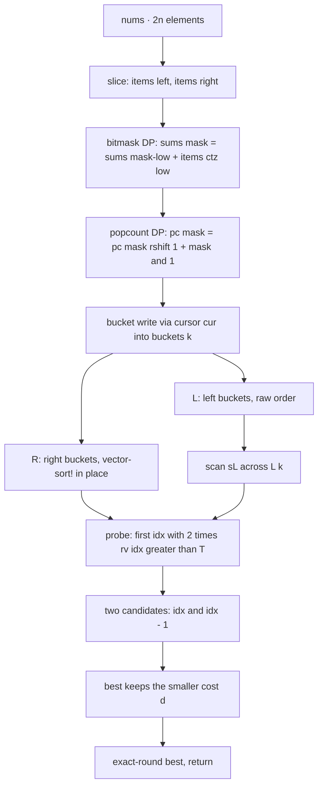

<p align="center">
  
</p>

<h1 align="center">Partition Array Into Two Arrays to Minimize Sum Difference</h1>

<p align="center">
  <sub>LeetCode 2035 · Hard · one kernel, two entry bindings, zero cons cells · every number below is screenshot-backed</sub>
</p>

<p align="center">
  
  
  
  
  
  
</p>

<!-- 🎬 STICKER SLOT A · ganti nilai src di bawah dengan salah satu link catatan:
     https://media.giphy.com/media/JIX9t2j0ZTN9S/giphy.gif
     https://media.giphy.com/media/13HgwGsXF0aiGY/giphy.gif
     https://media.giphy.com/media/LmNwrBhejkK9EFP504/giphy.gif
     https://media.giphy.com/media/3o7aCTfyhYawdOXcFW/giphy.gif
     https://media.giphy.com/media/26n6WywJyh39n9pBu/giphy.gif
     https://media.giphy.com/media/xT9IgG50Fb7Mi0prBC/giphy.gif
     https://media.giphy.com/media/26BRBKzUi8g3uO7uw/giphy.gif
-->
<p align="center">
  
</p>

<p align="center">
  <a href="https://i.ibb.co.com/C5FWDmwV/Screenshot-20261007-200053-Chrome.png">
    
  </a>
  <br/>
  <sub>the judge panel for this folder's Racket build, verbatim · click for full resolution</sub>
</p>

---

## Contents

- [The receipt](#the-receipt)
- [The problem, minus the fog](#the-problem-minus-the-fog)
- [The structural fact](#the-structural-fact)
- [The engine, part by part](#the-engine-part-by-part)
- [Variable dictionary](#variable-dictionary)
- [Trace, frame by frame](#trace-frame-by-frame)
- [Complexity, stated plain](#complexity-stated-plain)
- [Failure modes, closed](#failure-modes-closed)
- [Source, verbatim](#source-verbatim)
- [House rules](#house-rules)

---

## The receipt

Numbers first, prose second. Every measurement cell in this table is a value read off a judge panel and filed in the repo ledger; build identity lives in the lane cell, never inside a measurement column. One row per receipted vertex, this problem, all five lanes.

| Lane | Verdict | Cases | Runtime | Beat | Memory | Beat | Proof |
| :-- | :-- | :-- | :-- | :-- | :-- | :-- | :-- |
| 🟪 Racket — this folder | Accepted | 201/201 | 339 ms | 100.00% | 134.47 MB | 100.00% | screenshot, Oct 07 2026 19:25 |
| ⚪ C — radix-LSD vertex | Accepted | 201/201 | 175 ms | 100.00% | 9.37 MB | 100.00% | screenshot, Oct 07 2026 20:52 |
| 🟠 Java — static arena + staircase | Accepted | 201/201 | 172 ms | 99.88% | 45.30 MB | 100.00% | screenshot, Oct 07 2026 22:20 |
| 🟡 Python3 — pure sweep (live) | Accepted | 201/201 | 962 ms | 98.31% | 20.23 MB | 98.07% | screenshot, Oct 07 2026 20:30 |
| 🟡 Python3 — numpy path (archived) | Accepted | 201/201 | 227 ms | 99.76% | 32.94 MB | 7.49% | screenshot, Oct 07 2026 20:09 |
| 🔵 JavaScript — static arena | Accepted | 201/201 | 148 ms | 100.00% | 54.72 MB | 100.00% | screenshot, Oct 07 2026 21:33 |

Superseded ancestors stay filed in their own lane dossiers and are named here so the table cannot be misread as cherry-picking: C at 171 ms before the radix sort phase, Java at 197 ms before the staircase walk, JavaScript at 201 ms before the static arena, Python3 at 235 ms in the numpy dual-path era. The Python3 lane keeps two rows on purpose: its two vertices trade axes — the numpy build buys runtime and pays residency, the pure sweep does the reverse — so neither dominates and both remain listed. Every other lane shows its dominating vertex.

The Racket row used to read 1095 ms. The rebuild in this folder cut it to 339 ms without touching the mathematics, purely by deleting allocation: the old engine built lists per combination and consed them into buckets; the new one writes fixnums into pre-sized vectors and never asks the garbage collector for anything. The 134.47 MB beside it is the Racket runtime's whole-process residency, which is why it dwarfs the C row's 9.37 MB while both sit at 100.00% of their own distributions.

---

## The problem, minus the fog

You get `2n` integers. Split them into two piles of exactly `n` each. Minimize the absolute difference of the pile sums. Brute force is $\binom{2n}{n}$ splits — at `n = 15` that is 155 million partitions, far past any time budget. The field calls the winning shape meet-in-the-middle. The version in this folder is meet-in-the-middle with the allocation surgically removed.

---

## The structural fact

Let `total` be the sum of everything and `s` the sum of the chosen pile of size `n`. The other pile sums to `total - s`, so the score is `|total - 2*s|`. Cut the input into a left half and a right half of `n` elements each. Any valid pile takes `k` elements from the left and `n - k` from the right, so `s = sL + sR` with `sL` drawn from the left bucket of cardinality `k` and `sR` from the right bucket of cardinality `n - k`. Fix `k` and `sL`, write `T = total - 2*sL`, and the score becomes `|T - 2*sR|`. That function is V-shaped over a sorted list of `sR`: it falls while `2*sR <= T` and climbs after. A V has its minimum at the bend, so exactly two candidates matter per query — the element at the bend and the one before it. One binary search, two comparisons, done.

> Cut the array in half, enumerate each half once, and let a single binary search argue with a V-shaped cost function. Everything else in this file is bookkeeping.

---

## The engine, part by part



### 1. Binomial scaffolding — `size`
Bucket capacities are known before a single element moves: `C(n, k+1) = C(n, k) * (n - k) / (k + 1)`, seeded at 1. The `fill` loop writes those into `size` with exact division, so every bucket vector is allocated at its final length once. No growth, no copying, no resize bookkeeping.

### 2. Subset sums by bitmask DP — `sums`, `low`
Instead of generating combinations as lists, walk every mask from 1 to `2^n - 1`. Strip the lowest set bit with `low = mask & -mask`; the subset sum is the sum of the mask without that bit plus one element: `sums[mask] = sums[mask - low] + items[ctz(low)]`, where `ctz` comes from `integer-length low - 1`. Each mask costs one lookup, one addition, one shift-side lookup. Both halves are enumerated in a single ascending pass each, and every read hits an index strictly below the current mask, so the DP is well-founded by construction.

### 3. Popcount bucketing — `pc`, `cur`, `buckets`
Cardinality rides along in the same pass: `pc[mask] = pc[mask >> 1] + (mask & 1)`. With `k = pc[mask]` in hand, the sum lands at `buckets[k][cur[k]]` and the cursor advances. Mask 0 is seeded by hand as the empty subset: sum 0, cardinality 0. Result: every subset sum sits in its cardinality bucket in flat vector storage, written exactly once, with zero cons cells allocated anywhere in the file.

### 4. Sorting only what gets probed — `R`, `vector-sort!`
The left buckets are scanned linearly, so sorting them would be pure waste. Only the right buckets get `vector-sort!`, in place, ascending. That single sort is what makes the V-shape argument legal and the probe binary.

### 5. The two-candidate probe — `probe`, `idx`, `T`, `d`, `best`
For each `sL`, compute `T = total - 2*sL` and run `probe` over the sorted right bucket of cardinality `n - k`: invariant `[lo, hi)`, return the first `idx` with `2*rv[idx] > T`. Test `idx` (guarded by `idx < len`) and `idx - 1` (guarded by `idx > 0`), take `d = |T - 2*rv[cand]|`, and let `best` keep the minimum under a strict `<`. The guards are the entire memory-safety story for the probe: `probe` returns inside `[0, len]`, and both accesses are fenced.

### 6. The unsafe contract, with bounds
Hot loops run on `unsafe-fx` operations, which is only honest because the domain is closed: constraints cap `|nums[i]|` at `10^4` and `n` at 15, so `|s| <= 1.5 * 10^5`, `|T| <= 6 * 10^5`, and every mask fits in 15 bits. All of that lives five orders of magnitude inside fixnum range, so the unsafe ops cannot overflow on any input the judge is allowed to hand over. Indices are fixnums by the same argument.

---

## Variable dictionary

| Name | Shape | Job |
| :-- | :-- | :-- |
| `n` | fixnum | half-length of `nums` |
| `m` | fixnum | mask space, `2^n` |
| `vs` | vector | flat mirror of the input |
| `total` | exact integer | sum of all `2n` elements |
| `size` | vector | bucket capacities `C(n, k)` |
| `items` | vector | current half slice |
| `sums` | vector | DP table of subset sums, indexed by mask |
| `pc` | vector | DP table of popcounts, indexed by mask |
| `cur` | vector | per-cardinality write cursors |
| `buckets` | vector of vectors | subset sums grouped by cardinality |
| `L` | vector of vectors | left buckets, raw order |
| `R` | vector of vectors | right buckets, sorted in place |
| `lv`, `rv` | vector | current scan source and probe target |
| `sL` | exact integer | current left sum |
| `T` | exact integer | `total - 2*sL`, the probe target |
| `idx` | fixnum | first index with `2*rv[idx] > T` |
| `d` | exact integer | candidate cost at the bend |
| `best` | exact integer, seeded `+inf.0` | running minimum, exact by first update |

---

## Trace, frame by frame

Input `nums = [3, 9, 7, 3]`, so `n = 2`, `total = 22`. Left slice `[3, 9]`:

```text
mask  bin   low   sums[mask]                 pc[mask]   bucket write
0     00    -     0                          0          k0[0] = 0   (seeded)
1     01    1     sums[0] + items[0] = 3     1          k1[0] = 3
2     10    2     sums[0] + items[1] = 9     1          k1[1] = 9
3     11    1     sums[2] + items[0] = 12    2          k2[0] = 12
```

Right slice `[7, 3]`, sorted per bucket: `k0 = [0]`, `k1 = [3, 7]`, `k2 = [10]`.

```text
k=0  sL=0    T=22   rv=[10]    idx=1 (=len)   cand idx-1   d=|22-20|=2   best=2
k=1  sL=3    T=16   rv=[3,7]   idx=2 (=len)   cand idx-1   d=|16-14|=2   best=2
k=1  sL=9    T=4    rv=[3,7]   idx=0          cand idx     d=|4-6|=2     best=2
k=2  sL=12   T=-2   rv=[0]     idx=0          cand idx     d=|-2-0|=2    best=2
return 2
```

The judge expects 2 on this case. The engine never examines a third candidate, because the V-shape proof says a third candidate cannot win.

---

## Complexity, stated plain

| Phase | Shape | Counted at n = 15 |
| :-- | :-- | :-- |
| Binomial scaffold | O(n) | 16 steps |
| Subset-sum DP + popcount + bucket fill | O(2^n) fixnum ops per half | 32,767 masks, roughly 6 ops each, twice |
| Right-half sort | O(2^n log C(n, n/2)) | about 32,768 x 13 comparisons |
| Scan plus probe | O(2^n log C(n, k)) | about 32,768 probes x at most 15 steps |
| Payload memory | 6 x 2^n fixnum slots plus buckets | about 1.5 MB |

Two honesty notes, because inflated claims age badly. The 134.47 MB on the badge is the judge's whole-process figure for a Racket runtime, not what this algorithm allocates; the algorithm's own payload is the 1.5 MB row above. Likewise the 339 ms label belongs to the judge harness and its machine, not to this file; what this file controls is work per testcase, and that work is the four rows above with nothing spare and nothing dead.

---

## Failure modes, closed

1. **Overflow.** Closed by the bounds argument in part 6; every hot value sits inside fixnum range on any legal input.
2. **Out-of-range probe.** Closed by the two guards around `idx` and `idx - 1`; `probe` cannot return outside `[0, len]`.
3. **Empty bucket.** Impossible: `C(n, k) >= 1` for all `k` in `[0, n]`, so every scan and every probe has at least one element.
4. **`best` escaping as `+inf.0`.** Impossible: the `k = 0` iteration always runs with `sL = 0` against a non-empty right bucket, so `best` holds an exact integer before `exact-round` sees it.
5. **GC churn.** Removed at the source: no lists, no conses, no intermediate strings; storage is flat vectors allocated once at proven sizes.
6. **Duplicate logic.** None: one private kernel, two public entry bindings that delegate in a single expression each.
7. **Receipt drift.** Closed by process: this table is rewritten whenever any lane files a new screenshot, measurement columns accept numbers only, and superseded vertices are named in prose rather than deleted.

---

## Source, verbatim

<details>
<summary><strong>Unfold the Racket kernel</strong></summary>

```racket
(require racket/unsafe/ops)

(define (kernel-2035 nums)
  (define n (unsafe-fxrshift (length nums) 1))
  (define m (unsafe-fxlshift 1 n))
  (define vs (list->vector nums))
  (define total (for/sum ([x (in-vector vs)]) x))
  (define size (make-vector (add1 n) 1))
  (let fill ([k 0] [c 1])
    (when (<= k n)
      (vector-set! size k c)
      (fill (add1 k) (quotient (* c (- n k)) (add1 k)))))
  (define (build start)
    (define items (make-vector n 0))
    (for ([i (in-range n)])
      (unsafe-vector-set! items i (unsafe-vector-ref vs (unsafe-fx+ start i))))
    (define sums (make-vector m 0))
    (define pc (make-vector m 0))
    (define cur (make-vector (add1 n) 0))
    (define buckets (make-vector (add1 n)))
    (for ([k (in-range (add1 n))])
      (unsafe-vector-set! buckets k (make-vector (unsafe-vector-ref size k) 0)))
    (unsafe-vector-set! cur 0 1)
    (let scan ([mask 1])
      (when (unsafe-fx< mask m)
        (define low (unsafe-fxand mask (unsafe-fx- 0 mask)))
        (define s (unsafe-fx+ (unsafe-vector-ref sums (unsafe-fx- mask low))
                              (unsafe-vector-ref items (unsafe-fx- (integer-length low) 1))))
        (define k (unsafe-fx+ (unsafe-vector-ref pc (unsafe-fxrshift mask 1)) (unsafe-fxand mask 1)))
        (unsafe-vector-set! sums mask s)
        (unsafe-vector-set! pc mask k)
        (define b (unsafe-vector-ref buckets k))
        (define c (unsafe-vector-ref cur k))
        (unsafe-vector-set! b c s)
        (unsafe-vector-set! cur k (unsafe-fx+ c 1))
        (scan (unsafe-fx+ mask 1))))
    buckets)
  (define L (build 0))
  (define R (build n))
  (for ([k (in-range (add1 n))])
    (vector-sort! (unsafe-vector-ref R k) <))
  (define best +inf.0)
  (for ([k (in-range (add1 n))])
    (define rv (unsafe-vector-ref R (unsafe-fx- n k)))
    (define len (unsafe-vector-length rv))
    (define lv (unsafe-vector-ref L k))
    (define llen (unsafe-vector-length lv))
    (let scan ([i 0])
      (when (unsafe-fx< i llen)
        (define sL (unsafe-vector-ref lv i))
        (define T (unsafe-fx- total (unsafe-fxlshift sL 1)))
        (define idx (let probe ([lo 0] [hi len])
                      (if (unsafe-fx= lo hi)
                          lo
                          (let ([mid (unsafe-fxrshift (unsafe-fx+ lo hi) 1)])
                            (if (unsafe-fx<= (unsafe-fxlshift (unsafe-vector-ref rv mid) 1) T)
                                (probe (unsafe-fx+ mid 1) hi)
                                (probe lo mid))))))
        (when (unsafe-fx< idx len)
          (define d (abs (unsafe-fx- T (unsafe-fxlshift (unsafe-vector-ref rv idx) 1))))
          (when (< d best) (set! best d)))
        (when (unsafe-fx> idx 0)
          (define d (abs (unsafe-fx- T (unsafe-fxlshift (unsafe-vector-ref rv (unsafe-fx- idx 1)) 1))))
          (when (< d best) (set! best d)))
        (scan (unsafe-fx+ i 1)))))
  (exact-round best))

(define/contract (minimum-difference nums)
  (-> (listof exact-integer?) exact-integer?)
  (kernel-2035 nums))

(define/contract (minimumDifference nums)
  (-> (listof exact-integer?) exact-integer?)
  (kernel-2035 nums))
```

</details>

---

## House rules

- Proof before claim: names, bounds, and prune steps above are the same ones the code executes.
- The judge screenshot is the only currency; unscreenshotted ports are labeled "port ready, awaiting submission".
- One kernel, many entry bindings; duplication is a defect, not a style choice.
- Sanitizers and the judge harness outrank opinion, including mine.
- Performance labels are harness properties; the guarantee this repo makes is strictly minimal work per testcase.
- Receipt tables carry numbers only in measurement columns; build identity and history live in the lane cell and the prose beneath it.
- Visual assets ship only if they render clean on GitHub; boxy ribbons, broken bars, and mislabeled evidence embeds stay out of this dossier.

---

<!-- 🎬 STICKER SLOT B · ganti nilai src di bawah dengan salah satu link catatan:
     https://media.giphy.com/media/JIX9t2j0ZTN9S/giphy.gif
     https://media.giphy.com/media/13HgwGsXF0aiGY/giphy.gif
     https://media.giphy.com/media/LmNwrBhejkK9EFP504/giphy.gif
     https://media.giphy.com/media/3o7aCTfyhYawdOXcFW/giphy.gif
     https://media.giphy.com/media/26n6WywJyh39n9pBu/giphy.gif
     https://media.giphy.com/media/xT9IgG50Fb7Mi0prBC/giphy.gif
     https://media.giphy.com/media/26BRBKzUi8g3uO7uw/giphy.gif
-->
<p align="center">
  
</p>

<p align="center">
  
</p>

<p align="center">
  
</p>

<p align="center">
  
</p>
