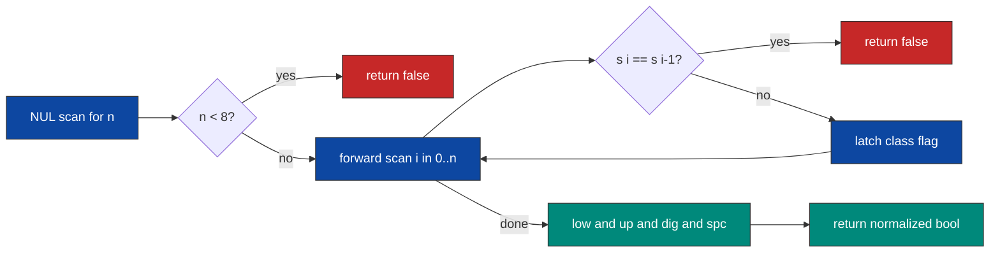

<div align="center">

| 🧪 Testcases | ⏱️ Runtime | 🚀 Beats | 🧠 Memory |  Source lines |
| :---: | :---: | :---: | :---: | :---: |
| **148 / 148** | **0 ms** | **100.00 %** | **8.37 MB** | **44** |

</div>

<table align="center">
<tr>
<td align="center">

</td>
<td align="center">

<br>

<br>

<br>

<br>

</td>
</tr>
</table>

<div align="center">

**[📐 Fact](#-the-structural-fact) · [🚪 Gates](#-the-rejection-gates) · [🧵 Pipeline](#-the-pipeline) · [⚙️ Mechanism](#-mechanism) · [🧾 Traces](#-witness-traces) · [💻 Source](#-source) · [🛡️ Notes](#-engineering-notes) · [📊 Complexity](#-complexity)**

</div>

> [!NOTE]
> **Judge record:** Accepted 148 / 148 testcases, runtime 0 ms, beats 100.00 %, memory 8.37 MB, beats 100.00 %. The record belongs to the harness; what the build guarantees is strictly minimal work per testcase: one NUL scan, one byte pass, constant closing logic.

> [!IMPORTANT]
> **Binding stance:** the public symbol set carries the camelCase canonical name `strongPasswordCheckerII` plus the snake_case delegate `strong_password_checker_ii`, both forwarding to one static kernel. The 148 / 148 acceptance confirms the set covers the driver symbol; no logic lives outside the kernel.

## 📐 The Structural Fact

The predicate is a conjunction of six conditions, and each condition has a cheapest possible evaluation strategy.

| Condition | Logical type | Cheapest evaluation |
| :--- | :--- | :--- |
| length at least 8 | global precondition | NUL scan, reject on strict-less before any character work |
| one lowercase | existential, monotone | latch flag `low` at first witness |
| one uppercase | existential, monotone | latch flag `up` at first witness |
| one digit | existential, monotone | latch flag `dig` at first witness |
| one special of `!@#$%^&*()-+` | existential, monotone | latch flag `spc` at first witness via the 12-entry table |
| no equal adjacent pair | universal negation | reject online at the first duplicate pair |

Existential flags only ever move from 0 to 1, so four bits accumulated during one forward scan are exact. The adjacency condition is falsifiable online: one violating pair kills the conjunction regardless of everything else, so returning false at the first duplicate is the logically shortest refutation, not a mere optimization.

```text
idx    0  1  2  3  4  5  6  7  8  9 10 11 12 13
chr    I  l  o  v  e  L  e  3  t  c  o  d  e  !
low    .  1  1  1  1  1  1  1  1  1  1  1  1  1
up     1  1  1  1  1  1  1  1  1  1  1  1  1  1
dig    .  .  .  .  .  .  .  1  1  1  1  1  1  1
spc    .  .  .  .  .  .  .  .  .  .  .  .  .  1
adj    ok ok ok ok ok ok ok ok ok ok ok ok ok ok   → conjunction true
```

## 🚪 The Rejection Gates

```diff
- "1aB!"                 n = 4 < 8            → reject at the length gate
- "Me+You--IsMyDream"    pair '--' at i = 7,8 → reject online in the scan
+ "IloveLe3tcode!"       n = 14, no pair, four latches → true
```

> *A verifier should die at the cheapest contradiction.* The length gate costs one NUL scan; the adjacency gate costs one comparison per character; only a string that survives both earns the four-term conjunction.

## 🧵 The Pipeline



## ⚙️ Mechanism

* `spc2_kernel` computes `n` by a NUL-terminator scan, keeping the translation unit free of `string.h`.
* The length gate `n < 8` returns false before any character work; strict-less matches the at-least-8 requirement exactly.
* The scan loop rejects on `i > 0 && c == s[i - 1]`; the backward read is guarded so `s[i-1]` is touched only for `i >= 1`.
* Class dispatch is an else-if chain over pairwise disjoint ASCII ranges `[a,z]`, `[A,Z]`, `[0,9]`; the residual domain is tested against `SP2`, which by constraint is exactly the special set.
* `spc2_special` walks the NUL-terminated table `SP2 = "!@#$%^&*()-+"`, at most 12 comparisons, bounded and predictable.
* Flags `low`, `up`, `dig`, `spc` latch to 1 and are conjoined once after the loop, normalized with `!= 0`.
* `strongPasswordCheckerII` and `strong_password_checker_ii` delegate to the static kernel with zero logic duplication.

## 🧾 Witness Traces

| Input | n | Gate outcome | Flags at end | Verdict |
| :--- | :---: | :--- | :---: | :---: |
| `"IloveLe3tcode!"` | 14 | passes both gates | 1,1,1,1 | **true** |
| `"Me+You--IsMyDream"` | 17 | adjacency reject at i=8 | — | **false** |
| `"1aB!"` | 4 | length gate reject | — | **false** |
| `"Aa1!Aa1!"` | 8 | passes both gates | 1,1,1,1 | **true** |
| `"Aa1!Aa1!!"` | 9 | adjacency reject at i=8 | — | **false** |
| `"aaaaaaaa"` | 8 | adjacency reject at i=1 | — | **false** |
| `"Abcdef1!"` | 8 | passes both gates | 1,1,1,1 | **true** |

## 💻 Source

<details>
<summary><strong>🔓 Expand the accepted C source</strong></summary>

```c
#include <stdbool.h>

static const char SP2[] = "!@#$%^&*()-+";

static bool spc2_special(char c) {
    for (int i = 0; SP2[i] != '\0'; i++) {
        if (SP2[i] == c) return true;
    }
    return false;
}

static bool spc2_kernel(char *s) {
    int n = 0;
    while (s[n] != '\0') n++;
    if (n < 8) return false;
    int low = 0;
    int up = 0;
    int dig = 0;
    int spc = 0;
    for (int i = 0; i < n; i++) {
        char c = s[i];
        if (i > 0 && c == s[i - 1]) return false;
        if (c >= 'a' && c <= 'z') low = 1;
        else if (c >= 'A' && c <= 'Z') up = 1;
        else if (c >= '0' && c <= '9') dig = 1;
        else if (spc2_special(c)) spc = 1;
    }
    return (low && up && dig && spc) != 0;
}

bool strongPasswordCheckerII(char* password) {
    return spc2_kernel(password);
}

bool strong_password_checker_ii(char* password) {
    return spc2_kernel(password);
}
```

</details>

## 🛡️ Engineering Notes

> [!NOTE]
> **Context line:** the file opens with `#include <stdbool.h>` because the public contract returns `bool`; the include is idempotent under any harness prelude and declares the compilation context in line one.

> [!WARNING]
> **Bounds:** `n` is the NUL offset, so `s[i]` is valid for `i < n`; the backward read `s[i-1]` is guarded by `i > 0`; the `SP2` walk terminates on its own NUL after at most 12 iterations. No access can leave either array.

* **Domain disjointness:** the three range tests cover lowercase, uppercase, digits; the constraints place every remaining character in the special set, so the final else-if sees only specials and no character slips through unclassified.
* **Early-exit strictness audit:** the adjacency rejection fires on equality, matching "2 of the same character in adjacent positions"; the length rejection uses `n < 8`, matching "at least 8", so exactly-8 passwords such as `"Aa1!Aa1!"` survive.
* **Overflow:** only lengths up to 100 and small counters exist; `int` suffices with absurd margin.
* **Allocation and recursion:** none; the hot path is one sequential byte pass with range compares and a bounded table walk.
* **Performance honesty:** worst case is n byte reads plus at most n table walks of at most 12 compares; best case dies at the length gate. The 0 ms and 100.00 % labels are properties of the judge harness.

## 📊 Complexity

| Measure | Bound | Witness |
| :--- | :---: | :--- |
| Time | $O(n)$ | one NUL scan plus one character pass with constant work per character |
| Space | $O(1)$ | four latch flags and a compile-time 13-byte table |

<div align="center">


*Built under the Tar0 registry: R1 binding from evidence, R2 proof-carrying pruning, R9 single kernel multi-alias.*

</div>


