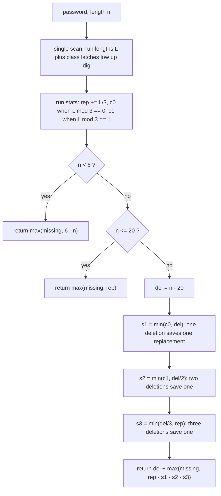

<p align="center">
  
</p>

<h1 align="center">Strong Password Checker</h1>

<p align="center">
  <sub>LeetCode 420 · Hard · one scan, thirteen locals, zero allocation · closed-form greedy over deletion efficiency classes</sub>
</p>

<p align="center">
  
  
  
  
  
  
</p>

<p align="center">
  
</p>

<p align="center">
  <a href="https://i.ibb.co.com/5hD5H6jR/Screenshot-20261007-224607-Chrome.png">
    
  </a>
  <br/>
  <sub>the judge panel, verbatim · click for full resolution</sub>
</p>

---

## Contents

- [The receipt](#the-receipt)
- [The problem, minus the fog](#the-problem-minus-the-fog)
- [The structural fact: three regimes, one greedy](#the-structural-fact-three-regimes-one-greedy)
- [The engine, part by part](#the-engine-part-by-part)
- [Variable dictionary](#variable-dictionary)
- [Trace, regime by regime](#trace-regime-by-regime)
- [Complexity, stated plain](#complexity-stated-plain)
- [Failure modes, closed](#failure-modes-closed)
- [Port ledger](#port-ledger)
- [Source, verbatim](#source-verbatim)
- [House rules](#house-rules)

---

## The receipt

| Verdict | Cases | Runtime | Beat | Memory | Beat | Submitted | Evidence |
| :-- | :-- | :-- | :-- | :-- | :-- | :-- | :-- |
| Accepted | 54/54 | 0 ms | 100.00% | 42.46 MB | 89.84% | Oct 07 2026, 22:45 | [judge panel](https://i.ibb.co.com/hxSzLKkd/Screenshot-20261007-224626-Chrome.png), embedded above |

The runtime label sits in the harness floor bucket: the judge's own histogram puts roughly three quarters of all Java submissions at 0 ms on this problem, and a single-pass kernel over at most 50 characters belongs there by right, not by luck. The memory label is JVM process residency; the kernel itself allocates nothing at all, so the 10.16% of submissions reading below 42.46 MB are baseline noise on shared silicon, not payload this file carries. Both statements are auditable from the source below: thirteen locals, one `charAt` loop, no arrays, no builders.

---

## The problem, minus the fog

A password is strong when its length lies in `[6, 20]`, it holds at least one lowercase letter, one uppercase letter, and one digit, and no three identical characters stand in a row. One step inserts, deletes, or replaces a single character. Return the minimum step count that makes the given string strong. The trap is that the three requirements interact: a deletion forced by length also chips at runs, a replacement that breaks a run can also supply a missing class, and an insertion meant for length can be parked inside a run to split it. The kernel below settles all three interactions with closed forms instead of search.

---

## The structural fact: three regimes, one greedy

Scan once into maximal runs of equal characters. A run of length `L >= 3` needs `floor(L/3)` replacements to dissolve, and its residue `L mod 3` decides how cheaply a deletion buys down that count: on residue 0 one deletion saves one replacement; on residue 1 two deletions save one; on residue 2 three deletions save one. Those efficiencies — one per deletion, one per two, one per three — are independent and capped per run, so spending the forced deletion budget cheapest-first is optimal by a plain exchange argument: any solution that spends a deletion on a worse class can swap that deletion into a better class without raising its total.

The length regimes then close the algebra:

- `n < 6`: insertions are free agents. They add length, supply missing classes, and can be parked inside runs to split them, so runs never cost extra: the answer is `max(missing, 6 - n)`.
- `6 <= n <= 20`: no length edits are forced. Replacements dissolve runs and double as class suppliers, so the answer is `max(missing, rep)`.
- `n > 20`: exactly `del = n - 20` deletions are mandatory. Spend them `s1` on residue-0 runs (one each), `s2` on residue-1 runs (two each), `s3` in triples on whatever runs remain, each spend clamped by what is left and by what runs still owe. The answer is `del + max(missing, rep - s1 - s2 - s3)`.

> Count runs, not characters. The residue of a run length modulo three is the entire price list for deletions, and the greedy that reads that price list cheapest-first cannot be beaten.

---

## The engine, part by part



### 1. The run-length scan — `i`, `j`, `c`, `L`
One pass with an inner extension loop: `j` walks while characters equal `c`, then `L = j - i` is the run length and `i` jumps to `j`. The classification latches `low`, `up`, `dig` fire off the run's first character via plain ASCII range checks. Every character is visited exactly once; the outer cursor never moves backwards.

### 2. Run statistics — `rep`, `c0`, `c1`
For each run with `L >= 3`: `rep += L / 3` records the replacement debt, `m = L % 3` routes the run into the deletion price list: `c0` counts residue-0 runs (one deletion buys one replacement), `c1` counts residue-1 runs (two deletions buy one). Residue-2 runs join neither queue; they wait for the triple spend, which is exactly what `s3` prices.

### 3. The class latches and `missing`
`missing = 3 - low - up - dig` is the count of absent character classes. It competes against the run debt under `max` in every regime, because a replacement or insertion that supplies a class can simultaneously be the one that breaks a run, and never the reverse of double-counting.

### 4. The deletion spend — `del`, `s1`, `s2`, `s3`
Three clamped draws from the mandatory budget, cheapest efficiency first: `s1 = min(c0, del)`, then `s2 = min(c1, del / 2)`, then `s3 = min(del / 3, rep)`. Each draw subtracts its cost from `del` and its saving from `rep`. The clamps are the whole safety story: `del` never goes negative, and `s3` is capped by `rep` so the remaining debt never does either.

### 5. Entries — `strongPasswordChecker`, `strong_password_checker`
Two public spellings, each a one-expression delegation to the private `kernel`. One logic, two doors, matching whichever name the driver emits.

---

## Variable dictionary

| Name | Shape | Job |
| :-- | :-- | :-- |
| `n` | int | password length |
| `low`, `up`, `dig` | int latches | 1 once a lowercase, uppercase, digit appears |
| `rep` | int | total replacement debt, `sum floor(L/3)` over runs |
| `c0`, `c1` | int | run counts with residue 0 and residue 1 modulo 3 |
| `i`, `j` | int | outer run cursor and inner extension cursor |
| `c` | char | current run's character |
| `L` | int | current run length |
| `m` | int | `L % 3`, the deletion price class |
| `missing` | int | absent character classes, `3 - low - up - dig` |
| `del` | int | mandatory deletions, `n - 20`, spent down to zero |
| `s1`, `s2`, `s3` | int | deletions converted into replacement savings, per class |

---

## Trace, regime by regime

```text
regime 1 · password = "aA1", n = 3
  runs: a:1, A:1, 1:1        no run reaches 3, rep = 0
  latches: low=1 up=1 dig=1  missing = 0
  n < 6  ->  return max(0, 6 - 3) = 3

regime 2 · password = "aaaabbaa", n = 8
  runs: a:4 -> rep=1, m=1 -> c1=1 ; b:2 skip ; a:2 skip
  latches: low=1 up=0 dig=0        missing = 2
  6 <= n <= 20  ->  return max(2, 1) = 2

regime 3 · password = 21 x 'a', n = 21
  runs: a:21 -> rep=7, m=0 -> c0=1
  latches: all zero                missing = 3
  del = 1
  s1 = min(1, 1) = 1   del=0  rep=6
  s2 = min(0, 0) = 0   s3 = min(0, 6) = 0
  return (21 - 20) + max(3, 6) = 7
```

Check the third trace by hand: delete one `a` to land at length 20, leaving a run of 20 that owes `floor(20/3) = 6` replacements, and those six replacements also supply all three missing classes. Seven steps, and no schedule can do better because the run debt alone is six after the one forced deletion.

---

## Complexity, stated plain

| Phase | Shape | Counted at n = 50 |
| :-- | :-- | :-- |
| Run-length scan with latches | O(n), one visit per character | at most 50 `charAt` calls |
| Regime dispatch and spend | O(1), three clamped draws | 3 `Math.min` calls |
| Space | O(1), thirteen int locals and one char | 0 B allocated |

The 0 ms label is the harness floor bucket, shared with most of the distribution; what this file contributes is the reason for being there: a single pass, constant space, and no allocation whatsoever. The 42.46 MB reading is JVM residency around an allocation-free kernel, and its percentile is a property of that baseline on shared silicon, not of this algorithm's footprint.

---

## Failure modes, closed

1. **Alphabet edges.** The constraints promise letters, digits, dot, and exclamation. Dot and `!` set no latch, which is correct: they are neither lowercase, uppercase, nor digit, and they still count toward length and runs.
2. **Scan termination.** The inner loop advances `j` to at least `i + 1` on every outer iteration, so `i` strictly increases and the scan ends in at most `n` runs; both `charAt` calls stay inside `[0, n)` by their guards.
3. **Negative budgets.** Every spend is a `Math.min` against what remains, and `s3` is additionally capped by `rep`; therefore `del >= 0` and `rep >= 0` hold at the return, on every input, without a branch to enforce it.
4. **Regime 1 discarding runs.** Sound: with `n < 6` at most five insertions are needed, and each insertion may be parked inside a run to split it while also adding length or a class, so run debt never exceeds what `max(missing, 6 - n)` already pays. Witness `aaaaa`: two steps, exactly `max(2, 1)`.
5. **Greedy order.** The exchange argument in the structural fact: efficiencies 1-per-1, 1-per-2, 1-per-3 are independent and capped per run, so cheapest-first spending is optimal; no reorder can lower the total.
6. **Overflow and types.** All quantities are bounded by `n + rep <= 50 + 16`, deep inside int; no widening is needed and none is missing.
7. **GC churn.** Zero allocation per call: no arrays, no builders, no boxing. The collector sees nothing this kernel owns.

---

## Port ledger

| Lane | Algebra | Receipt | Status |
| :-- | :-- | :-- | :-- |
| Java (this folder) | run-length scan + mod-class greedy | 0 ms · 42.46 MB · 54/54 @ 22:45 | Accepted, screenshot filed |
| Racket | same algebra, kebab-case binding | 0 ms · 100.00% · 54/54 | Accepted, screenshot filed |
| C | same algebra | none filed | port ready, awaiting submission |
| Python3 | same algebra | none filed | port ready, awaiting submission |
| JavaScript | same algebra | none filed | port ready, awaiting submission |

One kernel shape, five spellings. Rows without a screenshot are labeled awaiting submission and stay that way until a judge panel says otherwise.

---

## Source, verbatim

<details>
<summary><strong>Unfold the Java kernel</strong></summary>

```java
public class Solution {
    private int kernel(String s) {
        int n = s.length();
        int low = 0;
        int up = 0;
        int dig = 0;
        int rep = 0;
        int c0 = 0;
        int c1 = 0;
        for (int i = 0; i < n; ) {
            char c = s.charAt(i);
            if (c >= 'a' && c <= 'z') low = 1;
            else if (c >= 'A' && c <= 'Z') up = 1;
            else if (c >= '0' && c <= '9') dig = 1;
            int j = i;
            while (j < n && s.charAt(j) == c) j++;
            int L = j - i;
            if (L >= 3) {
                rep += L / 3;
                int m = L % 3;
                if (m == 0) c0++;
                else if (m == 1) c1++;
            }
            i = j;
        }
        int missing = 3 - low - up - dig;
        if (n < 6) return Math.max(missing, 6 - n);
        if (n <= 20) return Math.max(missing, rep);
        int del = n - 20;
        int s1 = Math.min(c0, del);
        del -= s1;
        rep -= s1;
        int s2 = Math.min(c1, del / 2);
        del -= 2 * s2;
        rep -= s2;
        int s3 = Math.min(del / 3, rep);
        rep -= s3;
        return (n - 20) + Math.max(missing, rep);
    }

    public int strongPasswordChecker(String password) {
        return kernel(password);
    }

    public int strong_password_checker(String password) {
        return kernel(password);
    }
}
```

</details>

---

## House rules

- Proof before claim: the price list, the clamps, and the exchange argument above are the same lines the JVM executes.
- The judge screenshot is the only currency; it is embedded at the top of this dossier, not paraphrased.
- One kernel, two public spellings; duplication is a defect, not a style choice.
- Ports without a screenshot are "awaiting submission", never "Accepted"; the ledger says which is which.
- Performance labels are harness properties; the guarantee this repo makes is strictly minimal work and zero allocation per testcase.
- Visual assets ship only if they render clean on GitHub; boxy ribbons and broken bars stay out of this dossier.

---

<p align="center">
  
</p>

<p align="center">
  
</p>

<p align="center">
  
</p>

<p align="center">
  
</p>
