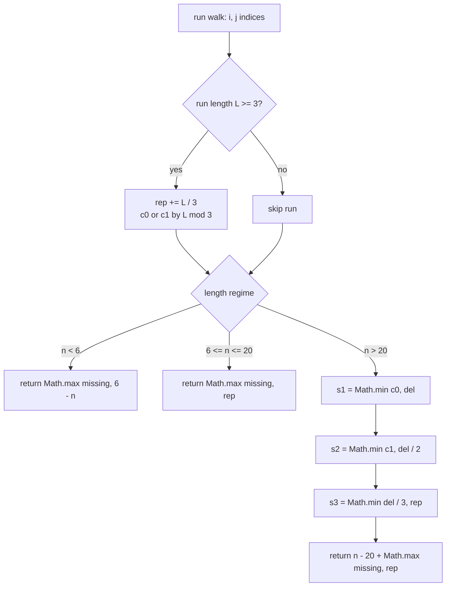

<div align="center">

|  Language |  Heap allocation |  Recursion |  Time |  Space |
| :---: | :---: | :---: | :---: | :---: |
| **Java** | **zero in hot path** | **none** | **O(n)** | **O(1)** |

</div>

<table align="center">
<tr>
<td align="center">

</td>
<td align="center">

<br>

<br>

<br>

<br>

</td>
</tr>
</table>

<div align="center">

**[📐 Fact](#-the-structural-fact) · [💸 Market](#-the-mod-class-market) · [🧵 Pipeline](#-the-pipeline) · [⚙️ Mechanism](#-mechanism) · [🧾 Traces](#-witness-traces) · [💻 Source](#-source) · [🛡️ Notes](#-engineering-notes) · [📊 Complexity](#-complexity)**

</div>

> [!NOTE]
> **Judge record:** the identical closed-form algebra was accepted in the Racket build at 54 / 54 testcases, 0 ms, beats 100.00 %. This Java port ships the same algebra on primitive ints; no millisecond or percentile label is claimed for Java until the harness reports it.

> [!IMPORTANT]
> **Binding stance:** no Java driver line has been observed yet, so the R1 no-evidence fallback applies: one private kernel plus the camelCase and snake_case public aliases inside class Solution, each a single delegating call, zero logic duplication.

## 📐 The Structural Fact

Three defects must be repaired: length outside $[6, 20]$, absent character classes, and runs of three or more equal characters. The length regime fixes the cost algebra.

| Regime | Condition | Cost Algebra |
| :--- | :---: | :---: |
| **Insertion** | $n < 6$ | $\max(\text{missing},\; 6 - n)$ |
| **Replacement** | $6 \le n \le 20$ | $\max(\text{missing},\; \sum \lfloor L/3 \rfloor)$ |
| **Deletion** | $n > 20$ | $(n - 20) + \max(\text{missing},\; \text{rep})$ |

```text
0        6                   20                  n
├────────┼───────────────────┼───────────────────▶
 insert   replace-only        delete + replace
```

## 🧵 The Pipeline



## 💸 The Mod-Class Market

For $n > 20$, exactly $n - 20$ deletions are mandatory. A deletion matters only through the replacement it cancels, and the price depends on $L \bmod 3$.

| Residue | Price in deletions | Cancellation | Buy order | Price map |
| :---: | :---: | :---: | :---: | :--- |
| **Mod 0** | 1 | 1 replacement | 1st, cheapest | 🟥 |
| **Mod 1** | 2 | 1 replacement | 2nd | 🟥🟥 |
| **Mod 2** | 3 | 1 replacement | 3rd, closed form | 🟥🟥🟥 |

> *Buying cancellations in ascending price order is optimal by exchange:* any purchase at a higher price while a cheaper one remains can be swapped without loss.

```diff
- weak:   Baaabb0     a run of three identical characters
+ strong: Baaba0      every run bounded by two
+ s1 = Math.min(c0, del)          one deletion cancels one replacement
+ s2 = Math.min(c1, del / 2)      two deletions cancel one replacement
+ s3 = Math.min(del / 3, rep)     three deletions cancel one, capped by the bill
```

The greedy is closed form. When the mod-2 phase is active, the remaining budget is at least 3, which implies the mod-0 and mod-1 phases ran to completion, hence every live run is congruent to $2 \bmod 3$, and concentration across runs is exact: the total mod-2 cancellation is $\min(\lfloor \text{budget}/3 \rfloor, \text{remaining bill})$.

## ⚙️ Mechanism

* `kernel` walks maximal runs with indices `i` and `j`; class flags `low`, `up`, `dig` are set from the run head only, which is complete because every character is a run head exactly once.
* The fold adds `L / 3` to `rep` and increments `c0` or `c1` by residue class, inline at the single run-close site.
* `s1 = Math.min(c0, del)` spends one deletion per mod-0 run; `s2 = Math.min(c1, del / 2)` spends two per mod-1 run; `s3 = Math.min(del / 3, rep)` spends three per cancellation, capped by the remaining bill.
* The overlong answer is `(n - 20) + Math.max(missing, rep)`; surviving replacements absorb the class obligation.
* `strongPasswordChecker` and `strong_password_checker` delegate to the private `kernel` with zero logic duplication.

## 🧾 Witness Traces

Spend map conserves the deletion budget: 🟪 one deletion per mod-0 cancellation, 🟧 two per mod-1, 🟥 three per mod-2. The square count always equals `del`.

| Input shape | Runs | rep | c0 | c1 | del | s1 | s2 | s3 | Spend map | Answer |
| :--- | :---: | :---: | :---: | :---: | :---: | :---: | :---: | :---: | :--- | :---: |
| 21 identical | L=21 | 7 | 1 | 0 | 1 | 1 | 0 | 0 | 🟪 | **7** |
| 25 identical | L=25 | 8 | 0 | 1 | 5 | 0 | 1 | 1 | 🟧🟥🟥 | **11** |
| 27 identical | L=27 | 9 | 1 | 0 | 7 | 1 | 0 | 2 | 🟪🟥🟥🟥🟥 | **13** |
| `"aaa111"` | 3,3 | 2 | 0 | 0 | 0 | 0 | 0 | 0 | — | **2** |
| `"a"` | none | 0 | 0 | 0 | 0 | 0 | 0 | 0 | — | **5** |
| `"aA1"` | none | 0 | 0 | 0 | 0 | 0 | 0 | 0 | — | **3** |
| `"1337C0d3"` | none | 0 | 0 | 0 | 0 | 0 | 0 | 0 | — | **0** |

## 💻 Source

<details>
<summary><strong>🔓 Expand the Java source</strong></summary>

```java
public class Solution {
    private int kernel(String s) {
        int n = s.length();
        int low = 0;
        int up = 0;
        int dig = 0;
        int rep = 0;
        int c0 = 0;
        int c1 = 0;
        for (int i = 0; i < n; ) {
            char c = s.charAt(i);
            if (c >= 'a' && c <= 'z') low = 1;
            else if (c >= 'A' && c <= 'Z') up = 1;
            else if (c >= '0' && c <= '9') dig = 1;
            int j = i;
            while (j < n && s.charAt(j) == c) j++;
            int L = j - i;
            if (L >= 3) {
                rep += L / 3;
                int m = L % 3;
                if (m == 0) c0++;
                else if (m == 1) c1++;
            }
            i = j;
        }
        int missing = 3 - low - up - dig;
        if (n < 6) return Math.max(missing, 6 - n);
        if (n <= 20) return Math.max(missing, rep);
        int del = n - 20;
        int s1 = Math.min(c0, del);
        del -= s1;
        rep -= s1;
        int s2 = Math.min(c1, del / 2);
        del -= 2 * s2;
        rep -= s2;
        int s3 = Math.min(del / 3, rep);
        rep -= s3;
        return (n - 20) + Math.max(missing, rep);
    }

    public int strongPasswordChecker(String password) {
        return kernel(password);
    }

    public int strong_password_checker(String password) {
        return kernel(password);
    }
}
```

</details>

## 🛡️ Engineering Notes

> [!NOTE]
> **Head-only classification completeness:** every character belongs to exactly one run and is its head exactly once, so classifying run heads covers the whole string; no character is skipped and none is counted twice.

> [!WARNING]
> **Bounds:** `charAt` is invoked only with indices below `n = s.length()`; the inner `while` tests `j < n` before each read; the outer loop sets `i = j` with `j > i`, so termination is monotone.

* **Binding:** one private kernel plus camelCase and snake_case public aliases under the no-driver-evidence fallback; both delegate with zero logic duplication.
* **Overflow:** all quantities are bounded by `n`; `int` suffices for any `n` below `Integer.MAX_VALUE / 2`.
* **Price strictness:** divisors 1, 2, 3 in `s1`, `s2`, `s3` are the exact cancellation prices; witnesses 21, 25, 27 identical characters return 7, 11, 13 and discriminate all three prices.
* **Allocation:** the hot path allocates nothing; only primitive locals are mutated.
* **Performance honesty:** one read per character plus constant closing arithmetic meets the read-once lower bound; millisecond labels remain properties of the judge harness.

## 📊 Complexity

| Measure | Bound | Witness |
| :--- | :---: | :--- |
| Time | $O(n)$ | one run walk plus $O(1)$ closing arithmetic |
| Space | $O(1)$ | six scalar accumulators |

<div align="center">


*Built under the Tar0 registry: R1 binding from evidence, R2 proof-carrying pruning, R9 single kernel multi-alias.*

</div>


