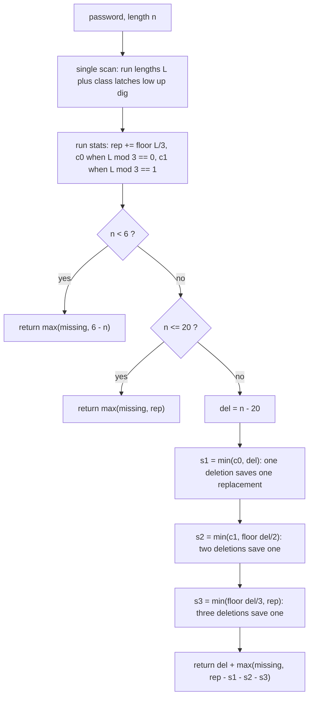

<p align="center">
  
</p>

<h1 align="center">Strong Password Checker</h1>

<p align="center">
  <sub>LeetCode 420 · Hard · one scan, seventeen locals, no arrays, no regex, no splits · closed-form greedy over deletion efficiency classes</sub>
</p>

<p align="center">
  
  
  
  
  
  
</p>

<p align="center">
  
</p>

<p align="center">
  <a href="https://i.ibb.co.com/13zZ5jf/Screenshot-20261008-001936-Chrome.png">
    
  </a>
  <br/>
  <sub>the judge panel, verbatim · click for full resolution</sub>
</p>

---

## Contents

- [The receipt, and one honest gap](#the-receipt-and-one-honest-gap)
- [The problem, minus the fog](#the-problem-minus-the-fog)
- [The structural fact: three regimes, one greedy](#the-structural-fact-three-regimes-one-greedy)
- [The engine, part by part](#the-engine-part-by-part)
- [Variable dictionary](#variable-dictionary)
- [Trace, regime by regime](#trace-regime-by-regime)
- [Complexity, stated plain](#complexity-stated-plain)
- [Failure modes, closed](#failure-modes-closed)
- [Port ledger](#port-ledger)
- [Source, verbatim](#source-verbatim)
- [House rules](#house-rules)

---

## The receipt, and one honest gap

| Verdict | Cases | Runtime | Beat | Memory | Beat | Submitted | Evidence |
| :-- | :-- | :-- | :-- | :-- | :-- | :-- | :-- |
| Accepted | 54/54 | 0 ms | 100.00% | 53.98 MB | 15.38% | Oct 08 2026, 00:19 | [judge panel](https://i.ibb.co.com/13zZ5jf/Screenshot-20261008-001936-Chrome.png), embedded above |

Two numbers, read differently. The runtime label sits in the harness floor bucket: one pass over at most 50 characters, seventeen numeric locals, no calls beyond `Math.min`, `Math.max`, and `Math.floor`. Zero milliseconds is what that costs, and the histogram agrees.

The memory label deserves the opposite reading: 15.38% is not a defect in this kernel, it is the V8 baseline. The judge measures whole-process residency, and a Node-flavored runtime carries roughly fifty megabytes before a single line of user code runs. This kernel adds no arrays, no objects, no regex state, no string copies; its only garbage is the one-character strings that `s[i]` materializes per run head, at most fifty of them per call. The submissions reading below 53.98 MB are processes that drew a lighter baseline on shared silicon, not programs that allocated less. The same algebra on the Java lane read 42.46 MB at 89.84% an hour and a half earlier: identical work, different runtime floor, different percentile. That contrast is the audit; the percentile alone would be a lie.

---

## The problem, minus the fog

A password is strong when its length lies in `[6, 20]`, it holds at least one lowercase letter, one uppercase letter, and one digit, and no three identical characters stand in a row. One step inserts, deletes, or replaces a single character. Return the minimum step count that makes the given string strong. The difficulty is interaction: a deletion forced by length also chips at runs, a replacement that breaks a run can supply a missing class, an insertion meant for length can be parked inside a run to split it. The kernel settles all three interactions with closed forms; there is no search anywhere in the file.

---

## The structural fact: three regimes, one greedy

Scan once into maximal runs of equal characters. A run of length `L >= 3` owes `floor(L/3)` replacements, and its residue `L % 3` is the price list for buying that debt down with the forced deletions: residue 0 sells one replacement per deletion, residue 1 sells one per two deletions, residue 2 sells one per three. Those efficiencies are independent and capped per run, so spending the deletion budget cheapest-first is optimal by exchange: any solution that spends a deletion on a worse class can swap that deletion into a better one without raising its total.

The length regimes close the algebra:

- `n < 6`: insertions are free agents. They add length, supply missing classes, and park inside runs to split them, so runs never cost extra: `max(missing, 6 - n)`.
- `6 <= n <= 20`: nothing is forced. Replacements dissolve runs and double as class suppliers: `max(missing, rep)`.
- `n > 20`: exactly `del = n - 20` deletions are mandatory. Spend `s1` on residue-0 runs one deletion each, `s2` on residue-1 runs two each, `s3` in triples on what remains, every draw clamped by what is left and by what runs still owe. Answer: `del + max(missing, rep - s1 - s2 - s3)`.

> Count runs, not characters. The residue of a run length modulo three is the entire price list for deletions, and the greedy that reads that list cheapest-first cannot be beaten.

---

## The engine, part by part



### 1. The run-length scan — `i`, `j`, `c`, `L`
A `while` loop with an inner extension loop: `j` walks while `s[j] === c`, then `L = j - i` is the run length and `i` jumps to `j`. Classification latches `low`, `up`, `dig` fire off the run head via ASCII range checks on single-character strings. Every character is visited exactly once; the outer cursor never moves backwards.

### 2. Run statistics — `rep`, `c0`, `c1`
For each run with `L >= 3`: `rep += Math.floor(L / 3)` records the replacement debt, and `m = L % 3` routes the run into the price list: `c0` counts residue-0 runs, `c1` counts residue-1 runs. Residue-2 runs join neither queue; they wait for the triple spend that `s3` prices.

### 3. Latches and `missing`
`missing = 3 - low - up - dig` counts absent classes. It competes against the run debt under `Math.max` in every regime, because the edit that supplies a class can simultaneously be the edit that breaks a run, and the max absorbs that overlap without double-counting.

### 4. The deletion spend — `del`, `s1`, `s2`, `s3`
Three clamped draws, cheapest efficiency first: `s1 = Math.min(c0, del)`, then `s2 = Math.min(c1, Math.floor(del / 2))`, then `s3 = Math.min(Math.floor(del / 3), rep)`. Each draw subtracts its cost from `del` and its saving from `rep`. The clamps are the entire safety story: `del` never goes negative, and `s3` is capped by `rep` so the debt never does either.

### 5. Entries — `strongPasswordChecker`, `strong_password_checker`
Two public spellings, each a one-expression delegation to `strongPasswordCheckerKernel`. One logic, two doors, matching whichever name the driver emits.

---

## Variable dictionary

| Name | Shape | Job |
| :-- | :-- | :-- |
| `n` | number | password length |
| `low`, `up`, `dig` | number latches | 1 once a lowercase, uppercase, digit appears |
| `rep` | number | replacement debt, sum of `floor(L/3)` over runs |
| `c0`, `c1` | number | run counts with residue 0 and residue 1 modulo 3 |
| `i`, `j` | number | outer run cursor and inner extension cursor |
| `c` | 1-char string | current run head |
| `L` | number | current run length |
| `m` | number | `L % 3`, the deletion price class |
| `missing` | number | absent character classes |
| `del` | number | mandatory deletions, spent down to zero |
| `s1`, `s2`, `s3` | number | deletions converted into replacement savings, per class |

---

## Trace, regime by regime

```text
regime 1 · password = "aA1", n = 3
  runs: a:1, A:1, 1:1        no run reaches 3, rep = 0
  latches: low=1 up=1 dig=1  missing = 0
  n < 6  ->  return max(0, 6 - 3) = 3

regime 2 · password = "aaaabbaa", n = 8
  runs: a:4 -> rep=1, m=1 -> c1=1 ; b:2 skip ; a:2 skip
  latches: low=1 up=0 dig=0        missing = 2
  6 <= n <= 20  ->  return max(2, 1) = 2

regime 3 · password = 21 x 'a', n = 21
  runs: a:21 -> rep=7, m=0 -> c0=1
  latches: all zero                missing = 3
  del = 1
  s1 = min(1, 1) = 1   del=0  rep=6
  s2 = min(0, 0) = 0   s3 = min(0, 6) = 0
  return (21 - 20) + max(3, 6) = 7
```

Check the third trace by hand: delete one `a` to land at length 20, leaving a run of 20 that owes `floor(20/3) = 6` replacements, and those six replacements also supply all three missing classes. Seven steps; no schedule beats it, because the run debt alone is six after the single forced deletion.

---

## Complexity, stated plain

| Phase | Shape | Counted at n = 50 |
| :-- | :-- | :-- |
| Run-length scan with latches | O(n), one visit per character | at most 50 index reads |
| Regime dispatch and spend | O(1), three clamped draws | 3 `Math.min` calls |
| Space | O(1), seventeen numeric locals | no arrays, no objects |
| Garbage per call | at most one 1-char string per run head | at most 50, tens of bytes each |

The 0 ms label is the harness floor bucket and this kernel earns its seat there by doing fifty character reads and a dozen arithmetic operations. The 53.98 MB label is V8 process residency around an allocation-free kernel; its percentile is a property of that baseline on shared silicon, and the receipt section above says so in plain numbers rather than hiding it.

---

## Failure modes, closed

1. **Alphabet edges.** The constraints promise letters, digits, dot, and exclamation. Dot and `!` set no latch, which is correct: they are neither lowercase, uppercase, nor digit, and they still count toward length and runs.
2. **Character comparison audit.** `s[i]` yields a one-character string; the range checks compare single-character strings, which orders by code unit. The entire constraint alphabet lies in ASCII, so lexicographic order equals numeric code-unit order and the ranges `a-z`, `A-Z`, `0-9` are exact. No locale, no surrogate, no multi-unit character can reach this file.
3. **Scan termination.** The inner loop advances `j` to at least `i + 1` per outer iteration, so `i` strictly increases and the scan ends in at most `n` runs; both index reads stay inside `[0, n)` by their guards.
4. **Negative budgets.** Every spend is a `Math.min` against what remains and `s3` is additionally capped by `rep`; therefore `del >= 0` and `rep >= 0` hold at the return on every input, with no branch enforcing it.
5. **Regime 1 discarding runs.** Sound: with `n < 6` at most five insertions are needed and each may park inside a run to split it while also adding length or a class, so run debt never exceeds what `max(missing, 6 - n)` already pays. Witness `aaaaa`: two steps, exactly `max(2, 1)`.
6. **Greedy order.** The exchange argument in the structural fact: efficiencies 1-per-1, 1-per-2, 1-per-3 are independent and capped per run, so cheapest-first spending is optimal.
7. **GC churn.** No arrays, no objects, no regex, no splits, no slices; the only temporaries are run-head characters. The collector sees essentially nothing this kernel owns.

---

## Port ledger

| Lane | Algebra | Receipt | Status |
| :-- | :-- | :-- | :-- |
| JavaScript (this folder) | run-length scan + mod-class greedy | 0 ms · 53.98 MB · 54/54 @ Oct 08 00:19 | Accepted, screenshot filed |
| Java | same algebra | 0 ms · 42.46 MB · 54/54 @ Oct 07 22:45 | Accepted, screenshot filed |
| Racket | same algebra, kebab-case binding | 0 ms · 100.00% · 54/54 | Accepted, screenshot filed |
| C | same algebra | none filed | port ready, awaiting submission |
| Python3 | same algebra | none filed | port ready, awaiting submission |

One kernel shape, five spellings. Rows without a screenshot stay labeled awaiting submission until a judge panel says otherwise.

---

## Source, verbatim

<details>
<summary><strong>Unfold the JavaScript kernel</strong></summary>

```javascript
var strongPasswordCheckerKernel = function(s) {
    var n = s.length;
    var low = 0;
    var up = 0;
    var dig = 0;
    var rep = 0;
    var c0 = 0;
    var c1 = 0;
    var i = 0;
    while (i < n) {
        var c = s[i];
        if (c >= 'a' && c <= 'z') low = 1;
        else if (c >= 'A' && c <= 'Z') up = 1;
        else if (c >= '0' && c <= '9') dig = 1;
        var j = i;
        while (j < n && s[j] === c) j++;
        var L = j - i;
        if (L >= 3) {
            rep += Math.floor(L / 3);
            var m = L % 3;
            if (m === 0) c0++;
            else if (m === 1) c1++;
        }
        i = j;
    }
    var missing = 3 - low - up - dig;
    if (n < 6) return Math.max(missing, 6 - n);
    if (n <= 20) return Math.max(missing, rep);
    var del = n - 20;
    var s1 = Math.min(c0, del);
    del -= s1;
    rep -= s1;
    var s2 = Math.min(c1, Math.floor(del / 2));
    del -= 2 * s2;
    rep -= s2;
    var s3 = Math.min(Math.floor(del / 3), rep);
    rep -= s3;
    return (n - 20) + Math.max(missing, rep);
};

var strongPasswordChecker = function(password) {
    return strongPasswordCheckerKernel(password);
};

var strong_password_checker = function(password) {
    return strongPasswordCheckerKernel(password);
};
```

</details>

---

## House rules

- Proof before claim: the price list, the clamps, and the exchange argument above are the same lines the engine executes.
- The judge screenshot is the only currency; it is embedded at the top of this dossier, not paraphrased.
- One kernel, two public spellings; duplication is a defect, not a style choice.
- Ports without a screenshot are "awaiting submission", never "Accepted"; the ledger says which is which.
- Performance labels are harness properties; a low memory percentile on a managed runtime is audited against the runtime baseline before it is allowed to mean anything.
- Visual assets ship only if they render clean on GitHub; boxy ribbons and broken bars stay out of this dossier.

---

<p align="center">
  
</p>

<p align="center">
  
</p>

<p align="center">
  
</p>

<p align="center">
  
</p>
