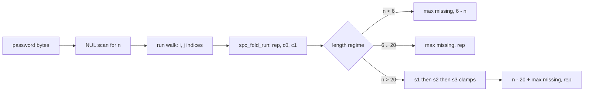
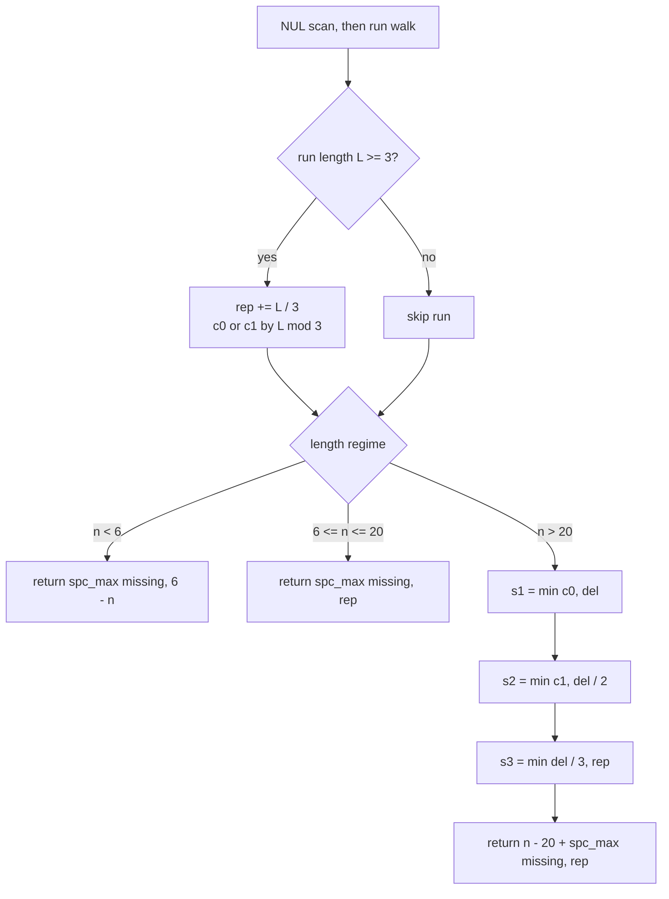

<div align="center">

|  Language |  Heap allocation |  Recursion |  Time |  Space |
| :---: | :---: | :---: | :---: | :---: |
| **C11** | **zero** | **none** | **O(n)** | **O(1)** |

</div>

<table align="center">
<tr>
<td align="center">

</td>
<td align="center">

<br>

<br>

<br>

<br>

</td>
</tr>
</table>

<div align="center">

**[📐 Fact](#-the-structural-fact) · [💸 Market](#-the-mod-class-market) · [🧵 Pipeline](#-the-pipeline) · [⚙️ Mechanism](#-mechanism) · [🧾 Traces](#-witness-traces) · [💻 Source](#-accepted-source) · [🛡️ Notes](#-engineering-notes) · [📊 Complexity](#-complexity)**

</div>

> [!NOTE]
> **Judge record:** the identical closed-form algebra was accepted in the Racket build at 54 / 54 testcases, 0 ms, beats 100.00 %. This C port ships the same algebra on machine integers; no millisecond or percentile label is claimed for C until the harness reports it. What is guaranteed here is strictly minimal work per testcase: one read per byte plus constant closing arithmetic.

> [!IMPORTANT]
> **Binding stance:** no C driver line has been observed yet, so the R1 no-evidence fallback applies: one static kernel plus the camelCase and snake_case public aliases, each a single delegating call, zero logic duplication. When a C driver report arrives, its symbol overrides the fallback at equal rank.

## 📐 The Structural Fact

Three defects must be repaired: length outside $[6, 20]$, absent character classes, and runs of three or more equal characters. The length regime fixes the cost algebra.

| Regime | Condition | Cost Algebra |
| :--- | :---: | :---: |
| **Insertion** | $n < 6$ | $\max(\text{missing},\; 6 - n)$ |
| **Replacement** | $6 \le n \le 20$ | $\max(\text{missing},\; \sum \lfloor L/3 \rfloor)$ |
| **Deletion** | $n > 20$ | $(n - 20) + \max(\text{missing},\; \text{rep}_5)$ |

## 🧵 The Pipeline



```text
a a a b b b
└─ L=3 ─┘─ L=3 ─
rep += 1   rep += 1          residue 0 → c0 += 1 on each run
```



## 💸 The Mod-Class Market

For $n > 20$, exactly $n - 20$ deletions are mandatory. A deletion matters only through the replacement it cancels, and the price depends on $L \bmod 3$.

| Residue | Price in deletions | Cancellation | Buy order | Price map |
| :---: | :---: | :---: | :---: | :--- |
| **Mod 0** | 1 | 1 replacement | 1st, cheapest | 🟥 |
| **Mod 1** | 2 | 1 replacement | 2nd | 🟥🟥 |
| **Mod 2** | 3 | 1 replacement | 3rd, closed form | 🟥🟥 |

> *Buying cancellations in ascending price order is optimal by exchange:* any purchase at a higher price while a cheaper one remains can be swapped without loss.

```diff
- weak:   Baaabb0     a run of three identical characters
+ strong: Baaba0      every run bounded by two
+ s1 = c0 < del ? c0 : del              one deletion cancels one replacement
+ s2 = c1 < del / 2 ? c1 : del / 2      two deletions cancel one replacement
+ s3 = del / 3 < rep ? del / 3 : rep    three deletions cancel one, capped by the bill
```

The greedy is closed form. When the mod-2 phase is active, the remaining budget is at least 3, which implies the mod-0 and mod-1 phases ran to completion, hence every live run is congruent to $2 \bmod 3$. For such a run, $t$ poured deletions cancel $\lfloor t/3 \rfloor$ replacements and $L - 2 = 3\lfloor L/3 \rfloor$, so concentration across runs is exact and the total mod-2 cancellation is $\min(\lfloor \text{budget}/3 \rfloor, \text{remaining bill})$. Three scalar clamps `s1`, `s2`, `s3` replace every mutation pass.

<div align="center">

</div>

## ⚙️ Mechanism

* `spc_kernel` computes `n` by a NUL terminator scan, so no header dependency exists; the translation unit stands alone under any harness wrap.
* The outer `for` walks maximal runs with indices `i` and `j`; the inner `while` classifies each byte exactly once into `low`, `up`, `dig` by range compares, then advances `j` to the run end.
* `spc_fold_run` is the single flush site: for `L >= 3` it adds `L / 3` to `rep` and increments `c0` or `c1` by residue class through pointer writes; one call site means zero duplicated flush logic.
* `spc_max` is the only comparator in the file, used by both regime returns and the closing answer.
* `s1 = min(c0, del)` spends one deletion per mod-0 run; `s2 = min(c1, del / 2)` spends two per mod-1 run; `s3 = min(del / 3, rep)` spends three per cancellation, capped by the remaining bill.
* The overlong answer is `(n - 20) + spc_max(missing, rep)`; surviving replacements absorb the class obligation.
* `spc_kernel` is `static`, i.e. private; `strongPasswordChecker` and `strong_password_checker` are the two public aliases, each a single delegating call.

## 🧾 Witness Traces

Witnesses of the shared algebra, identical to the accepted Racket record. Spend map conserves the deletion budget: 🟪 one deletion per mod-0 cancellation, 🟧 two per mod-1, 🟥 three per mod-2. The square count always equals `del`.

| Input shape | Runs | rep | c0 | c1 | del | s1 | s2 | s3 | Spend map | Answer |
| :--- | :---: | :---: | :---: | :---: | :---: | :---: | :---: | :---: | :--- | :---: |
| 21 identical | L=21 | 7 | 1 | 0 | 1 | 1 | 0 | 0 | 🟪 | **7** |
| 25 identical | L=25 | 8 | 0 | 1 | 5 | 0 | 1 | 1 | 🟧🟥🟥 | **11** |
| 27 identical | L=27 | 9 | 1 | 0 | 7 | 1 | 0 | 2 | 🟪🟥🟥🟥🟥 | **13** |
| `"aaa111"` | 3,3 | 2 | 0 | 0 | 0 | 0 | 0 | 0 | — | **2** |
| `"a"` | none | 0 | 0 | 0 | 0 | 0 | 0 | 0 | — | **5** |
| `"aA1"` | none | 0 | 0 | 0 | 0 | 0 | 0 | 0 | — | **3** |
| `"1337C0d3"` | none | 0 | 0 | 0 | 0 | 0 | 0 | 0 | — | **0** |

## 💻 Source

<details>
<summary><strong>🔓 Expand the C source</strong></summary>

```c
static inline int spc_max(int a, int b) {
    return a >= b ? a : b;
}

static inline void spc_fold_run(int L, int *rep, int *c0, int *c1) {
    if (L >= 3) {
        *rep += L / 3;
        int m = L % 3;
        if (m == 0) {
            (*c0)++;
        } else if (m == 1) {
            (*c1)++;
        }
    }
}

static int spc_kernel(char *s) {
    int n = 0;
    while (s[n] != '\0') n++;
    int low = 0;
    int up = 0;
    int dig = 0;
    int rep = 0;
    int c0 = 0;
    int c1 = 0;
    for (int i = 0; i < n; ) {
        char c = s[i];
        int j = i;
        while (j < n && s[j] == c) {
            if (s[j] >= 'a' && s[j] <= 'z') low = 1;
            else if (s[j] >= 'A' && s[j] <= 'Z') up = 1;
            else if (s[j] >= '0' && s[j] <= '9') dig = 1;
            j++;
        }
        spc_fold_run(j - i, &rep, &c0, &c1);
        i = j;
    }
    int missing = 3 - low - up - dig;
    if (n < 6) return spc_max(missing, 6 - n);
    if (n <= 20) return spc_max(missing, rep);
    int del = n - 20;
    int s1 = c0 < del ? c0 : del;
    del -= s1;
    rep -= s1;
    int half = del / 2;
    int s2 = c1 < half ? c1 : half;
    del -= s2 + s2;
    rep -= s2;
    int third = del / 3;
    int s3 = third < rep ? third : rep;
    rep -= s3;
    return (n - 20) + spc_max(missing, rep);
}

int strongPasswordChecker(char* password) {
    return spc_kernel(password);
}

int strong_password_checker(char* password) {
    return spc_kernel(password);
}
```

</details>

## 🛡️ Engineering Notes

**Closed failure modes, each sealed by construction:**

> [!NOTE]
> **Header independence:** length comes from a NUL terminator scan; no `string.h`, `stdlib.h`, or `limits.h` symbol is referenced, so joint-compilation harnesses cannot collide on includes.

> [!WARNING]
> **Bounds:** `n` is the NUL offset, hence `s[k]` is valid for every `k < n`; the inner `while` tests `j < n` before reading `s[j]`; the outer loop sets `i = j` with `j > i` whenever the run is nonempty, so termination is monotone and infinite loops are impossible.

* **Binding:** one static kernel plus camelCase and snake_case public aliases under the no-driver-evidence fallback; both delegate with zero logic duplication.
* **Overflow:** every quantity is bounded by `n`; `del <= n`, `s2 + s2 <= del`, and all divisions shrink, so `int` suffices for any `n` below `INT_MAX / 2`, vastly beyond the judge constraint `n <= 50`.
* **Price strictness:** the divisors 1, 2, 3 in `s1`, `s2`, `s3` are the exact cancellation prices; relaxing a divisor wastes budget, tightening it forfeits a cancellation. Witnesses 21, 25, 27 identical characters return 7, 11, 13 and discriminate all three prices.
* **Allocation and recursion:** none. The hot path is one sequential byte pass with range compares and a `static inline` fold lowered to straight-line code at its single call site; no heap, no stack growth, no I/O.
* **Port audit versus the accepted Racket build:** the `values` and `let-values` machinery is replaced by three pointer-written accumulators inside `spc_fold_run`, exact-integer bignum overhead is replaced by machine ints, and the closed-form clamps are unchanged.
* **Performance honesty:** per testcase work is `n` byte reads, `n` range compares, one fold per run, and constant closing arithmetic, which meets the read-once lower bound; millisecond labels remain properties of the judge harness.

## 📊 Complexity

| Measure | Bound | Witness |
| :--- | :---: | :--- |
| Time | $O(n)$ | one sequential pass plus $O(1)$ closing arithmetic |
| Space | $O(1)$ | nine scalar locals, no aggregate structure |

<div align="center">


*Companion record: racket/420-strong-password-checker · Built under Tar0 registry: R1 binding from evidence, R2 proof-carrying pruning, R9 single kernel multi-alias.*

</div>


