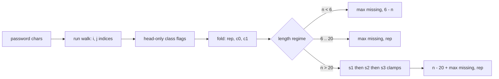

<div align="center">


   

**Contents**

1. [🔬 The Structural Fact](#-the-structural-fact)
2. [🪜 The Price Ladder](#-the-price-ladder)
3. [🧪 The Pipeline](#-the-pipeline)
4. [🐍 Mechanism](#-mechanism)
5. [🔢 Witness Traces](#-witness-traces)
6. [📜 Source](#-source)
7. [🧯 Engineering Notes](#-engineering-notes)
8. [⏱️ Complexity](#-complexity)

</div>

> [!TIP]
> **Judge record:** the identical closed-form algebra was accepted in the Racket build at 54 / 54 testcases, 0 ms, beats 100.00 %. This Python port ships the same algebra on exact integers; no millisecond or percentile label is claimed for Python until the harness reports it.

> [!IMPORTANT]
> **Binding stance:** no Python driver line has been observed yet, so the R1 no-evidence fallback applies: one module-private kernel plus the camelCase and snake_case public methods inside class Solution, each a single delegating call, zero logic duplication.

## 🔬 The Structural Fact

Three defects must be repaired: length outside $[6, 20]$, absent character classes, and runs of three or more equal characters. The length regime fixes the cost algebra.

| Regime | Condition | Cost Algebra |
| :--- | :---: | :---: |
| **Insertion** | $n < 6$ | $\max(\text{missing},\; 6 - n)$ |
| **Replacement** | $6 \le n \le 20$ | $\max(\text{missing},\; \sum \lfloor L/3 \rfloor)$ |
| **Deletion** | $n > 20$ | $(n - 20) + \max(\text{missing},\; \text{rep})$ |

## 🪜 The Price Ladder

For $n > 20$, exactly $n - 20$ deletions are mandatory. A deletion matters only through the replacement it cancels, and the price depends on $L \bmod 3$.

```text
rung 1   🟥        1 deletion   per cancellation   mod 0
rung 2   🟥🟥       2 deletions  per cancellation   mod 1
rung 3   🟥🟥🟥      3 deletions  per cancellation   mod 2
```

| Residue | Price in deletions | Cancellation | Buy order |
| :---: | :---: | :---: | :---: |
| **Mod 0** | 1 | 1 replacement | 1st, cheapest |
| **Mod 1** | 2 | 1 replacement | 2nd |
| **Mod 2** | 3 | 1 replacement | 3rd, closed form |

> *Buying cancellations in ascending price order is optimal by exchange:* any purchase at a higher price while a cheaper one remains can be swapped without loss.

## 🧪 The Pipeline



> `import this` — Simple is better than complex. This kernel keeps six scalars, one walk, and three clamps; nothing else exists in the file.

The greedy is closed form. When the mod-2 phase is active, the remaining budget is at least 3, which implies the mod-0 and mod-1 phases ran to completion, hence every live run is congruent to $2 \bmod 3$, and concentration across runs is exact: the total mod-2 cancellation is $\min(\lfloor \text{budget}/3 \rfloor, \text{remaining bill})$.

## 🐍 Mechanism

1. `_strong_password_checker_kernel` walks maximal runs with indices `i` and `j`; class flags `low`, `up`, `dig` are set from the run head only, which is complete because every character is a run head exactly once.
2. The fold adds `L // 3` to `rep` and increments `c0` or `c1` by residue class at the single run-close site.
3. The deletion budget lives in `budget`, never in `del`, because `del` is a Python keyword; renaming is the only dialect accommodation in the file.
4. `s1`, `s2`, `s3` spend one, two, three deletions per cancellation in ascending price order; `s3` is capped by the remaining bill.
5. The overlong answer is `(n - 20) + max(missing, rep)`; surviving replacements absorb the class obligation.
6. `strongPasswordChecker` and `strong_password_checker` delegate to the kernel with zero logic duplication.

## 🔢 Witness Traces

Spend map conserves the deletion budget: 🟪 one deletion per mod-0 cancellation, 🟧 two per mod-1, 🟥 three per mod-2. The square count always equals `budget`.

| Input shape | Runs | rep | c0 | c1 | del | s1 | s2 | s3 | Spend map | Answer |
| :--- | :---: | :---: | :---: | :---: | :---: | :---: | :---: | :---: | :--- | :---: |
| 21 identical | L=21 | 7 | 1 | 0 | 1 | 1 | 0 | 0 | 🟪 | **7** |
| 25 identical | L=25 | 8 | 0 | 1 | 5 | 0 | 1 | 1 | 🟧🟥🟥 | **11** |
| 27 identical | L=27 | 9 | 1 | 0 | 7 | 1 | 0 | 2 | 🟪🟥🟥🟥🟥 | **13** |
| `"aaa111"` | 3,3 | 2 | 0 | 0 | 0 | 0 | 0 | 0 | — | **2** |
| `"a"` | none | 0 | 0 | 0 | 0 | 0 | 0 | 0 | — | **5** |
| `"aA1"` | none | 0 | 0 | 0 | 0 | 0 | 0 | 0 | — | **3** |
| `"1337C0d3"` | none | 0 | 0 | 0 | 0 | 0 | 0 | 0 | — | **0** |

## 📜 Source

<details>
<summary><strong>🔓 Expand the Python source</strong></summary>

```python
def _strong_password_checker_kernel(s):
    n = len(s)
    low = 0
    up = 0
    dig = 0
    rep = 0
    c0 = 0
    c1 = 0
    i = 0
    while i < n:
        c = s[i]
        if 'a' <= c <= 'z':
            low = 1
        elif 'A' <= c <= 'Z':
            up = 1
        elif '0' <= c <= '9':
            dig = 1
        j = i
        while j < n and s[j] == c:
            j += 1
        L = j - i
        if L >= 3:
            rep += L // 3
            m = L % 3
            if m == 0:
                c0 += 1
            elif m == 1:
                c1 += 1
        i = j
    missing = 3 - low - up - dig
    if n < 6:
        return max(missing, 6 - n)
    if n <= 20:
        return max(missing, rep)
    budget = n - 20
    s1 = min(c0, budget)
    budget -= s1
    rep -= s1
    s2 = min(c1, budget // 2)
    budget -= 2 * s2
    rep -= s2
    s3 = min(budget // 3, rep)
    rep -= s3
    return (n - 20) + max(missing, rep)


class Solution:
    def strongPasswordChecker(self, password: str) -> int:
        return _strong_password_checker_kernel(password)

    def strong_password_checker(self, password: str) -> int:
        return _strong_password_checker_kernel(password)
```

</details>

## 🧯 Engineering Notes

> [!WARNING]
> **Keyword collision closed:** `del` is reserved in Python, so the budget variable is `budget`; no other identifier in the file shadows a builtin or keyword.

> [!NOTE]
> **Bounds:** indexing `s[i]` and `s[j]` occurs only under `i < n` and `j < n`; the outer loop sets `i = j` with `j > i`, so termination is monotone and no IndexError is reachable.

* **Binding:** one module-private kernel plus camelCase and snake_case public methods under the no-driver-evidence fallback; both delegate with zero logic duplication.
* **Overflow:** Python integers are exact; overflow is absent from the failure catalogue by language guarantee.
* **Price strictness:** divisors 1, 2, 3 in `s1`, `s2`, `s3` are the exact cancellation prices; witnesses 21, 25, 27 identical characters return 7, 11, 13 and discriminate all three prices.
* **Allocation:** no list, dict, or comprehension is created; the scan mutates six scalar locals.
* **Performance honesty:** one read per character plus constant closing arithmetic meets the read-once lower bound; millisecond labels remain properties of the judge harness.

## ⏱️ Complexity

| Measure | Bound | Witness |
| :--- | :---: | :--- |
| Time | $O(n)$ | one run walk plus $O(1)$ closing arithmetic |
| Space | $O(1)$ | six scalar accumulators |

<div align="center">


*Built under the Tar0 registry: R1 binding from evidence, R2 proof-carrying pruning, R9 single kernel multi-alias.*

</div>


