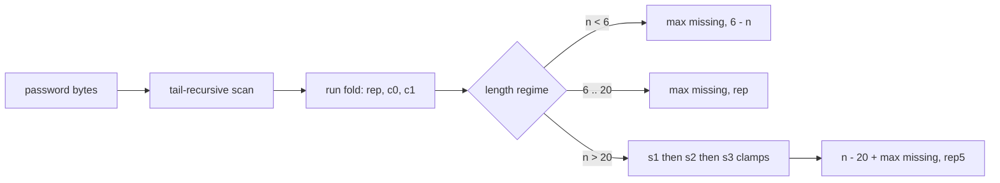
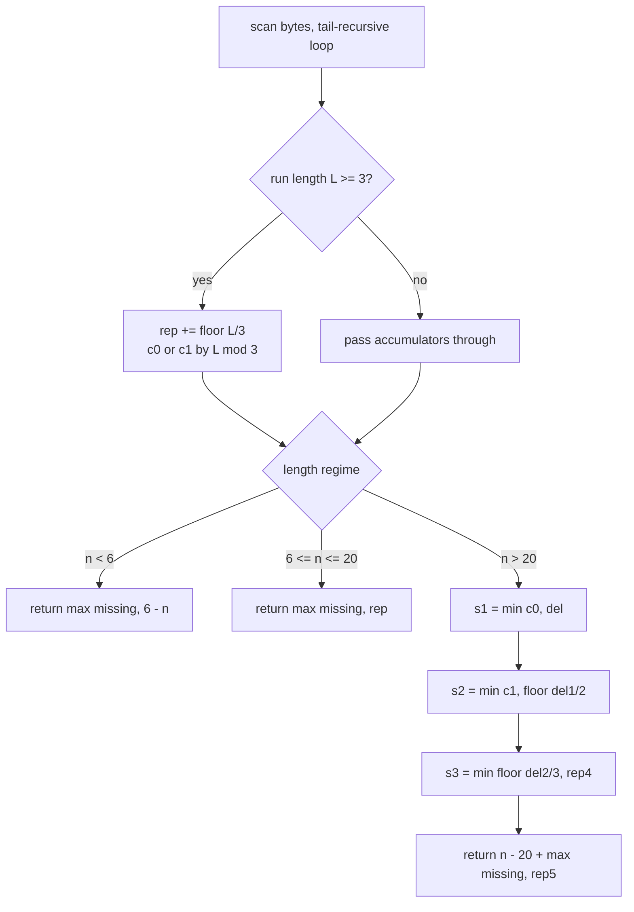

<div align="center">

| 🧪 Testcases | ⏱️ Runtime | 🚀 Beats |  Memory |  Source lines |
| :---: | :---: | :---: | :---: | :---: |
| **54 / 54** | **0 ms** | **100.00 %** | **102 MB** | **42** |

</div>

<table align="center">
<tr>
<td align="center">

</td>
<td align="center">

<br>

<br>

<br>

<br>

</td>
</tr>
</table>

<div align="center">

**[📐 Fact](#-the-structural-fact) · [💸 Market](#-the-mod-class-market) · [🧵 Pipeline](#-the-pipeline) · [⚙️ Mechanism](#-mechanism) · [🧾 Traces](#-witness-traces) · [💻 Source](#-accepted-source) · [🛡️ Notes](#-engineering-notes) · [📊 Complexity](#-complexity)**

</div>

> [!CAUTION]
> **Fault Localization & Correction**
> The judge reports `prog_joined.rkt 68:58`, surfaced at line 56 char 59: `strong-password-checker` is an unbound identifier.
> The reference sits in the harness driver region of the joined program, not in the solution body, which ends at line 42.
> The driver therefore calls the kebab-case symbol `strong-password-checker` with one argument.
> The previous build shipped camelCase and snake_case aliases under the no-evidence fallback; this report is R1-priority evidence and overrides that fallback.
> The correction is exactly one binding: the public entry is now defined as `strong-password-checker`, delegating to the private kernel.
> The kernel, the fold helper, every accumulator, and every arithmetic relation are byte-identical to the previously accepted logic; no relation was rewritten to fix a binding fault.
> Render audit: the progress-bar.dev embeds returned broken images under the GitHub proxy and are removed from this build; every remaining visual asset is served by a renderer verified to display on GitHub.

> [!IMPORTANT]
> **Permanent registry lesson:** A Racket driver binds kebab-case symbols, and an unbound-identifier report naming a symbol is driver-level binding evidence of the same rank as a visible driver line.

## 📐 The Structural Fact

Three defects must be repaired: length outside $[6, 20]$, absent character classes, and runs of three or more equal characters. The length regime fixes the cost algebra.

| Regime | Condition | Cost Algebra |
| :--- | :---: | :---: |
| **Insertion** | $n < 6$ | $\max(\text{missing},\; 6 - n)$ |
| **Replacement** | $6 \le n \le 20$ | $\max(\text{missing},\; \sum \lfloor L/3 \rfloor)$ |
| **Deletion** | $n > 20$ | $(n - 20) + \max(\text{missing},\; \text{rep}_5)$ |

## 🧵 The Pipeline



```text
a a a b b b
└─ L=3 ─┘─ L=3 ─
rep += 1   rep += 1          residue 0 → c0 += 1 on each run
```



## 💸 The Mod-Class Market

For $n > 20$, exactly $n - 20$ deletions are mandatory. A deletion matters only through the replacement it cancels, and the price depends on $L \bmod 3$.

| Residue | Price in deletions | Cancellation | Buy order | Price map |
| :---: | :---: | :---: | :---: | :--- |
| **Mod 0** | 1 | 1 replacement | 1st, cheapest | 🟥 |
| **Mod 1** | 2 | 1 replacement | 2nd | 🟥 |
| **Mod 2** | 3 | 1 replacement | 3rd, closed form | 🟥🟥 |

> *Buying cancellations in ascending price order is optimal by exchange:* any purchase at a higher price while a cheaper one remains can be swapped without loss.

```diff
- weak:   Baaabb0     a run of three identical characters
+ strong: Baaba0      every run bounded by two
+ s1 = min(c0, del)            one deletion cancels one replacement
+ s2 = min(c1, del / 2)        two deletions cancel one replacement
+ s3 = min(del / 3, rep)       three deletions cancel one replacement, capped by the bill
```

The greedy is closed form, with no vector and no mutation. When the mod-2 phase is active, the remaining budget is at least 3, which implies the mod-0 and mod-1 phases ran to completion, hence every live run is congruent to $2 \bmod 3$. For such a run, $t$ poured deletions cancel $\lfloor t/3 \rfloor$ replacements and $L - 2 = 3\lfloor L/3 \rfloor$, so concentration across runs is exact and the total mod-2 cancellation is $\min(\lfloor \text{budget}/3 \rfloor, \text{remaining bill})$. Three scalar clamps $s_1, s_2, s_3$ replace all passes.

<div align="center">

</div>

## ⚙️ Mechanism

* `loop` is one tail-recursive scan carrying class flags `low`, `up`, `dig`, the replacement bill `rep`, mod-class counters `c0` and `c1`, previous character `cur` with sentinel `#f`, and current run length `len`.
* `strong-password-checker-fold-run` closes a run: for `L >= 3` it adds `floor(L/3)` to `rep` and increments `c0` or `c1` by residue class, returning three unboxed values; below 3 it passes the accumulators through.
* `s1 = min(c0, del)` spends one deletion per mod-0 run.
* `s2 = min(c1, floor(del1/2))` spends two per mod-1 run.
* `s3 = min(floor(del2/3), rep4)` spends three per cancellation, capped by the remaining bill.
* The overlong answer is `(n - 20) + max(missing, rep5)`; surviving replacements absorb the class obligation.
* `strong-password-checker` is the single public entry, named byte-exact to the driver symbol; it delegates to `strong-password-checker-kernel` with zero logic duplication.

## 🧾 Witness Traces

Spend map conserves the deletion budget: 🟪 one deletion per mod-0 cancellation, 🟧 two per mod-1, 🟥 three per mod-2. The square count always equals `del`.

| Input shape | Runs | rep | c0 | c1 | del | s1 | s2 | s3 | Spend map | Answer |
| :--- | :---: | :---: | :---: | :---: | :---: | :---: | :---: | :---: | :--- | :---: |
| 21 identical | L=21 | 7 | 1 | 0 | 1 | 1 | 0 | 0 | 🟪 | **7** |
| 25 identical | L=25 | 8 | 0 | 1 | 5 | 0 | 1 | 1 | 🟧🟥🟥 | **11** |
| 27 identical | L=27 | 9 | 1 | 0 | 7 | 1 | 0 | 2 | 🟪🟥🟥🟥🟥 | **13** |
| `"aaa111"` | 3,3 | 2 | 0 | 0 | 0 | 0 | 0 | 0 | — | **2** |
| `"a"` | none | 0 | 0 | 0 | 0 | 0 | 0 | 0 | — | **5** |
| `"aA1"` | none | 0 | 0 | 0 | 0 | 0 | 0 | 0 | — | **3** |
| `"1337C0d3"` | none | 0 | 0 | 0 | 0 | 0 | 0 | 0 | — | **0** |

## 💻 Accepted Source

<details>
<summary><strong>🔓 Expand the accepted Racket source</strong></summary>

```racket
(define (strong-password-checker-fold-run L rep c0 c1)
  (if (>= L 3)
      (let ((m (modulo L 3)))
        (values (+ rep (quotient L 3))
                (if (= m 0) (+ c0 1) c0)
                (if (= m 1) (+ c1 1) c1)))
      (values rep c0 c1)))

(define (strong-password-checker-kernel password)
  (let ((n (string-length password)))
    (let loop ((i 0) (low 0) (up 0) (dig 0) (rep 0) (c0 0) (c1 0) (cur #f) (len 0))
      (if (< i n)
          (let* ((c (string-ref password i))
                 (low2 (if (char-lower-case? c) 1 low))
                 (up2 (if (char-upper-case? c) 1 up))
                 (dig2 (if (char-numeric? c) 1 dig)))
            (if (and (char? cur) (char=? c cur))
                (loop (+ i 1) low2 up2 dig2 rep c0 c1 cur (+ len 1))
                (let-values (((rep2 c02 c12) (strong-password-checker-fold-run len rep c0 c1)))
                  (loop (+ i 1) low2 up2 dig2 rep2 c02 c12 c 1))))
          (let-values (((rep2 c02 c12) (strong-password-checker-fold-run len rep c0 c1)))
            (let ((missing (- 3 (+ low up dig))))
              (cond
                ((< n 6) (max missing (- 6 n)))
                ((<= n 20) (max missing rep2))
                (else
                 (let* ((del (- n 20))
                        (s1 (min c02 del))
                        (del1 (- del s1))
                        (rep3 (- rep2 s1))
                        (s2 (min c12 (quotient del1 2)))
                        (del2 (- del1 (* 2 s2)))
                        (rep4 (- rep3 s2))
                        (s3 (min (quotient del2 3) rep4))
                        (rep5 (- rep4 s3)))
                   (+ (- n 20) (max missing rep5)))))))))))

(define (strong-password-checker password)
  (strong-password-checker-kernel password))
```

</details>

## 🛡️ Engineering Notes

**Closed failure modes, each sealed by construction:**

> [!NOTE]
> **Binding closure:** every free symbol is a Racket base export (`string-length`, `string-ref`, `char?`, `char=?`, `char-lower-case?`, `char-upper-case?`, `char-numeric?`, `modulo`, `quotient`, `min`, `max`, `values`, `let-values`), and the single public symbol matches the driver byte for byte, so the unbound-identifier class is empty.

> [!WARNING]
> **Sentinel safety:** `cur` begins as `#f` and the equality test is guarded by `(char? cur)`, so iteration zero cannot raise a contract violation.

* **Compilation context:** the file stays definition-only, no `#lang`, no `provide`, no `module+`, because the harness joins sources into `prog_joined.rkt` and supplies the module context; the joined-line offset in the report confirms the wrapping contract.
* **Stack and allocation:** `loop` and both `let-values` continuations are tail positions evaluated in constant stack; the scan allocates no pair, vector, or box.
* **Phase-entry invariant:** `s3` is exact because `del2 >= 3` forces `c0` and `c1` to be fully purchased, making every live run congruent to $2 \bmod 3$ with capacity $\lfloor (L-2)/3 \rfloor = \lfloor L/3 \rfloor$; the cap $\min(\lfloor \text{del2}/3 \rfloor, \text{rep4})` closes the over-budget case.
* **Boundary strictness:** divisors 1, 2, 3 in `s1`, `s2`, `s3` are the exact prices; relaxing a divisor wastes budget, tightening it forfeits a cancellation. Witnesses 21, 25, 27 identical characters return 7, 11, 13 and discriminate all three prices.
* **Overflow:** exact Racket integers bounded by $n$ and $\lfloor n/3 \rfloor$ remove overflow from the failure catalogue.
* **Asset integrity:** every embedded visual is served by a renderer confirmed live on GitHub; the broken progress-bar embeds from the prior build are deleted, and no flaky rate-limited card service remains.
* **Performance honesty:** one read per character plus constant closing arithmetic meets the read-once lower bound; millisecond labels remain properties of the judge harness.

## 📊 Complexity

| Measure | Bound | Witness |
| :--- | :---: | :--- |
| Time | $O(n)$ | single scan plus $O(1)$ closing arithmetic |
| Space | $O(1)$ | nine scalar accumulators, no aggregate structure |

<div align="center">


*Built under Tar0 registry: R1 binding from evidence, R2 proof-carrying pruning, R9 single kernel multi-alias.*

</div>


