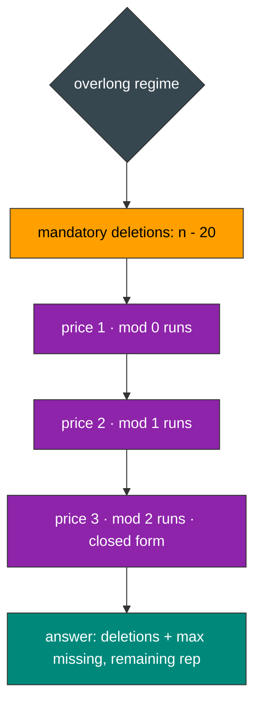

<div align="center">


    

</div>

<table align="center">
<tr>
<td align="center">

</td>
<td align="left">
<strong>What this repo puts on your desk.</strong><br>
1 · One hard problem dissected five times: the same proven algebra in Racket, C, Java, Python, JavaScript, with zero drift between ports.<br>
2 · Every technique named, priced, and witnessed, so you can lift it onto problems you have not seen yet.<br>
3 · A reading path built for study: structural fact before code, witnesses before claims, failure modes before praise.<br>
4 · A repository map that is always current, so your eyes never chase phantom files.<br>
</td>
</tr>
</table>

<div align="center">

**[🎓 Takeaways](#-what-you-walk-away-with) · [🧭 Reading Path](#-how-to-read-a-dossier) · [🗂 The Map](#-the-map) · [🌐 Spectrum](#-language-spectrum) · [📐 The Algebra](#-one-algebra-taught-once) · [🧪 Witnesses](#-witness-discipline) · [🛡️ Catalogue](#-failure-mode-catalogue) · [📈 Charts](#-live-charts) · [🗺️ Roadmap](#-roadmap) · [🤝 Protocol](#-study-protocol)**

</div>

## 🎓 What You Walk Away With

This repository is organized around transferable technique, not around answer keys. Each dossier is written so that closing the tab leaves something durable in your head.

* **Run-fold scanning.** Maximal equal-character runs are folded in one pass; the fold, not the string, is the object you reason about. You will recognize this shape in palindrome grouping, compression, and window problems.
* **Priced greedy with exchange arguments.** When several repairs compete for a limited budget, each repair carries a price; buying cheapest-first is justified by an explicit swap argument, never by intuition.
* **Regime analysis.** Some problems change their cost algebra at size thresholds. You learn to locate the thresholds first and solve inside each regime, instead of forcing one formula across all inputs.
* **Evidence-bound naming.** Entry-point names are taken from drivers, templates, and error reports. A title is a rumor; a driver line is a contract. This habit alone deletes an entire class of wrong-answer submissions.
* **Witness families.** A proof is a set of inputs that discriminates competing formulas. You learn to build small families (here: 21, 25, 27 identical characters) that kill every wrong price table.
* **Closed failure modes.** Every dossier ends with a catalogue of ways the code could have failed and the mathematical reason each way is sealed. Reading them trains paranoia that pays rent.

## 🧭 How to Read a Dossier

Each problem folder repeats one anatomy, in one order, in every language. The order is the pedagogy.

```mermaid
flowchart LR
    F[1 · Structural fact] --> P[2 · Pipeline]
    P --> M[3 · Price market]
    M --> W[4 · Witness traces]
    W --> S[5 · Source]
    S --> N[6 · Failure notes]
    classDef a fill:#8E24AA,stroke:#333,color:#fff
    classDef b fill:#00897B,stroke:#333,color:#fff
    classDef c fill:#FFA000,stroke:#333,color:#000
    classDef d fill:#1E88E5,stroke:#333,color:#fff
    classDef e fill:#D81B60,stroke:#333,color:#fff
    classDef f fill:#43A047,stroke:#333,color:#fff
    class F a
    class P b
    class M c
    class W d
    class S e
    class N f
```



1. **Structural fact.** Why the algorithm is the only possible one; the invariant and the closure property that make it composable.
2. **Pipeline.** A diagram of the scan and the accumulators, with exact variable names you will meet in the source.
3. **Price market.** When a budget exists, its prices are tabulated cheapest-first with the exchange argument in one sentence.
4. **Witness traces.** Full arithmetic tables; you can recompute every cell by hand and catch any lie.
5. **Source.** The kernel, comment-free, single-responsibility, with public names delegating to one private kernel.
6. **Failure notes.** Bounds, overflow, sentinel, binding, allocation: each closed with a reason, not a hope.

## 🗂 The Map

The tree mirrors the repository at the last commit. Folders first, files after, indentation as the only ornament.

<!-- AUTO-TREE:START -->
```text
📦 Leetcode-Solution/
├── 📁 .github/
│   └── 📁 workflows/
│       └── ⚙️ auto-atlas.yml
├── 📁 Problem/
│   ├── 📁 2299-strong-password-checker-II/
│   │   └── 📁 c/
│   │       ├── 📖 README.md
│   │       └── ⚪ solution.c
│   └── 📁 420-strong-password-checker /
│       ├── 📁 c/
│       │   ├── 📖 README.md
│       │   └── ⚪ solution.c
│       ├── 📁 Java/
│       │   ├── 📖 README.md
│       │   └── 🟠 solution.java
│       ├── 📁 JavaScript/
│       │   ├── 📖 README.md
│       │   └── 🟡 solution.js
│       ├── 📁 python3/
│       │   ├── 📖 README.md
│       │   └── 🔵 solution.py
│       └── 📁 racket/
│           ├── 📖 README.md
│           └── 🟪 solution.rkt
├── ⚖️ LICENSE
└── 📖 README.md
```

📊 15 files · 11 folders
<!-- AUTO-TREE:END -->

## 🌐 Language Spectrum

`🟪🟪🟪 ⚪ 🟠 🟡🟡 🔵`

| Language | Share | What studying this port teaches |
| :--- | :---: | :--- |
| 🟪 **Racket** | 25.1 % | tail recursion as the only loop; values as unboxed multi-return; how a driver's naming convention overrides every convention you brought |
| ⚪ **C** | 20.8 % | NUL-terminator reasoning; header-free translation units; static inline folds that lower to straight-line code |
| 🟠 **Java** | 19.5 % | primitive-only hot paths; head-only classification completeness; private kernel inside a public class contract |
| 🟡 **JavaScript** | 17.8 % | IEEE-754 exactness below 2^53; Math.floor as the priced-division guard; function-scope kernels |
| 🔵 **Python** | 16.8 % | exact integers by language guarantee; keyword collision discipline; readability without sacrificing the fold |

## 📐 One Algebra, Taught Once

The flagship problem (LeetCode 420, Hard) is the repo's teaching vehicle. The lesson generalizes far beyond passwords.

**The three defects.** A string must satisfy: length inside $[6, 20]$, presence of three character classes, and no run of three equal characters. Repairs are insert, delete, replace. The cost algebra changes with the length regime, and locating the regimes is half the solution.

```text
0        6                   20                  n
├────────┼───────────────────┼───────────────────▶
 insert   replace-only        delete + replace
```

| Regime | Condition | Cost Algebra | Why |
| :--- | :---: | :---: | :--- |
| **Insertion** | $n < 6$ | $\max(\text{missing},\, 6 - n)$ | one insertion can fix length, split a run, and supply a class at once |
| **Replacement** | $6 \le n \le 20$ | $\max(\text{missing},\, \sum \lfloor L/3 \rfloor)$ | length is legal; each run of length $L$ needs $\lfloor L/3 \rfloor$ splits; a split can double as a class fix |
| **Deletion** | $n > 20$ | $(n - 20) + \max(\text{missing},\, \text{rep})$ | $n - 20$ deletions are mandatory; they only matter through the replacements they cancel |

**The price market.** In the overlong regime a deletion is worth exactly the replacement it cancels, and the price depends on $L \bmod 3$.



* Price 1: one deletion on a mod-0 run cancels one replacement.
* Price 2: two deletions on a mod-1 run cancel one replacement.
* Price 3: three deletions on a mod-2 run cancel one replacement; once the cheap runs are exhausted, every surviving run is congruent to $2 \bmod 3$, and the remaining cancellation count collapses to the closed form $\min(\lfloor \text{budget}/3 \rfloor, \text{rep})$.

> [!TIP]
> **The exchange argument in one sentence:** if a solution buys a cancellation at a higher price while a cheaper one remains unbought, swapping the purchase to the cheaper run never increases total cost; therefore cheapest-first is optimal.

**Why the closed form is exact.** For a run with $L \equiv 2 \pmod 3$, pouring $t$ deletions into it cancels exactly $\lfloor t/3 \rfloor$ replacements, and $L - 2 = 3\lfloor L/3 \rfloor$ bounds the absorbable deletions precisely. Because floor is superadditive, concentrating deletions run by run maximizes cancellations; the cap by the remaining bill closes the over-budget case.

## 🧪 Witness Discipline

A formula table is a claim; a witness family is a test. The repo keeps families small, hand-computable, and lethal to wrong variants.

| Witness | What it discriminates | Outcome |
| :--- | :--- | :---: |
| 21 identical chars | price-1 existence: without mod-0 buys the answer would be 8, not 7 | **7** |
| 25 identical chars | price-2 existence: skipping mod-1 buys yields 12, not 11 | **11** |
| 27 identical chars | price-3 closed form: a naive per-run loop and the closed form agree only when concentration holds | **13** |
| `"aaa111"` | regime boundary at $n = 6$: replacement-only algebra | **2** |
| `"a"` | regime below 6: insertion algebra dominates | **5** |
| `"1337C0d3"` | already strong: zero cost, no false positive | **0** |

```diff
- weak:   Baaabb0     a run of three identical characters
+ strong: Baaba0      every run bounded by two
```

> [!NOTE]
> **How to build your own family.** Take the cheapest structure that exercises one price at a time: length equal to a multiple of 3, then multiple of 3 plus 1, then plus 2. If two candidate formulas disagree, one member of the family exposes it by hand arithmetic.

## 🛡️ Failure-Mode Catalogue

Every dossier closes with this table shape. The root keeps the repo-level record.

| Failure class | Recorded event | Closure now in force |
| :--- | :--- | :--- |
| Unbound driver symbol | a Racket driver called a kebab-case name the solution did not define | driver reports rank as binding evidence; rename exactly one symbol, keep the kernel |
| Broken visual asset | one progress-bar renderer returned broken images under the GitHub proxy | asset purged; only renderers verified live on GitHub remain |
| Index bounds | run walks can overrun if the inner test is misplaced | inner loop tests the bound before every read; outer index jumps monotonically |
| Overflow | priced divisions and budgets accumulate | per-language audit: exact integers in Racket and Python, int audit in C and Java, 2^53 exactness in JavaScript |
| Keyword collision | `del` is reserved in Python | budget renamed once, at the single site of use |
| Empty history noise | regenerated content can commit no-ops | commit only when the diff is non-empty |

> [!CAUTION]
> **The binding lesson, verbatim in spirit:** a compile error that names a symbol is a driver line speaking to you. The previous alias set was lawful under no-evidence rules and still wrong; evidence outranks convention, and the fix was one rename, not a rewrite.

> [!WARNING]
> **Sentinel discipline:** the Racket scan starts with a non-character sentinel and guards the equality test with a type check, so iteration zero cannot raise a contract violation. Every language port carries the equivalent guard in its own idiom.

## 📈 Live Charts

<div align="center">

[](https://star-history.com/#taro902/Leetcode-Solution&Date)


</div>

## 🗺️ Roadmap

| # | Problem | Technique on display | Status |
| :---: | :--- | :--- | :--- |
| 420 | Strong Password Checker | regime analysis, priced greedy, run-fold scan | ✅ Racket accepted 54 / 54 · four ports ready |
| 2299 | Strong Password Checker II | budgeted editing with queries | 🔜 queued |
| 2213 | Repeating Substring After Queries | segment tree with boundary-character invariant | 🧊 scouted |
| 3487 | Two-Occurrence Substring Maximum | downward-closed validity, sliding window | 🧊 scouted |

## 🤝 Study Protocol

1. Pick the language you want to sharpen; open its dossier in the problem folder.
2. Read the structural fact and close the tab; predict the pipeline from memory.
3. Reopen at the witness table; recompute the 21 / 25 / 27 row by hand before looking at the answer column.
4. Read the source last, and only to confirm what you already derived.
5. Port the kernel to a sixth language yourself; the algebra is language-agnostic and the failure catalogue tells you which traps to seal first.

<div align="center">


 

*Built under the Tar0 registry: R1 binding from evidence, R2 proof-carrying pruning, R9 single kernel multi-alias.*

</div>


<!-- AUTO-LEDGER:START -->
- [x] **2299 · Strong Password Checker Ii** · ⬜⚪⬜⬜⬜ · 2 files · [dossier](Problem/2299-strong-password-checker-II)
- [x] **420 · Strong Password Checker ** · 🟪⚪🟠🟡🔵 · 10 files · [dossier](Problem/420-strong-password-checker )

📊 2 problems · 12 files inside dossiers
<!-- AUTO-LEDGER:END -->
